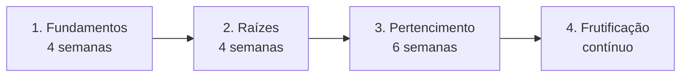
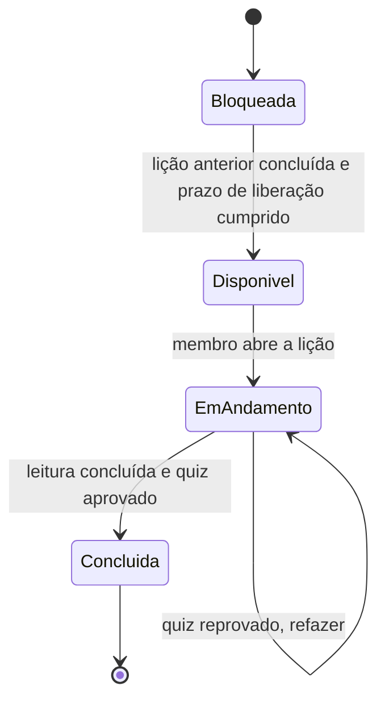
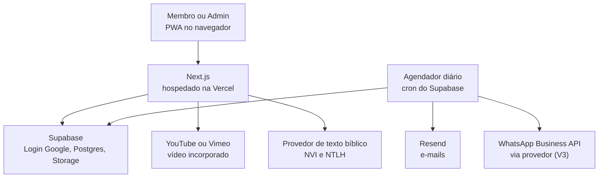

# Plataforma de Discipulado da Vertical Church

> **Pacote de handoff para o Claude Code**
> Gerado em 19/09/2026 a partir das sessões de planejamento no Claude.ai. Especificação e conteúdos aprovados pelo pastor ("Gostei"), com as pendências listadas na Parte 3.

## Como este arquivo está organizado

| Parte | O que contém |
| --- | --- |
| **Parte 0** | Contexto, decisões já tomadas, regras que não podem ser quebradas, ordem de trabalho sugerida, formato de importação do conteúdo e um primeiro prompt. Leia primeiro. |
| **Parte 1** | Especificação completa da plataforma (seções 1 a 20): perfis, telas, regras de negócio, modelo de dados, arquitetura, LGPD, roadmap e o módulo Grupo de Discipulado. |
| **Parte 2** | Conteúdo pronto (rascunho) das lições: Ciclo 1 (8), Ciclo 2 (8) e Ciclo 3 (12). Cada lição tem um bloco YAML de metadados para facilitar a importação. |
| **Parte 3** | Pendências: trechos `[PREENCHER]`, conteúdo ainda não escrito, licenças e itens para confirmar com o pastor. |

---

# PARTE 0: CONTEXTO E INSTRUÇÕES

## 0.1 Resumo do projeto

- **Cliente:** o pastor da **Vertical Church**. Ele **não é técnico**: você vai guiá-lo passo a passo e ele será o dono das contas e da manutenção (decisão dele).
- **O que é:** um aplicativo web responsivo (PWA) de discipulado **self-service**. Leva o novo convertido, em quatro ciclos, dos primeiros passos à frutificação, mede o progresso automaticamente e chama a equipe pastoral só quando alguém para ou pede ajuda.
- **Dois módulos:**
  1. **Trilha de novos convertidos:** Ciclo 1 Fundamentos, Ciclo 2 Raízes, Ciclo 3 Pertencimento e Ciclo 4 Frutificação (ainda não escrito). Cada ciclo termina com um encontro presencial.
  2. **Grupo de Discipulado:** para quem já é membro. Um discipulador conduz vários discípulos por uma trilha diária, todos no mesmo ritmo, e acompanha o grupo e cada pessoa.
- **Conteúdo:** majoritariamente em **texto** (para formar o hábito de leitura), com vídeo opcional (YouTube ou Vimeo). O texto das lições foi escrito pelo Claude e é editável pelo pastor no painel.
- **Login:** somente **conta Google**. Alternativa por e-mail fica para a V3.
- **Bíblia:** versões **NVI e NTLH**, com licença ainda pendente (ver regras abaixo).
- **Idioma:** português do Brasil na interface e no conteúdo.

## 0.2 Dados institucionais (usados nas lições e na página "Nossa Igreja")

Textos transcritos dos cartazes da igreja (o pastor enviou uma foto). Confirme a fidelidade com ele antes de publicar.

- **Nossa visão:** "Ser uma igreja relevante, influente, estabelecendo o Reino de Deus em todas as esferas da sociedade através do serviço e discipulado."
- **Nossa missão:** "Levar pessoas a um encontro genuíno com Jesus, trazendo salvação, libertação, cura e restauração para suas famílias."
- **Cumprimento da missão:** "Fazemos isso por meio de conexões genuínas em pequenos grupos, do discipulado intencional e do ensino transformador da Palavra de Deus, capacitando cada pessoa a viver e compartilhar o evangelho."
- **Identidade visual (inferida dos cartazes, a confirmar):** vermelho profundo, preto e cinza-lilás claro; títulos em fonte serifada; símbolos de montanha (visão), cruz (missão) e pessoas (cumprimento). Peça ao pastor o logotipo e as cores oficiais.

## 0.3 Decisões já tomadas

| Tema | Decisão |
| --- | --- |
| Tipo de sistema | PWA responsivo, mobile-first |
| Login | Google (Supabase Auth); e-mail alternativo só na V3 |
| Stack sugerida | Next.js + TypeScript + Tailwind, Supabase (Auth, Postgres, Storage), Vercel, Resend; WhatsApp só na V3 |
| Formato da trilha | Self-service em ciclos, com encerramento presencial de cada ciclo |
| Conteúdo | Escrito pelo Claude, editável pelo pastor no painel, com rascunho, revisão, publicado e histórico de versões |
| Público da V1 | **Somente maiores de 18 anos** |
| Discípulo em mais de um grupo | Permitido, com aviso de sobrecarga quando houver mais de dois grupos ativos |
| Reflexões visíveis ao discipulador | Comuns compartilhadas por padrão; lições sensíveis privadas; o discípulo pode mudar em cada reflexão |
| Formação do discipulador | Trilha de formação recomendada, mas **opcional** |
| Dias ativos padrão de um grupo | Segunda a sábado |
| Certificado de trilha de discipulado | **Não haverá**; apenas registro de conclusão |
| Criação de trilhas de discipulado | **Somente o Admin** cria trilhas; discipuladores escolhem entre as oficiais |
| Pedidos de ajuda pastoral | O discipulador atende primeiro e escala à equipe pastoral; em casos graves o discípulo pode enviar direto à equipe |
| Ciclo seguinte antes do encerramento presencial | **Não bloqueia**; o encerramento fica como "marco pendente" |
| Manutenção técnica | O pastor cuida, com o Claude guiando. Registrar acessos e passo a passo em documento e dar acesso de emergência a uma segunda pessoa de confiança |
| Pagamentos | Fora do escopo: a plataforma **ensina** dízimo e ofertas, mas não processa pagamentos |

## 0.4 Regras que não podem ser quebradas

1. **Texto bíblico e direitos autorais.** NVI e NTLH têm titulares de direitos autorais (até onde se sabe, Biblica e Sociedade Bíblica do Brasil; confirmar). Portanto:
   - As lições trazem **apenas referências** (por exemplo, "João 1.12") e paráfrases próprias. **Nunca cole o texto literal das traduções** no conteúdo nem no código.
   - O versículo é guardado como **referência + código da versão**. Crie um módulo "provedor de texto bíblico" com interface (`getPassage(ref, versionCode)`) que possa trocar de fonte sem reescrever lições.
   - Enquanto não houver licença, mostre a referência com link para um leitor externo. Cada versículo exibido mostra a nota de copyright exigida pelo titular.
2. **LGPD.** Convicção religiosa é dado pessoal sensível. Consentimentos separados (dados, e-mail, WhatsApp), Row Level Security em todas as tabelas, mínimo de dados (nome, e-mail e foto do Google; WhatsApp opcional), direito de exportar e excluir os próprios dados, log de auditoria. Um advogado precisa validar os textos antes do lançamento.
3. **Não invente conteúdo da igreja.** Onde o texto traz `[PREENCHER: ...]`, o pastor ainda não informou os dados (história, valores, declaração de fé, estrutura de liderança, ministérios, requisitos de membresia). No importador, **marque essas lições com `has_placeholders: true` e bloqueie a publicação** até os marcadores serem resolvidos.
4. **Lições sensíveis** (finanças, emocional, conjugal) têm aviso fixo de que não substituem aconselhamento profissional e o botão "Pedir ajuda pastoral". Números de emergência usados no conteúdo (CVV 188, Ligue 180, polícia 190) devem ser **conferidos antes da publicação**.
5. **Privacidade entre perfis.** Membro vê só seus dados; cuidador e discipulador só veem quem está atribuído a eles; notas de cuidado e reflexões privadas só para quem a regra permite. Toda promoção de perfil e toda publicação ficam no log de auditoria.
6. **Nada de app nas lojas, chat entre membros ou processamento de pagamentos** na V1.
7. **Campos internos não aparecem para o membro:** "Sugestão de vídeo", "Nota para revisão pastoral", "Aviso de rascunho" e `[PREENCHER]` são material de trabalho da equipe.

## 0.5 Como trabalhar com o pastor

- Explique cada passo em linguagem simples. Antes de qualquer ação irreversível ou que envolva contas (criar projetos, publicar, apagar dados, mudar configurações), peça confirmação.
- Ele fará sozinho: criar as contas em Google Cloud, Supabase, Vercel e Resend, e guardar credenciais. Você guia; ele executa. Nunca peça que cole senhas ou chaves no chat.
- Mantenha um `docs/RUNBOOK.md` com: onde ficam as contas, como publicar uma correção, como restaurar um backup e quem tem acesso de emergência.
- Mostre o progresso com demonstrações pequenas e frequentes (por exemplo, o Ciclo 1 navegável no celular).

## 0.6 Ordem de trabalho sugerida

Siga o roadmap da seção 14 da Parte 1. Resumo operacional:

1. **Fase 0, preparação:** repositório, ambientes (desenvolvimento, homologação, produção), projeto Supabase com Row Level Security desde a primeira migração, login Google, tela de consentimento OAuth, domínio, README e RUNBOOK. Redigir minuta de Termos e Política de Privacidade para revisão jurídica.
2. **Fase 1, MVP:** login Google, onboarding com consentimentos, trilha em texto, progresso, botão "Concluir lição", "Nossa Igreja" editável, editor de lições básico, lista de membros e ficha, exclusão e exportação de dados. **Importar o Ciclo 1** como rascunho.
3. **Piloto:** 20 a 30 novos convertidos por 4 semanas. Só depois disso, iniciar a V2.
4. **Fase 2, V2:** quiz, vídeo, prática e reflexão, lembretes por e-mail, alertas de parados, cuidadores, encerramentos, certificados, histórico de versões, exportação CSV e importação dos Ciclos 2 e 3.
5. **Módulo Grupo de Discipulado (G1 e G2):** só depois do MVP validado (seções 17 a 20).
6. **V3:** WhatsApp, gamificação leve, login por e-mail, multi-campus, Ciclo 4.

**Não implemente V2, V3 ou o módulo de grupos antes de o MVP ser validado.**

## 0.7 Formato do conteúdo e como importar

Cada lição da Parte 2 segue o mesmo molde:

- Título H3 `### Lição N: ...`, seguido de um **bloco YAML de metadados** (gerado neste arquivo): `id`, `cycle`, `order`, `title`, `key_verse`, `estimated_minutes`, `tags`, `has_placeholders`.
- Linhas em negrito no início: `**Objetivo:**`, `**Versículo-chave:**`, `**Tempo estimado:** ... · **Etiquetas:** ...`.
- Corpo da lição em subtítulos H4 (`#### ...`), com parágrafos, listas, citações (`>`) e tabelas.
- Blocos finais com rótulo em negrito: `**Prática da semana**` (lista numerada), `**Reflexão**`, `**Quiz**` (3 perguntas, alternativas A a C e linha `**Resposta:** X. explicação`), `**Sugestão de vídeo (opcional):**`, `**Botão sugerido:**` (quando houver), `**Nota para revisão pastoral:**`.
- Versículos aparecem entre parênteses no texto, por referência (ex.: "João 3.16", "Efésios 2.8-9", "1 Coríntios 10.13"). Sugestão: detectar referências por expressão regular e renderizá-las como toque para abrir o texto na versão escolhida pelo membro.

**Modelo sugerido para importação** (uma lição por objeto; ajuste ao seu esquema):

```json
{
  "id": "c1-l01",
  "cycle": 1,
  "order": 1,
  "title": "Bem-vindo à família de Deus",
  "objective": "...",
  "key_verse": { "ref": "João 1.12" },
  "estimated_minutes": 5,
  "tags": ["Fundamentos", "Ciclo 1"],
  "sensitive": false,
  "body_blocks": [
    { "type": "heading", "level": 3, "text": "..." },
    { "type": "paragraph", "text": "... (João 1.12) ..." },
    { "type": "list", "ordered": false, "items": ["..."] },
    { "type": "quote", "text": "..." },
    { "type": "table", "header": ["..."], "rows": [["..."]] }
  ],
  "practice": { "items": ["..."] },
  "reflection": "...",
  "quiz": [
    { "question": "...", "options": { "A": "...", "B": "...", "C": "..." }, "correct": "B", "explanation": "..." }
  ],
  "video_suggestion": "...",
  "pastoral_review_note": "...",
  "has_placeholders": false,
  "status": "draft"
}
```

Recomendações:
- Escreva um script de importação (por exemplo, `scripts/import-content.ts`) que leia a Parte 2 deste arquivo e gere os registros em `lessons`, `lesson_versions` e `quiz_questions`, todos como **rascunho**.
- Os textos das lições de Ciclos 1 a 3 são "lições de trilha" (`tipo = novo convertido`). A biblioteca do Grupo de Discipulado (24 lições) ainda **não foi escrita**; só existem os títulos na seção 19 da Parte 1.
- Lições sensíveis da biblioteca: 9, 10, 12, 13, 14, 16 e 17 (ver seção 19).

## 0.8 Primeiro prompt sugerido para o Claude Code

Cole o texto abaixo na primeira mensagem da sessão do Claude Code, com este arquivo na pasta do projeto (por exemplo, `docs/HANDOFF.md`):

```text
Leia docs/HANDOFF.md inteiro, começando pela Parte 0. Você vai construir a
plataforma de discipulado da Vertical Church seguindo a Parte 1 (especificação).
O usuário é um pastor não técnico: guie cada passo em português simples e peça
confirmação antes de ações irreversíveis.

Comece pela Fase 0 (preparação) e pelo MVP (Fase 1). Não implemente V2, V3 nem o
módulo Grupo de Discipulado agora. Respeite as regras da seção 0.4, em especial:
não inclua texto literal da NVI ou da NTLH, use RLS desde a primeira migração e
marque como bloqueadas para publicação as lições com [PREENCHER].

Primeiro, me diga em uma lista curta o que você entendeu, quais decisões técnicas
você propõe (estrutura de pastas, esquema inicial do banco, ordem das migrações)
e o que precisa que o pastor faça (contas e configurações). Só depois de eu
aprovar, crie o repositório.
```

---
# PARTE 1: ESPECIFICAÇÃO DA PLATAFORMA

Especificação completa (seções 1 a 20). As decisões registradas na seção 20 e na seção 16 estão incorporadas ao texto. Onde a especificação diz "Claude" como autor do conteúdo, refere-se ao trabalho de redação já entregue na Parte 2.

## 1. Visão geral

A plataforma é um aplicativo web (PWA) de discipulado self-service: leva o novo convertido, em ciclos, dos primeiros passos à frutificação, mede o progresso sozinha e chama o pastor só quando alguém precisa de cuidado.

**Público:** novos convertidos (principal), membros em formação e a equipe pastoral que gerencia a trilha.

**Objetivos**

- **Escalar:** uma equipe pequena acompanha centenas de pessoas sem encontros individuais recorrentes.
- **Ensinar pela leitura:** conteúdo majoritariamente em texto, com vídeo opcional em qualquer lição.
- **Comunicar a visão:** apresentação resumida no Ciclo 1 e aprofundada no Ciclo 3.
- **Acompanhar:** saber quem está em cada etapa e quem parou.
- **Ser editável:** o pastor altera qualquer conteúdo sem depender de programador.

**Metas iniciais sugeridas** (a calibrar após 3 meses de uso)

| Indicador | Meta sugerida |
| --- | --- |
| Novos convertidos que iniciam a trilha em até 7 dias | 70% |
| Conclusão do Ciclo 1 | 60% |
| Membros parados contatados em até 3 dias | 90% |

**Fora do escopo da primeira versão:** dízimos e ofertas online (a plataforma ensina, não processa pagamentos), transmissão de cultos, chat ou fórum entre membros e aplicativo nas lojas da Apple e do Google.

## 2. Perfis e permissões

Cada pessoa entra com a conta Google e recebe o perfil Membro; o Admin promove quem for cuidador, editor ou administrador.

| Perfil | Quem é | Pode |
| --- | --- | --- |
| Membro | Novo convertido ou membro em formação | Fazer a trilha, ver o próprio progresso e certificados, editar o próprio perfil, exportar ou excluir os próprios dados |
| Cuidador | Líder ou discipulador voluntário | Tudo do Membro, mais ver progresso e alertas dos membros atribuídos a ele e registrar notas de cuidado |
| Editor | Equipe de conteúdo | Criar e editar ciclos, lições, quizzes e vídeos em rascunho; não publica |
| Admin / Pastor | Pastor e equipe de gestão | Tudo: publicar conteúdo, ver todos os membros, atribuir cuidadores, confirmar encerramentos, emitir certificados, gerir perfis e configurações |

**Regras de acesso**

- O membro vê somente os próprios dados.
- O cuidador vê somente os membros atribuídos a ele.
- Notas de cuidado ficam visíveis apenas ao cuidador que as escreveu e ao Admin.
- O primeiro Admin é definido por e-mail na configuração inicial; depois, só um Admin promove outro.
- Toda mudança de perfil e toda publicação de conteúdo fica registrada em log de auditoria.

## 3. Estrutura da trilha

A trilha tem quatro ciclos em sequência; cada ciclo reúne lições curtas e termina com um encerramento presencial que marca a conclusão.



O membro avança lição por lição, no ritmo da liberação gradual, e só encontra a equipe pastoral nos encerramentos ou quando o sistema gera um alerta.

| Ciclo | Duração | Temas | Visão da igreja | Encerramento presencial |
| --- | --- | --- | --- | --- |
| 1. Fundamentos | 4 semanas, 8 lições | Salvação, identidade em Cristo, leitura bíblica, oração, comunhão, batismo | Apresentação resumida: quem somos e para onde vamos | Culto de boas-vindas ou batismo |
| 2. Raízes | 4 semanas, 8 lições | Mordomia cristã, dízimo, generosidade, vida financeira, disciplinas espirituais, grupo pequeno | Valores vividos no dia a dia | Café com os pastores e entrada em um grupo |
| 3. Pertencimento | 6 semanas, 12 lições | História, propósito, valores, doutrina, ministérios, compromisso de membresia | Aprofundamento completo | Aula de membresia e certificado |
| 4. Frutificação | Contínuo, trilhas eletivas | Dons, servir, evangelismo, discipular, liderança | Chamado pessoal dentro da visão | Comissionamento em um ministério |

**Regras gerais**

- Cada lição leva de 5 a 10 minutos.
- Nos Ciclos 1 a 3, no máximo 2 lições são liberadas por semana (configurável por ciclo).
- O Ciclo 4 funciona como biblioteca de trilhas eletivas: o membro escolhe onde servir e aprender.
- Uma página fixa, **Nossa Igreja** (missão, visão, valores, história e ministérios), fica acessível em qualquer momento e é editável pelo Admin.
- Lições que tratam da visão recebem a etiqueta "visão", o que permite medir quem já conhece a visão da igreja.

## 4. Conteúdo e Bíblia

Toda lição segue o mesmo molde, para o membro criar hábito e o editor produzir rápido; o texto é o formato principal e o vídeo é sempre opcional.

**Anatomia da lição**

| Elemento | Descrição | Obrigatório |
| --- | --- | --- |
| Título e objetivo | Uma frase sobre o que o membro vai aprender | Sim |
| Tempo estimado | Calculado pelo texto (cerca de 200 palavras por minuto) | Automático |
| Versículo-chave | Referência e texto, na versão escolhida pelo membro | Sim |
| Texto principal | 700 a 1.200 palavras, com subtítulos curtos | Sim |
| Vídeo | Link do YouTube ou Vimeo, inserido em qualquer ponto do texto | Não |
| Prática | Ação da semana, por exemplo orar por 3 dias ou ler João 1 | Sim |
| Quiz | 3 perguntas de múltipla escolha, com explicação | Sim (a partir da V2) |
| Reflexão | Pergunta aberta, resposta privada, visível ao cuidador | Não |

**Tipos de bloco do editor:** texto formatado, versículo, vídeo, destaque (citação ou aviso), imagem, prática e chamada para ação (por exemplo, link para agendar o batismo).

**Editor sem código**

- Editor visual, com arrastar e soltar para reordenar blocos, lições e ciclos.
- Estados da lição: rascunho, em revisão, publicada e arquivada. Só o Admin publica.
- Pré-visualização idêntica à do membro, no celular e no computador.
- Histórico de versões por lição, com restauração de qualquer versão anterior.
- Lições que já têm progresso nunca são apagadas, apenas arquivadas.

**Como o conteúdo nasce:** o Claude escreve todas as lições como primeira versão e as carrega no sistema em rascunho; o pastor revisa e edita no painel antes de publicar (ver seção 15).

**Bíblia: NVI e NTLH**

A NVI e a NTLH têm direitos autorais. Até onde sei, a NVI pertence à Biblica e a NTLH à Sociedade Bíblica do Brasil; confirme os titulares atuais. Exibir o texto na plataforma exige autorização, e os limites de citação variam por titular. Por isso o texto bíblico é tratado como um serviço separado:

- O versículo é guardado como **referência + código da versão** (por exemplo, João 3.16 + NTLH), nunca como texto colado dentro da lição.
- Um módulo "provedor de texto bíblico" busca o texto na versão escolhida. A fonte pode ser trocada (licença direta com o titular, serviço licenciado ou link para leitor externo) sem reescrever nenhuma lição.
- O membro escolhe NVI ou NTLH no perfil. Sugestão: NTLH como padrão no Ciclo 1, pela linguagem simples.
- Cada versículo exibido mostra a nota de direitos autorais exigida pelo titular.
- Enquanto a licença não sair, o versículo aparece como referência com link para um leitor externo, e a plataforma já pode operar.
- As lições escritas pelo Claude trazem referências e paráfrases próprias, sem transcrever trechos longos das traduções.

**Ação necessária antes do lançamento:** solicitar autorização por escrito aos titulares da NVI e da NTLH e registrar os limites permitidos.

## 5. Requisitos funcionais

São 31 requisitos, cada um com a fase em que entra; o MVP cobre o mínimo para uma pessoa fazer o Ciclo 1 e o pastor acompanhar.

| ID | Módulo | Requisito | Fase |
| --- | --- | --- | --- |
| RF-01 | Acesso | Login com Google (OAuth via Supabase), pedindo apenas nome, e-mail e foto | MVP |
| RF-02 | Acesso | Sessão persistente no celular e opção de sair | MVP |
| RF-03 | Onboarding | No primeiro acesso, coletar nome de exibição, WhatsApp (opcional), versão da Bíblia (NVI ou NTLH) e consentimento LGPD | MVP |
| RF-04 | Onboarding | Registrar cada aceite com data, versão do termo e finalidade | MVP |
| RF-05 | Trilha | Tela "Minha trilha" com ciclo atual, próxima lição e porcentagem concluída | MVP |
| RF-06 | Trilha | Lista de lições do ciclo com estados: bloqueada, disponível, em andamento e concluída, com data de liberação | MVP |
| RF-07 | Lição | Leitura em blocos: texto, versículo, destaque, imagem e prática | MVP |
| RF-08 | Leitura | Fonte ajustável (3 tamanhos), modo escuro, tempo estimado e barra de progresso de leitura | MVP |
| RF-09 | Lição | Retomar do ponto em que o membro parou | MVP |
| RF-10 | Lição | Botão "Concluir lição"; a partir da V2 exige o quiz | MVP |
| RF-11 | Vídeo | Bloco de vídeo incorporado (YouTube ou Vimeo), com campo para transcrição em texto | V2 |
| RF-12 | Quiz | 3 perguntas com explicação, refazer sem limite, mínimo de 2 acertos para liberar | V2 |
| RF-13 | Prática | Marcar a prática como feita e, opcionalmente, escrever uma reflexão | V2 |
| RF-14 | Progresso | Registro automático de início, conclusão e última posição de cada lição | MVP |
| RF-15 | Visão | Página fixa "Nossa Igreja" (missão, visão, valores, história, ministérios), editável | MVP |
| RF-16 | Lembretes | Lembretes e avisos por e-mail (seção 10) | V2 |
| RF-17 | Lembretes | Lembretes por WhatsApp, com consentimento | V3 |
| RF-18 | Encerramento | Admin cria o evento de encerramento (ciclo, data, local) e confirma a presença de cada membro | V2 |
| RF-19 | Certificado | PDF com nome, ciclo, data e código, com página pública de verificação | V2 |
| RF-20 | Cuidador | Atribuir membros a cuidadores, manualmente ou por rodízio | V2 |
| RF-21 | Cuidador | Ver progresso e alertas dos atribuídos e registrar notas de cuidado | V2 |
| RF-22 | Admin | Editor de lições, quizzes e ciclos (seção 4) | MVP (básico) |
| RF-23 | Admin | Lista de membros com filtros por ciclo, status, cuidador e parados | MVP |
| RF-24 | Admin | Ficha do membro com progresso, respostas, notas e encerramentos | MVP |
| RF-25 | Admin | Lista de alertas de membros parados, com status de contato | V2 |
| RF-26 | Admin | Exportar membros e progresso em CSV | V2 |
| RF-27 | Privacidade | Membro exporta ou exclui os próprios dados | MVP |
| RF-28 | Configurações | Nome, logo e cores da igreja, textos dos e-mails e regras de liberação | V2 |
| RF-29 | Multi-campus | Vários campi ou igrejas na mesma plataforma | V3 |
| RF-30 | Engajamento | Gamificação leve: sequência de dias e marcos | V3 |
| RF-31 | Acesso | Login alternativo por e-mail para quem não tem conta Google | V3 |

## 6. Telas

São 10 telas para o membro, pensadas primeiro para o celular, e 9 telas de gestão para o Admin, cuidador e editor.

**Área do membro**

| Tela | Conteúdo principal |
| --- | --- |
| Login | Botão "Entrar com Google", link para termos e política de privacidade |
| Onboarding | Nome, WhatsApp opcional, versão da Bíblia, consentimentos separados (dados, lembretes por e-mail, lembretes por WhatsApp) |
| Minha trilha (início) | Ciclo atual, próxima lição, porcentagem concluída, marcos pendentes (encerramento) |
| Ciclo | Lista de lições com estado, tempo estimado e data de liberação |
| Lição | Texto em blocos, vídeo opcional, versículos, prática, controles de leitura, botão concluir |
| Quiz | 3 perguntas, resultado com explicação, botão refazer |
| Conclusão de ciclo | Parabéns, convite para o encerramento presencial, próximo ciclo |
| Meus certificados | Lista e download em PDF |
| Nossa Igreja | Missão, visão, valores, história e ministérios |
| Perfil e privacidade | Dados pessoais, versão da Bíblia, preferências de lembrete, exportar e excluir dados |

**Área de gestão**

| Tela | Perfil | Conteúdo principal |
| --- | --- | --- |
| Painel | Admin | Indicadores, funil por ciclo, alertas abertos (seção 11) |
| Membros | Admin, cuidador | Lista com busca e filtros; cuidador vê só os seus |
| Ficha do membro | Admin, cuidador | Linha do tempo, progresso por ciclo, respostas de quiz, reflexões, notas de cuidado |
| Trilha | Admin, editor | Ciclos e lições em árvore, arrastar para reordenar, status de cada lição |
| Editor de lição | Admin, editor | Blocos, quiz, pré-visualização, histórico de versões, enviar para revisão |
| Encerramentos | Admin | Criar eventos, lista de presença, emitir certificados em lote |
| Alertas | Admin, cuidador | Parados há mais de 14 dias, status (aberto, em contato, resolvido) |
| Configurações | Admin | Igreja, versões da Bíblia, regras de liberação, modelos de mensagem, certificado |
| Usuários e perfis | Admin | Promover editor, cuidador e admin; atribuir cuidadores |

## 7. Regras de negócio

O fluxo de cada lição segue os estados abaixo; as regras numeradas definem como o sistema decide liberar, concluir e alertar.



| ID | Regra |
| --- | --- |
| RN-01 | **Liberação gradual:** a lição seguinte libera quando a anterior é concluída e o intervalo mínimo do ciclo passou (padrão: 3 dias; máximo de 2 lições por semana). Ambos configuráveis por ciclo. |
| RN-02 | **Conclusão da lição:** no MVP, o membro clica em "Concluir". Na V2, precisa também acertar 2 de 3 no quiz. O quiz é formativo: pode refazer sem limite e vê a explicação de cada resposta. |
| RN-03 | **Prática e reflexão:** a prática é autodeclarada e não bloqueia a conclusão; a reflexão é opcional e privada (visível ao cuidador e ao Admin). |
| RN-04 | **Ciclo concluído:** todas as lições obrigatórias do ciclo concluídas. |
| RN-05 | **Encerramento presencial:** não bloqueia o ciclo seguinte. Fica como "marco pendente" até o Admin confirmar a presença. (Decisão confirmada.) |
| RN-06 | **Certificado:** emitido quando o ciclo está concluído e a presença no encerramento foi confirmada. Cada certificado tem código único de verificação. |
| RN-07 | **Parado:** 14 dias sem atividade em uma lição disponível muda o status para "parado" e abre um alerta para o cuidador (ou, sem cuidador, para o Admin). O status volta a "em andamento" ao primeiro acesso. |
| RN-08 | **Revisitar:** o membro pode reler qualquer lição concluída a qualquer momento. |
| RN-09 | **Edição de conteúdo:** editar o texto de uma lição publicada não altera o progresso de ninguém. |
| RN-10 | **Lição nova em ciclo já concluído:** entra como opcional e não reabre o ciclo, a menos que o Admin a marque como obrigatória. |
| RN-11 | **Lição arquivada:** some para novos membros e permanece no histórico de quem já a concluiu. |
| RN-12 | **Visão da igreja:** o indicador "conhece a visão" é atingido quando o membro conclui todas as lições com a etiqueta "visão". |
| RN-13 | **Cuidador:** membro sem cuidador atribuído aparece na fila do Admin; a atribuição pode ser manual ou por rodízio entre cuidadores ativos. |

## 8. Modelo de dados

O banco é relacional (Postgres) com 19 tabelas; o conteúdo da lição fica em versões, e o progresso aponta para a lição, não para o texto, o que permite editar sem perder histórico.

| Tabela | Campos principais | Relações |
| --- | --- | --- |
| profiles | id, nome, email, foto_url, whatsapp, versao_biblia, papel, status, criado_em | 1:1 com o usuário do login Google |
| cycles | id, titulo, descricao, ordem, semanas_previstas, intervalo_liberacao_dias, ativo | 1:N com lessons |
| lessons | id, cycle_id, titulo, objetivo, ordem, tempo_estimado_min, tags, obrigatoria, status, versao_atual_id | N:1 com cycles |
| lesson_versions | id, lesson_id, conteudo (JSON de blocos), autor_id, nota, criado_em | N:1 com lessons; guarda o histórico |
| quiz_questions | id, lesson_id, enunciado, opcoes (JSON), correta, explicacao, ordem | N:1 com lessons |
| lesson_progress | user_id, lesson_id, status, liberada_em, iniciada_em, concluida_em, ultima_posicao, pratica_feita | Chave (user_id, lesson_id) |
| quiz_attempts | id, user_id, lesson_id, respostas, acertos, criado_em | N:1 com profiles e lessons |
| reflections | id, user_id, lesson_id, texto, criado_em | N:1 com profiles e lessons |
| cycle_progress | user_id, cycle_id, status, iniciado_em, concluido_em | Chave (user_id, cycle_id) |
| care_assignments | id, member_id, caregiver_id, ativo, desde | Liga dois profiles |
| care_notes | id, member_id, author_id, texto, criado_em | N:1 com profiles |
| closure_events | id, cycle_id, titulo, tipo, data_hora, local | N:1 com cycles |
| closure_attendance | id, event_id, user_id, presente, confirmado_por | N:1 com closure_events |
| certificates | id, user_id, cycle_id, event_id, codigo_verificacao, emitido_em, pdf_path | N:1 com profiles e cycles |
| notifications | id, user_id, tipo, canal, status, agendada_para, enviada_em, erro | N:1 com profiles |
| alerts | id, user_id, tipo, status, criado_em, resolvido_por, resolvido_em | N:1 com profiles |
| consents | id, user_id, finalidade, versao_termo, aceito_em, revogado_em | N:1 com profiles |
| bible_versions | codigo, nome, titular_direitos, aviso_copyright, ativa | Referenciada pelo bloco de versículo |
| audit_log | id, ator_id, acao, entidade, entidade_id, criado_em | Somente inserção |

**Regras de dados**

- Row Level Security em todas as tabelas: o banco, e não só a aplicação, impede que um membro leia dados de outro.
- Exclusão de conta remove ou anonimiza dados pessoais, mantendo apenas contagens agregadas.
- Para o V3, cada tabela ganha uma coluna campus_id, o que permite várias igrejas ou campi.

## 9. Arquitetura e stack

A arquitetura usa serviços gerenciados para que a igreja não precise administrar servidores: o Next.js entrega a aplicação, o Supabase cuida de login, banco e arquivos, e um agendador diário dispara liberações, lembretes e alertas.



| Camada | Escolha | Observação |
| --- | --- | --- |
| Front-end | Next.js, TypeScript e Tailwind | Mobile-first, com manifesto e service worker para instalar como app |
| Login | Supabase Auth com provedor Google | Requer projeto no Google Cloud e tela de consentimento OAuth publicada em produção; em modo de teste o Google limita os usuários |
| Banco | Postgres (Supabase) com Row Level Security | Migrações versionadas |
| Editor | Editor visual de blocos (por exemplo, TipTap) | Salva o conteúdo em JSON |
| Arquivos | Supabase Storage | Imagens e PDFs de certificado |
| Hospedagem | Vercel | Deploy automático a cada alteração aprovada |
| E-mail | Resend | Domínio próprio da igreja com SPF e DKIM configurados |
| Agendamento | Supabase cron e Edge Functions | Liberação de lições, lembretes e detecção de parados |
| WhatsApp | API oficial via provedor (V3) | Exige modelos de mensagem aprovados e consentimento |
| Monitoramento | Sentry e logs da Vercel | Alerta de erros por e-mail |

**Ambientes:** desenvolvimento, homologação e produção, cada um com seu projeto Supabase e suas chaves. O conteúdo é escrito em produção pelo editor; o código só vai ao ar depois de testado em homologação.

**Custo:** começa em planos gratuitos ou de entrada e cresce com o número de usuários, e-mails e mensagens de WhatsApp (cobradas por conversa). Confirme os preços vigentes de cada serviço antes de contratar.

**Portabilidade:** nada na especificação depende de um único fornecedor; o Postgres e o código podem migrar para outra hospedagem se necessário.

## 10. Notificações e lembretes

O e-mail é o canal padrão a partir da V2 e o WhatsApp entra na V3; nenhuma pessoa recebe mais de 2 lembretes por semana, e o tom é sempre de cuidado, nunca de cobrança.

| Gatilho | Canal | Mensagem | Limite |
| --- | --- | --- | --- |
| Primeiro login | E-mail | Boas-vindas e link para a primeira lição | 1 vez |
| Nova lição liberada | E-mail (V2), WhatsApp (V3) | Aviso de que a próxima lição está disponível | Até 2 por semana |
| 3 dias sem acesso | E-mail | Lembrete gentil para retomar | 1 por ocorrência |
| 7 dias sem acesso | WhatsApp (V3) ou e-mail | Convite carinhoso para voltar | 1 por ocorrência |
| 14 dias parado | Alerta no painel e e-mail ao cuidador ou Admin | Pedido de contato pessoal com o membro | 1 até ser resolvido |
| Ciclo concluído | E-mail | Parabéns e convite para o encerramento presencial | 1 vez |
| Certificado emitido | E-mail | Link para baixar o certificado | 1 vez |
| Resumo semanal | E-mail ao cuidador | Membros ativos, parados e concluídos na semana | Semanal |

**Regras**

- Mensagens só entre 8h e 20h, no fuso do membro.
- Cada canal tem consentimento próprio e pode ser desligado em um clique, no perfil ou pelo link do e-mail.
- Textos das mensagens são editáveis pelo Admin (RF-28).
- Toda mensagem enviada é registrada na tabela de notificações, com status e erro, se houver.
- Se o membro voltou a acessar, lembretes pendentes são cancelados.
- No WhatsApp, só são usados modelos de mensagem aprovados pelo provedor.

## 11. Painel e métricas

O painel responde três perguntas ao pastor: quantos estão em cada etapa, onde as pessoas travam e quem precisa de contato hoje.

| Indicador | Definição | Para que serve |
| --- | --- | --- |
| Novos no período | Contas criadas no mês | Medir entrada de novos convertidos |
| Início em 7 dias | Novos que concluíram a 1ª lição em até 7 dias | Avaliar o acolhimento inicial |
| Funil por ciclo | Quantos membros estão em cada ciclo e em cada lição | Ver onde as pessoas travam |
| Taxa de conclusão | Concluíram o ciclo ÷ iniciaram o ciclo | Avaliar a qualidade do conteúdo |
| Tempo médio por ciclo | Dias entre início e conclusão | Ajustar o ritmo de liberação |
| Parados | Membros com 14 dias ou mais sem atividade | Direcionar o cuidado pastoral |
| Contato em 3 dias | Alertas com contato registrado em até 3 dias ÷ alertas abertos | Medir a resposta da equipe |
| Conhece a visão | Membros que concluíram as lições com etiqueta "visão" | Medir a comunicação da visão |
| Encerramentos pendentes | Ciclos concluídos sem presença confirmada | Organizar os eventos presenciais |
| Lições com mais abandono | Lições em que mais gente para | Priorizar revisão de conteúdo |

**Filtros:** período, ciclo, cuidador, status (não iniciado, em andamento, concluído, parado).

**Visões por perfil:** o Admin vê a igreja toda; o cuidador vê só os seus membros; o editor vê apenas as métricas de conteúdo (conclusão e abandono por lição), sem dados pessoais.

**Exportação:** lista de membros e progresso em CSV (V2), com registro de quem exportou e quando.

## 12. LGPD, segurança e privacidade

A plataforma trata convicção religiosa, que a LGPD classifica como dado pessoal sensível; por isso a regra é coletar o mínimo, pedir consentimento específico e restringir quem vê o quê. Esta seção é um guia técnico e deve ser validada por um advogado antes do lançamento.

**Privacidade**

- **Consentimento destacado:** aceite separado para o tratamento dos dados, para lembretes por e-mail e para lembretes por WhatsApp, cada um registrado com data e versão do termo (tabela consents).
- **Minimização:** do Google vêm só nome, e-mail e foto; WhatsApp é opcional; não se coleta CPF, endereço nem data de nascimento na V1.
- **Direitos do titular:** o perfil permite ver, corrigir, exportar e excluir os próprios dados (RF-27), e revogar cada consentimento.
- **Encarregado (DPO):** a igreja designa um responsável e publica o contato na política de privacidade.
- **Documentos:** Termos de Uso e Política de Privacidade em português simples, acessíveis no login e no perfil.
- **Menores de 18 anos:** a V1 é destinada a maiores de 18; adolescentes só entram em uma fase futura, com consentimento de um responsável e revisão jurídica (decisão confirmada).
- **Retenção:** definir por quanto tempo se guardam os dados de contas inativas e eliminar ou anonimizar depois (sugestão: 24 meses de inatividade, a validar).

**Segurança**

- HTTPS em todo o tráfego e criptografia em repouso, oferecida pelo Supabase.
- Row Level Security em todas as tabelas (seção 8) e testes automatizados das políticas de acesso.
- Chaves e segredos apenas em variáveis de ambiente, nunca no código.
- Verificação em duas etapas obrigatória para contas Admin (exigida na conta Google).
- Notas de cuidado e reflexões visíveis apenas a quem a regra permite; acesso do Admin a essas notas fica registrado no log de auditoria.
- Backups diários com teste de restauração a cada trimestre.
- Plano de resposta a incidentes: quem avisa, em quanto tempo e como comunicar titulares e a ANPD quando houver risco relevante.
- Links de vídeo incorporados em modo de privacidade aprimorado, quando o provedor oferecer.

## 13. Requisitos não funcionais

A prioridade é uma experiência de leitura rápida e simples no celular, inclusive em conexões fracas, e um custo que acompanhe o tamanho da igreja.

| Categoria | Requisito |
| --- | --- |
| Desempenho | Carregamento principal (LCP) em até 2,5 s em 4G; imagens otimizadas; vídeo só carrega ao toque |
| Dispositivos | Mobile-first; funciona nas duas últimas versões de Chrome, Safari, Edge e Firefox |
| PWA | Instalável na tela inicial; lições já abertas ficam disponíveis sem internet, e o progresso sincroniza depois |
| Acessibilidade | Meta WCAG 2.1 nível AA: contraste, navegação por teclado, textos alternativos, compatibilidade com leitores de tela |
| Leitura | Fonte ajustável, modo escuro, largura de linha confortável e tipografia legível |
| Idioma | Português do Brasil, com estrutura pronta para outros idiomas |
| Escala | Suportar 5.000 membros ativos sem mudar a arquitetura |
| Disponibilidade | Meta de 99,5% ao mês, com página de status simples |
| Backup | Diário, com restauração testada |
| Manutenção | Código versionado, testes automatizados nas regras críticas (liberação, progresso, permissões) e documentação para quem assumir o projeto |
| Custo | Operação inicial em planos gratuitos ou de entrada; orçamento mensal revisto a cada fase |

## 14. Roadmap por fases

O plano tem quatro fases; cada uma termina com um critério de pronto que pode ser testado por você antes de avançar. As durações são estimativas para uma construção com o Claude e revisão sua, e devem ser ajustadas ao seu tempo disponível.

| Fase | Escopo | Critério de pronto | Estimativa |
| --- | --- | --- | --- |
| 0. Preparação | Definir doutrina, visão e valores; pedir licenças NVI e NTLH; configurar Google Cloud, Supabase, Vercel e domínio; redigir termos e política de privacidade | Contas criadas, licenças solicitadas, textos jurídicos revisados | 1 a 2 semanas |
| 1. MVP | RF-01 a RF-10, RF-14, RF-15, RF-22 a RF-24 e RF-27; conteúdo completo do Ciclo 1 em rascunho | Um convertido faz o Ciclo 1 inteiro pelo celular e o pastor vê o progresso no painel | 4 a 6 semanas |
| 2. V2 | Quiz, vídeo, prática e reflexão, lembretes por e-mail, alertas de parados, cuidadores, encerramentos, certificados, histórico de versões, exportação CSV e Ciclos 2 e 3 | Um parado por 14 dias gera alerta e e-mail; um encerramento gera certificado | 6 a 8 semanas |
| 3. V3 | WhatsApp, gamificação leve, login por e-mail, multi-campus, Ciclo 4 e relatórios avançados | Lembretes por WhatsApp entregues com consentimento; segundo campus operando | Sob demanda |

**Piloto recomendado:** rodar o MVP com 20 a 30 novos convertidos por 4 semanas antes de iniciar a V2, para ajustar o conteúdo e o ritmo de liberação com dados reais.

## 15. Plano de criação do conteúdo

O Claude escreve as 28 lições dos Ciclos 1 a 3 em três levas, uma por ciclo, e você revisa e ajusta cada leva no editor antes de publicar. Os títulos abaixo são a proposta inicial de currículo e podem ser trocados.

**Ciclo 1: Fundamentos (8 lições)**

1. Bem-vindo à família de Deus
2. Salvos pela graça
3. Minha nova identidade em Cristo
4. Como ler a Bíblia (estrutura, por onde começar, plano de leitura de João)
5. Como orar (o Pai Nosso como modelo)
6. Comunhão e igreja: por que não caminhar sozinho
7. Batismo: o que é e como se preparar
8. Nossa igreja: quem somos e para onde vamos (visão resumida)

**Ciclo 2: Raízes (8 lições)**

1. Mordomia: tudo vem de Deus (tempo, talentos e recursos)
2. Dízimo: o que é, de onde vem e como praticar
3. Ofertas e generosidade
4. Vida financeira com sabedoria: contentamento e dívidas
5. Jejum e outras disciplinas espirituais
6. Perdão e relacionamentos
7. Enfrentando tentações e dúvidas
8. Grupo pequeno: crescer em comunhão

**Ciclo 3: Pertencimento (12 lições)**

1. Nossa história
2. Nosso propósito e missão
3. Nossa visão, parte 1
4. Nossa visão, parte 2
5. Nossos valores
6. O que cremos (declaração de fé)
7. Ceia e batismo na vida da igreja
8. Governo e liderança da igreja
9. Dons espirituais
10. Ministérios e onde servir
11. Compromisso de membresia
12. Meu próximo passo

**Ciclo 4: Frutificação:** trilhas eletivas sobre servir, evangelismo e testemunho, discipular outros e liderança, definidas junto com os ministérios depois do piloto.

**Molde de cada lição**

- 700 a 1.200 palavras, linguagem simples e pastoral, sem jargão teológico.
- Abertura com uma situação real, ensino em 3 a 4 subtítulos curtos, versículo-chave e aplicação.
- Uma prática concreta para a semana.
- 3 perguntas de quiz com explicação.
- Sugestão de tema para vídeo opcional.
- Versículos indicados por referência, sem texto literal (seção 4).

**Fluxo de produção e revisão**

1. Você me envia os insumos abaixo.
2. Eu escrevo a leva de um ciclo e a carrego no sistema como rascunho.
3. Você lê no painel, edita o que quiser e envia para revisão.
4. Você publica; a versão fica no histórico e pode ser restaurada.
5. Depois do piloto, ajustamos as lições com maior abandono.

**Insumos que preciso de você**

- Denominação e declaração de fé, ou o resumo doutrinário da igreja.
- Missão, visão, valores e história, no texto que vocês já usam.
- Posição da igreja sobre batismo, ceia, dízimo e ofertas.
- Estrutura de ministérios e grupos pequenos.
- Requisitos para se tornar membro.
- Tom desejado (mais formal ou mais próximo) e expressões que vocês preferem ou evitam.

## 16. Riscos, decisões pendentes e próximos passos

O maior risco do projeto é jurídico e não técnico: a licença de NVI e NTLH e a LGPD precisam andar em paralelo com o desenvolvimento.

| Item | Risco ou decisão | Recomendação |
| --- | --- | --- |
| Licença NVI e NTLH | Sem autorização por escrito, exibir o texto pode violar direitos autorais | Solicitar já aos titulares; operar com referência e link externo até a resposta |
| LGPD | Dado de convicção religiosa é sensível | Consentimento destacado, encarregado designado e revisão por advogado |
| Baixa conclusão | Self-service pode perder pessoas no meio do caminho | Lembretes, alertas aos 14 dias e contato humano rápido; medir no piloto |
| Ciclo seguinte antes do encerramento | Bloquear o avanço até o encontro presencial ou não bloquear | Decidido: não bloquear; manter como marco pendente (RN-05) |
| Quem não tem conta Google | Pessoas ficam de fora, principalmente idosos e quem usa celular compartilhado | Login por e-mail na V3; enquanto isso, cadastro assistido por um líder |
| Menores de 18 anos | Exigem consentimento de responsável | Decidido: V1 apenas para maiores de 18; adolescentes em fase futura, com revisão jurídica |
| Custo do WhatsApp | Cobrança por conversa e modelos de mensagem aprovados | Começar só com e-mail; adotar WhatsApp na V3 se o piloto mostrar necessidade |
| Manutenção técnica | Alguém precisa publicar correções e renovar serviços | Decidido: o pastor cuida da parte técnica, com o Claude guiando. Guardar acessos e passo a passo de manutenção em um documento e dar acesso de emergência a uma segunda pessoa de confiança |
| Retenção de dados | Por quanto tempo guardar contas inativas | Sugestão de 24 meses, a validar com o advogado |

**Próximos passos**

1. Revisar a especificação atualizada (as decisões já estão registradas).
2. Enviar os insumos doutrinários e de visão (seção 15).
3. Solicitar as licenças NVI e NTLH e contratar a revisão jurídica dos termos.
4. Criar as contas de Google Cloud, Supabase, Vercel e Resend; eu guio cada configuração.
5. Eu escrevo o Ciclo 1 e começo o desenvolvimento do MVP em paralelo.
6. Rodar o piloto com 20 a 30 convertidos e ajustar antes da V2.
7. Depois do MVP, iniciar o módulo Grupo de Discipulado (seções 17 a 20).

## 17. Módulo Grupo de Discipulado: visão e regras

O Grupo de Discipulado leva membros já batizados a crescer em maturidade: um discipulador conduz vários discípulos pela mesma trilha diária, no mesmo ritmo, e acompanha o grupo e cada pessoa. O módulo complementa as seções 1 a 16 e reaproveita login, editor, progresso, lembretes e painel.

**Como funciona**

1. O Admin cria as **trilhas** (sequências de lições, uma por dia) e, com os editores, mantém a **biblioteca** de lições.
2. O discipulador cria um **grupo**: nome, trilha oficial, data de início, dias ativos e dia do encontro.
3. Convida os discípulos por link; cada um entra com Google e aceita o consentimento do grupo.
4. A partir da data de início, o sistema libera uma lição por dia ativo, para todos ao mesmo tempo.
5. Cada discípulo lê, responde à reflexão e marca o desafio do dia.
6. No encontro, o discipulador usa o guia da lição e registra a presença.
7. Ao terminar a trilha, o grupo vê o relatório e o discipulador escolhe a próxima.

**Perfis do módulo**

| Perfil | Quem é | Pode |
| --- | --- | --- |
| Discipulador | Membro que conduz um ou mais grupos | Criar e pausar grupos, convidar discípulos, escolher entre as trilhas oficiais, ver progresso do grupo e de cada discípulo, usar o guia do encontro, registrar presença e notas, atender os pedidos de ajuda do grupo e escalá-los ao pastor |
| Discípulo | Membro que participa de um grupo | Ler a lição do dia, responder reflexões, escolher o que compartilhar, pedir ajuda pastoral, ver o próprio histórico |
| Admin / Pastor | Já existente | Ver todos os grupos, receber pedidos de ajuda escalados, criar trilhas, gerir a biblioteca e os discipuladores |
| Editor | Já existente | Criar e editar lições em rascunho; não cria trilhas |

A mesma pessoa pode acumular perfis: por exemplo, ser Cuidador na trilha de novos convertidos, Discipulador de um grupo e Discípulo em outro.

**Regras do módulo**

| ID | Regra |
| --- | --- |
| RG-01 | **Caminhada conjunta:** o calendário pertence ao grupo. A lição do dia libera no horário do grupo (padrão 6h) nos dias ativos (padrão segunda a sábado), igual para todos. |
| RG-02 | **Atraso sem bloqueio:** lições já liberadas ficam sempre abertas. Quem perdeu um dia lê depois e aparece como "em atraso" até se colocar em dia. |
| RG-03 | **Entrada tardia:** quem entra com o grupo em andamento começa na lição do dia e pode ler as anteriores. |
| RG-04 | **Pausa:** o discipulador pode pausar o grupo (feriado, viagem, período difícil); o calendário desloca os dias seguintes. |
| RG-05 | **Escolha da trilha:** o discipulador escolhe uma trilha oficial; somente o Admin cria e edita trilhas. O grupo segue a trilha escolhida até o fim e, ao concluir, o discipulador escolhe a próxima. |
| RG-06 | **Encontro:** o grupo tem um dia de encontro sugerido; o guia cobre as lições desde o último encontro. |
| RG-07 | **Visibilidade:** o discipulador vê status de leitura, sequência e presença de todos. As reflexões só ficam visíveis quando o discípulo as compartilha. Padrão: compartilhadas nas lições comuns e privadas nas lições sensíveis. |
| RG-08 | **Consentimento:** ao entrar, o discípulo vê exatamente o que o discipulador enxerga. Pode sair a qualquer momento, e o discipulador perde o acesso aos seus dados. |
| RG-09 | **Lição sensível:** exibe aviso fixo de que não substitui aconselhamento profissional e o botão "Pedir ajuda pastoral". |
| RG-10 | **Pedido de ajuda:** o pedido vai primeiro ao discipulador, que atende e pode escalá-lo à equipe pastoral com um botão. Em casos graves ou que envolvam o próprio discipulador, o discípulo pode enviar o pedido direto à equipe pastoral, com prioridade. |
| RG-11 | **Alerta ao discipulador:** discípulo com 3 dias ativos seguidos sem leitura (configurável) e resumo semanal do grupo por e-mail. |
| RG-12 | **Vários grupos:** o discipulador pode conduzir vários grupos e o discípulo pode participar de mais de um, com aviso de sobrecarga quando houver mais de dois grupos ativos. |
| RG-13 | **Tamanho:** sem limite técnico; recomendação de 3 a 12 discípulos por grupo, para manter proximidade. |
| RG-14 | **Conclusão da trilha:** o discípulo concluiu quando leu todas as lições, mesmo em atraso. Não há certificado: a conclusão fica registrada no histórico do discípulo. |

## 18. Módulo Grupo de Discipulado: telas e dados

O módulo acrescenta 11 telas e 7 tabelas novas, e altera 3 tabelas existentes; a lição da biblioteca usa o mesmo editor e o mesmo bloco de conteúdo da trilha de novos convertidos.

**Telas do discípulo**

| Tela | Conteúdo principal |
| --- | --- |
| Meu grupo | Lição de hoje, lições em atraso, sequência de dias, data do próximo encontro |
| Lição do dia | Texto, versículo, reflexão com opção "compartilhar com meu discipulador", desafio do dia, botão "Pedir ajuda pastoral" nas lições sensíveis |

**Telas do discipulador**

| Tela | Conteúdo principal |
| --- | --- |
| Meus grupos | Lista de grupos com trilha, dia atual e porcentagem de leitura |
| Criar grupo | Passo a passo: nome, trilha, data de início, dias ativos, horário, dia do encontro, link de convite |
| Painel do grupo | Matriz discípulos × dias (lido, em atraso, não liberado), sequência, presença nos encontros |
| Ficha do discípulo | Histórico de leitura, reflexões compartilhadas, presença, notas do discipulador |
| Guia do encontro | Perguntas prontas das lições da semana, campo de notas, lista de presença |
| Biblioteca | Busca por tema, filtro de lições sensíveis, prévia da lição |
| Pedidos de ajuda do grupo | Pedidos dos discípulos do grupo: responder, registrar o atendimento e escalar à equipe pastoral |

**Telas de gestão (Admin e editor)**

| Tela | Conteúdo principal |
| --- | --- |
| Grupos | Visão geral: grupos ativos, taxa de leitura, discipuladores sem atividade |
| Pedidos de ajuda | Fila dos pedidos escalados pelos discipuladores ou enviados direto pelos discípulos, com prioridade, status e responsável |

A biblioteca e o editor de trilhas passam a fazer parte da tela Trilha (seção 6), com os campos novos de tema, sensibilidade e guia do discipulador. Somente o Admin cria e edita trilhas.

**Tabelas novas**

| Tabela | Campos principais |
| --- | --- |
| tracks | id, titulo, descricao, temas, dias_total, status, autor_id |
| track_days | id, track_id, dia_numero, lesson_id |
| discipleship_groups | id, nome, discipulador_id, track_id, data_inicio, dias_ativos, hora_liberacao, dia_encontro, status, codigo_convite |
| group_members | group_id, user_id, entrou_em, saiu_em, status, consentimento_id |
| group_pauses | id, group_id, de, ate |
| group_meetings | id, group_id, data, notas, presentes (lista de user_id) |
| help_requests | id, user_id, group_id, tema, mensagem, destino, status, responsavel_id, escalado_em, criado_em |

**Tabelas alteradas**

| Tabela | Mudança |
| --- | --- |
| lessons | Novos campos: tipo (novo convertido ou biblioteca), temas, sensivel, guia_discipulador (perguntas do encontro) e desafio_dia |
| lesson_progress | Novo campo group_id; a chave passa a ser (user_id, lesson_id, group_id) |
| reflections | Novos campos group_id e compartilhada |

As políticas de acesso (Row Level Security) ganham as regras: o discipulador só lê dados de grupos que conduz e só vê reflexões marcadas como compartilhadas; o discípulo só lê os próprios dados.

## 19. Biblioteca inicial de lições

A biblioteca de lançamento tem 24 lições em 6 temas, cada uma pensada para um dia de leitura, e 5 trilhas prontas montadas a partir delas. Os títulos são uma proposta e podem ser trocados por você.

| # | Lição | Tema | Sensível |
| --- | --- | --- | --- |
| 1 | Andar com Deus todos os dias | Caminhada cristã | Não |
| 2 | Bíblia e oração na rotina | Caminhada cristã | Não |
| 3 | Caráter em transformação (o fruto do Espírito) | Caminhada cristã | Não |
| 4 | Arrependimento e restauração | Caminhada cristã | Não |
| 5 | Tudo é de Deus: fundamentos da mordomia | Mordomia | Não |
| 6 | Administrando o tempo | Mordomia | Não |
| 7 | Dízimo e ofertas na maturidade | Mordomia | Não |
| 8 | Contentamento e o perigo do materialismo | Mordomia | Não |
| 9 | Dívidas: como sair com sabedoria | Finanças | Sim |
| 10 | Confiar em Deus na escassez e no desemprego | Finanças | Sim |
| 11 | Orçamento e prioridades da família | Finanças | Não |
| 12 | Ansiedade: entregar a Deus o que pesa | Emocional | Sim |
| 13 | Desânimo e tristeza: quando a alma está abatida | Emocional | Sim |
| 14 | Mágoa, ofensa e perdão | Emocional | Sim |
| 15 | Casamento como aliança | Conjugal | Não |
| 16 | Comunicação e conflitos no casamento | Conjugal | Sim |
| 17 | Crises no casamento: quando buscar ajuda pastoral | Conjugal | Sim |
| 18 | Lealdade | Maturidade | Não |
| 19 | Unidade no corpo de Cristo | Maturidade | Não |
| 20 | Perseverança na dificuldade | Maturidade | Não |
| 21 | Honra e respeito à autoridade | Maturidade | Não |
| 22 | Servir sem esperar reconhecimento | Maturidade | Não |
| 23 | Fé nas esperas | Maturidade | Não |
| 24 | Fazendo discípulos: multiplicar o que recebi | Maturidade | Não |

**Trilhas prontas**

| Trilha | Dias | Lições |
| --- | --- | --- |
| Caminhada e Coração | 7 | 1, 2, 3, 4, 12, 13, 14 |
| Mordomia e Finanças | 7 | 5, 6, 7, 8, 9, 10, 11 |
| Maturidade em Comunidade | 7 | 18, 19, 20, 21, 22, 23, 24 |
| Casamento Firme | 4 | 15, 16, 14, 17 |
| Jornada Completa | 24 | 1 a 24, na ordem da tabela |

Uma lição pode aparecer em mais de uma trilha (a 14 está em duas), e o discipulador pode montar a própria trilha com qualquer combinação.

**Molde da lição diária**

- Leitura de 3 a 5 minutos (400 a 700 palavras), em linguagem simples e pastoral.
- Versículo-chave por referência, na versão escolhida pelo membro (seção 4).
- 1 ou 2 perguntas de reflexão.
- Desafio do dia: uma ação pequena e concreta.
- Guia do discipulador: 3 ou 4 perguntas para o encontro e uma nota de cuidado quando o tema for sensível.
- Etiquetas: tema, sensível ou não, e duração.

**Avisos de segurança nas lições sensíveis**

- Aviso fixo: a lição não substitui acompanhamento profissional de saúde, jurídico ou financeiro.
- Lições emocionais (12, 13, 14): indicar o CVV (telefone 188, gratuito, 24 horas) e orientar a procurar ajuda imediata em caso de sofrimento intenso ou pensamentos de se machucar.
- Lições conjugais (16, 17): orientar que, havendo violência ou medo, a segurança vem primeiro; indicar o Ligue 180 e o 190 em emergência, e o encaminhamento discreto ao pastor.
- Os números devem ser conferidos antes da publicação.
- Todas as lições sensíveis passam por revisão pastoral e, quando aplicável, por um profissional da área antes de serem publicadas.

## 20. Módulo Grupo de Discipulado: fases e decisões tomadas

A recomendação é lançar o módulo depois do MVP da trilha de novos convertidos, em duas fases, e testá-lo com 2 ou 3 grupos reais antes de abrir para toda a igreja.

| Fase | Escopo | Critério de pronto | Estimativa |
| --- | --- | --- | --- |
| G1 | Biblioteca com 24 lições em rascunho, 5 trilhas prontas, criar grupo e convite, calendário diário, lição do dia com reflexão, painel do grupo, alerta e resumo semanal por e-mail | Um grupo de teste percorre uma trilha de 7 dias e o discipulador vê o progresso de cada pessoa | 4 a 6 semanas |
| G2 | Guia do encontro com presença, pedidos de ajuda, pausa do grupo, visão geral do Admin, relatório do grupo | Um pedido de ajuda é atendido pelo discipulador e escalado ao pastor | 3 a 4 semanas |

As estimativas supõem o MVP já publicado e a revisão do conteúdo por você em paralelo.

**Decisões tomadas**

| Decisão | Resposta |
| --- | --- |
| Discípulo em mais de um grupo | Permitido, com aviso de sobrecarga quando houver mais de dois grupos ativos |
| Reflexões visíveis ao discipulador | Comuns compartilhadas por padrão e sensíveis privadas; o discípulo pode mudar em cada reflexão |
| Formação do discipulador | Trilha de formação recomendada, mas opcional |
| Dias ativos padrão | Segunda a sábado |
| Certificado ao concluir trilha | Não haverá; fica apenas o registro de conclusão |
| Criação de trilhas | Somente o Admin cria trilhas; discipuladores escolhem entre as oficiais |
| Pedidos de ajuda | O discipulador atende primeiro e escala à equipe pastoral; em casos graves o discípulo pode enviar direto à equipe |

**Riscos do módulo**

- **Dados sensíveis dentro do grupo:** reflexões sobre casamento, finanças e emoções exigem consentimento claro, acesso restrito e revisão jurídica (seção 12).
- **Discipulador sem preparo:** pode lidar mal com casos graves; como a formação é opcional, o guia do encontro traz orientações para casos sensíveis e o botão de escalar leva o caso ao pastor.
- **Volume de conteúdo:** 24 lições são um começo; o Claude escreve por leva, e o pastor revisa antes de cada publicação (seção 15).

---

# PARTE 2: CONTEÚDO DAS LIÇÕES

Rascunho aprovado pelo pastor quanto ao tom e ao molde. Cada lição traz um bloco YAML de metadados logo abaixo do título. Convenções (ver também a seção 0.7):

- Versículos só por referência; o texto será exibido na versão NVI ou NTLH escolhida pelo membro, mediante licença.
- `**[PREENCHER: ...]**` marca informação que só o pastor pode fornecer. Lições com esse marcador não podem ser publicadas.
- **Sugestão de vídeo**, **Nota para revisão pastoral**, **Aviso de rascunho** e **Botão sugerido** são material interno da equipe e não aparecem para o membro (o botão sugerido indica uma chamada para ação a implementar).
- A biblioteca do Grupo de Discipulado (24 lições) ainda não foi escrita; ver seção 19 da Parte 1 e a Parte 3.


## Ciclo 1: Fundamentos

4 semanas, 8 lições. Encerramento presencial: culto de boas-vindas ou batismo.


### Lição 1: Bem-vindo à família de Deus

```yaml
id: c1-l01
cycle: 1
cycle_name: "Fundamentos"
order: 1
title: "Bem-vindo à família de Deus"
key_verse: "João 1.12"
estimated_minutes: 5
tags: ["Fundamentos", "Ciclo 1"]
has_placeholders: false
placeholder_count: 0
status: draft
```


**Objetivo:** entender o que aconteceu quando você decidiu seguir Jesus e saber que agora faz parte de uma família.

**Versículo-chave:** João 1.12

**Tempo estimado:** 5 minutos · **Etiquetas:** Fundamentos, Ciclo 1

#### Você deu o passo mais importante da vida

Alguns dias atrás, você fez uma escolha que muda tudo: decidiu seguir Jesus. Talvez tenha sido num culto, com lágrimas. Talvez tenha sido em silêncio, depois de um período difícil. De qualquer forma, ele acolheu você. Antes de qualquer curso ou regra, a primeira coisa que queremos dizer é: seja muito bem-vindo. Você não chegou aqui por acaso e não está sozinho.

#### O que aconteceu de verdade

O apóstolo João explica o que acontece com quem recebe Jesus e crê nele: essa pessoa ganha o direito de se tornar filho ou filha de Deus (João 1.12). Não é uma promoção nem a entrada em um clube. É uma mudança de família.

Pense em uma criança adotada. Ela não precisa provar nada para ser filha; foi escolhida, recebeu o sobrenome e ganhou um lar. Em outra carta, o mesmo João se admira com isso: que amor imenso é esse, que nos chama de filhos (1 João 3.1)? Você não foi aceito por causa do que fez. Foi aceito por causa do que Jesus fez.

#### O que esperar agora

Algumas pessoas saem dessa decisão cheias de alegria. Outras sentem paz, e outras ficam com perguntas e até dúvidas. Tudo isso é normal. A fé não depende de sentir uma emoção específica; depende de em quem você confia.

Também é honesto dizer que seguir Jesus não faz os problemas desaparecerem. O que muda é que você passa a enfrentá-los com um Pai ao seu lado, e com uma família de irmãos que caminha junto.

#### Uma família precisa de casa

Filhos crescem melhor em família. Por isso Deus nos coloca em uma igreja: um lugar onde aprendemos, somos cuidados e cuidamos dos outros. Nas próximas semanas, esta trilha vai ajudar você a dar os primeiros passos: entender a graça, conhecer sua nova identidade, aprender a ler a Bíblia e a orar, viver em comunhão, conhecer o batismo e entender para onde a nossa igreja caminha.

Cada lição leva poucos minutos. Não tenha pressa: o objetivo não é terminar rápido, e sim criar o hábito de caminhar com Deus todos os dias.

**Prática da semana**

1. Escreva em poucas linhas a sua história: como você conheceu Jesus e o que espera que mude a partir de agora. Guarde o texto; daqui a alguns meses você vai gostar de reler.
2. Durante três dias, faça uma oração curta de gratidão, com uma frase só: "Pai, obrigado por me receber como filho."

**Reflexão**

Qual é o primeiro sentimento que vem quando você pensa em ser filho ou filha de Deus: alegria, dúvida, medo, paz? Escreva com sinceridade. Não existe resposta errada.

**Quiz**

**Pergunta 1.** De acordo com João 1.12, quem recebe o direito de ser filho de Deus?

- A) Quem faz muitas boas obras
- B) Quem recebe Jesus e crê nele
- C) Quem nasceu em uma família cristã

**Resposta:** B. O texto fala de quem recebe Jesus e crê nele, e não de méritos nem de origem familiar.

**Pergunta 2.** Ser filho de Deus significa:

- A) Um prêmio para quem se esforça mais
- B) Uma mudança de família, dada por amor
- C) Um título reservado a líderes

**Resposta:** B. É um presente de Deus, e não algo que conquistamos.

**Pergunta 3.** Depois de decidir seguir Jesus, é normal:

- A) Ter dúvidas e perguntas ao longo do caminho
- B) Achar que a decisão foi errada se não sentir emoção
- C) Esperar que todos os problemas desapareçam

**Resposta:** A. A fé não depende de emoção, e as dúvidas sinceras fazem parte do crescimento.

**Sugestão de vídeo (opcional):** de 2 a 3 minutos, o pastor dá as boas-vindas, conta rapidamente a própria história com Jesus e apresenta a trilha.

**Nota para revisão pastoral:** confirme se a igreja usa outra expressão para a decisão (por exemplo, "aceitar Jesus") e se quer incluir aqui o contato da equipe de acolhimento ou uma oração de decisão para quem ainda não fez.


### Lição 2: Salvos pela graça

```yaml
id: c1-l02
cycle: 1
cycle_name: "Fundamentos"
order: 2
title: "Salvos pela graça"
key_verse: "Efésios 2.8-9"
estimated_minutes: 6
tags: ["Fundamentos", "Ciclo 1"]
has_placeholders: false
placeholder_count: 0
status: draft
```


**Objetivo:** entender por que precisávamos de salvação, o que Deus fez por nós e por que ela é um presente, e não um prêmio.

**Versículo-chave:** Efésios 2.8-9

**Tempo estimado:** 6 minutos · **Etiquetas:** Fundamentos, Ciclo 1

#### Por que precisamos ser salvos

A Bíblia é direta: todos nós erramos e ficamos aquém do que Deus espera (Romanos 3.23). Pecado não é apenas fazer coisas "feias". É viver longe de Deus, mesmo quando somos pessoas educadas, trabalhadoras e bem-intencionadas. E essa distância tem um preço: o pagamento do pecado é a morte, mas o presente de Deus é a vida eterna em Cristo Jesus (Romanos 6.23).

Se fosse só uma questão de melhorar, bastaria nos esforçarmos mais. Mas o problema é mais fundo do que o comportamento: precisamos de um novo começo, e ele não vem de dentro de nós.

#### O que Deus fez

Deus não esperou que nos consertássemos para então nos amar. Paulo escreve que Deus mostrou o seu amor por nós de um jeito concreto: Cristo morreu em nosso favor quando ainda éramos pecadores (Romanos 5.8). Na cruz, Jesus tomou o lugar que era nosso. E, ao ressuscitar no terceiro dia, provou que venceu o pecado e a morte (1 Coríntios 15.3-4).

#### Graça: um presente, não um salário

Imagine duas situações. Na primeira, você trabalha o mês inteiro e recebe o salário: você o merece. Na segunda, alguém chega e entrega um presente que você não pediu e não poderia pagar. A salvação é a segunda situação.

Efésios 2.8-9 resume assim: somos salvos pela graça, mediante a fé. Isso não vem de nós, é dom de Deus, e por isso ninguém tem motivo para se orgulhar. **Graça** é o favor que não merecemos. **Fé** é a mão aberta que recebe o presente: confiar em Jesus e no que ele fez.

#### E as boas obras?

Elas importam, mas ocupam outro lugar. Na sequência, Paulo diz que fomos criados em Cristo para praticar boas obras (Efésios 2.10). Não fazemos o bem para sermos aceitos; fazemos o bem porque já fomos aceitos. A obediência é o fruto da salvação, e não o preço dela.

#### Certeza, e não insegurança

Muitos novos convertidos se perguntam: "Será que eu realmente fui salvo?" O apóstolo João escreveu uma carta para que quem crê em Jesus saiba que tem a vida eterna (1 João 5.13). Sua segurança não está no seu desempenho, nem nas suas emoções de hoje. Está em Jesus e na promessa dele.

**Prática da semana**

1. Leia Efésios 2.1-10 em voz alta uma vez por dia, durante três dias. A cada leitura, sublinhe as palavras "graça" e "fé".
2. No terceiro dia, escreva com suas próprias palavras: "O que significa, para mim, ser salvo pela graça?"

**Reflexão**

Em que áreas da sua vida você ainda tenta "merecer" o amor de Deus? O que muda se você aceitar que ele já ama você?

**Quiz**

**Pergunta 1.** Segundo Efésios 2.8-9, a salvação vem:

- A) Do esforço de ser uma boa pessoa
- B) Do cumprimento de rituais religiosos
- C) Da graça de Deus, recebida pela fé

**Resposta:** C. Ela é um presente de Deus, e não algo que se conquista.

**Pergunta 2.** O que é graça?

- A) Um favor que não merecemos, dado por amor
- B) O pagamento pelas nossas boas obras
- C) Uma regra que precisamos cumprir

**Resposta:** A. Graça é favor imerecido: Deus dá o que não poderíamos comprar.

**Pergunta 3.** Qual é o lugar das boas obras na vida de quem foi salvo?

- A) Servem para conquistar a salvação
- B) São fruto de quem já foi salvo
- C) Não têm importância nenhuma

**Resposta:** B. Fazemos o bem porque fomos aceitos, e não para sermos aceitos.

**Sugestão de vídeo (opcional):** de 3 minutos, o pastor usa a ilustração do salário e do presente e traz o testemunho de alguém que sentia que "não merecia" ser perdoado.

**Nota para revisão pastoral:** confira a posição da igreja sobre a certeza da salvação e o vocabulário usado (por exemplo, "vida eterna" e "perdão dos pecados"). Se a igreja usa uma oração de arrependimento, ela pode ser incluída ao fim do texto.


### Lição 3: Minha nova identidade em Cristo

```yaml
id: c1-l03
cycle: 1
cycle_name: "Fundamentos"
order: 3
title: "Minha nova identidade em Cristo"
key_verse: "2 Coríntios 5.17"
estimated_minutes: 6
tags: ["Fundamentos", "Ciclo 1"]
has_placeholders: false
placeholder_count: 0
status: draft
```


**Objetivo:** descobrir quem você é agora, à luz do que a Bíblia diz, e aprender a responder às vozes do passado com a verdade.

**Versículo-chave:** 2 Coríntios 5.17

**Tempo estimado:** 6 minutos · **Etiquetas:** Fundamentos, Ciclo 1

#### O passado não define quem você é

Todo mundo carrega rótulos: "o que sempre desiste", "a que errou demais", "o que nunca vai mudar". Alguns vieram dos outros; outros nós mesmos colocamos. Depois de decidir seguir Jesus, é comum que essas frases continuem ecoando na cabeça.

Paulo afirma algo radical: quem está em Cristo é nova criação; o velho passou, e o novo chegou (2 Coríntios 5.17). Não é uma versão reformada da pessoa de antes. É um novo começo, dado por Deus.

#### Quem você é agora

A Bíblia descreve a sua nova identidade com verdades bem concretas:

- **Filho ou filha amado.** O Espírito confirma dentro de nós que somos filhos, e por isso podemos chamar Deus de Pai (Romanos 8.15-16).
- **Perdoado.** Em Cristo temos redenção e perdão dos pecados (Efésios 1.7). Deus nos tirou do domínio das trevas e nos transferiu para o reino do seu Filho amado (Colossenses 1.13-14).
- **Livre da condenação.** Para quem está em Cristo Jesus, já não há condenação (Romanos 8.1).
- **Em construção.** Aquele que começou uma boa obra em você vai completá-la (Filipenses 1.6).

#### A voz que acusa

Depois de um recomeço, é natural ouvir uma voz que lembra o que você fez: "Quem você pensa que é?". Ela pode vir de dentro de você, de pessoas próximas ou de lembranças que voltam sem aviso. Culpa e vergonha são pesadas, e muita gente as carrega por anos.

A resposta não é discutir com a voz nem tentar se justificar. É responder com o que Deus já disse. Quando o rótulo antigo aparecer, lembre a verdade nova: "Isso já foi resolvido em Cristo. Eu sou perdoado."

#### Novo, mas em processo

Ser nova criação não significa que tudo muda de um dia para o outro. Hábitos antigos podem demorar a sair, e pensamentos velhos podem voltar. Paulo fala de tirar o jeito antigo de viver e se revestir do novo (Efésios 4.22-24). É uma troca que acontece dia após dia.

A parte de Deus é transformar você por dentro. A nossa parte é colaborar com hábitos novos: ler a Bíblia, orar, viver em comunhão. É exatamente o que vamos aprender nas próximas lições.

**Prática da semana**

1. Escreva três frases negativas que você já pensou ou ouviu sobre si mesmo.
2. Ao lado de cada uma, escreva uma verdade da lista acima, com a referência do versículo.
3. Leia em voz alta essas verdades uma vez por dia, durante sete dias.

**Reflexão**

Qual rótulo do seu passado ainda pesa mais? O que muda em você ao imaginar que Deus o chama de outra forma?

**Quiz**

**Pergunta 1.** Segundo 2 Coríntios 5.17, quem está em Cristo é:

- A) Uma pessoa melhorada
- B) Uma nova criação
- C) Alguém que ainda precisa provar seu valor

**Resposta:** B. Paulo fala de um novo começo, e não de um simples ajuste.

**Pergunta 2.** De acordo com Romanos 8.1, para quem está em Cristo Jesus não há:

- A) Condenação
- B) Dificuldade
- C) Tentação

**Resposta:** A. O perdão de Deus nos livra da condenação, embora as dificuldades continuem.

**Pergunta 3.** Como a nova identidade se desenvolve na vida diária?

- A) De forma instantânea e sem esforço
- B) Apenas pela força de vontade da pessoa
- C) Deus continua transformando, e nós o acompanhamos com hábitos novos

**Resposta:** C. É um processo em que Deus age e nós colaboramos.

**Sugestão de vídeo (opcional):** de 3 minutos, o testemunho de alguém que carregava um rótulo do passado e descobriu quem é em Cristo.

**Nota para revisão pastoral:** confira como a igreja fala sobre a "voz que acusa" e sobre libertação, e se deseja indicar aqui um momento de oração pessoal ou acompanhamento para quem carrega culpa profunda.


### Lição 4: Como ler a Bíblia

```yaml
id: c1-l04
cycle: 1
cycle_name: "Fundamentos"
order: 4
title: "Como ler a Bíblia"
key_verse: "2 Timóteo 3.16-17"
estimated_minutes: 7
tags: ["Fundamentos", "Ciclo 1"]
has_placeholders: false
placeholder_count: 0
status: draft
```


**Objetivo:** aprender por onde começar e um método simples para ler a Bíblia todos os dias, entendendo e aplicando o que lê.

**Versículo-chave:** 2 Timóteo 3.16-17

**Tempo estimado:** 7 minutos · **Etiquetas:** Fundamentos, Ciclo 1

#### Por que a Bíblia importa

A Bíblia não é um livro qualquer. São 66 livros, escritos por dezenas de autores ao longo de mais de mil anos, e todos apontam para a mesma história: o amor de Deus por nós e o plano de nos salvar por meio de Jesus. Ela se divide em Antigo Testamento, com 39 livros, e Novo Testamento, com 27.

Paulo escreve a Timóteo que toda a Escritura é inspirada por Deus e serve para ensinar, corrigir e preparar a pessoa para toda boa obra (2 Timóteo 3.16-17). E o salmista diz que a Palavra é como uma lâmpada para os nossos passos (Salmo 119.105): ela não mostra a estrada inteira de uma vez, mas ilumina o próximo passo.

#### Por onde começar

Muita gente empolgada abre a Bíblia no Gênesis e se perde no meio das leis e das genealogias. Para quem está começando, sugerimos outra ordem:

1. **Evangelho de João:** conta quem é Jesus e por que devemos confiar nele. Tem 21 capítulos, o que dá exatamente um capítulo por dia em três semanas.
2. **Atos:** mostra como nasceu a igreja.
3. **Salmos e Provérbios:** ensinam a orar e a viver com sabedoria.
4. **Romanos:** explica com profundidade o que Jesus fez por nós.

Depois disso, você estará pronto para ler a Bíblia inteira, do começo ao fim.

#### Um método simples de leitura

Um caminho fácil de lembrar tem cinco passos:

1. **Ore antes de ler:** peça a Deus que fale com você.
2. **Leia com calma:** um capítulo ou um trecho, sem pressa.
3. **Pergunte ao texto:** o que ele diz sobre Deus? E sobre mim? Há uma promessa, uma ordem, um exemplo ou um aviso?
4. **Aplique:** escolha uma coisa para colocar em prática hoje. Tiago lembra que não basta ouvir a Palavra; é preciso praticá-la (Tiago 1.22).
5. **Anote em uma frase:** escrever ajuda a lembrar e a perceber o que Deus está fazendo.

#### Quando ficar difícil

Tem trechos que parecem difíceis, e isso é normal. Anote a dúvida, siga em frente e pergunte depois a alguém do seu grupo ou a um líder. Evite tirar um versículo do contexto: leia os versos ao redor para entender de que o texto está falando.

#### Crie o hábito

Escolha um horário fixo, de 10 a 15 minutos, e um lugar tranquilo. O melhor horário é aquele que você consegue manter. Na plataforma, você pode escolher a versão que prefere: a NTLH usa linguagem bem simples, e a NVI é bastante usada nas igrejas. Qualquer uma serve; o que importa é ler.

**Prática da semana**

1. Comece hoje o plano de 21 dias: um capítulo de João por dia, usando os cinco passos. Hoje é João 1.
2. Anote, a cada dia, uma frase sobre o que você entendeu ou vai praticar.

**Reflexão**

Qual é o horário do seu dia mais tranquilo para ler? O que pode atrapalhar, e como você pode se preparar para isso?

**Quiz**

**Pergunta 1.** Por onde é recomendado começar a ler a Bíblia?

- A) Pelo Gênesis, na primeira página
- B) Pelo Apocalipse
- C) Pelo Evangelho de João

**Resposta:** C. João apresenta Jesus de forma clara e é uma ótima porta de entrada.

**Pergunta 2.** Depois de ler um trecho, qual passo é essencial?

- A) Decorar tudo o que leu
- B) Escolher algo para colocar em prática
- C) Ler mais rápido no dia seguinte

**Resposta:** B. Tiago 1.22 nos lembra de que ler sem praticar é incompleto.

**Pergunta 3.** O que fazer ao encontrar um trecho difícil?

- A) Anotar a dúvida, seguir em frente e perguntar depois
- B) Desistir da leitura
- C) Escolher qualquer explicação que pareça boa

**Resposta:** A. Dúvidas fazem parte do processo, e é melhor levá-las a alguém experiente.

**Sugestão de vídeo (opcional):** de 3 a 4 minutos, alguém lê João 1 na tela e demonstra os cinco passos ao vivo.

**Nota para revisão pastoral:** defina se a igreja tem um plano de leitura oficial ou um aplicativo recomendado, e se quer sugerir a ordem de leitura acima ou outra.


### Lição 5: Como orar

```yaml
id: c1-l05
cycle: 1
cycle_name: "Fundamentos"
order: 5
title: "Como orar"
key_verse: "Mateus 6.9-13"
estimated_minutes: 7
tags: ["Fundamentos", "Ciclo 1"]
has_placeholders: false
placeholder_count: 0
status: draft
```


**Objetivo:** aprender que orar é conversar com o Pai e praticar um modelo simples, baseado no que Jesus ensinou.

**Versículo-chave:** Mateus 6.9-13

**Tempo estimado:** 7 minutos · **Etiquetas:** Fundamentos, Ciclo 1

#### Oração é conversar com o Pai

Muita gente acha que orar exige palavras bonitas, um tom especial ou um lugar sagrado. Não exige. Orar é conversar com Deus, e agora você sabe que ele é o seu Pai. Os próprios discípulos de Jesus pediram a ele: "Ensina-nos a orar" (Lucas 11.1). Ou seja, oração se aprende, com o tempo, como toda conversa se aprofunda.

Jesus também avisou o que a oração não é: não é um espetáculo para impressionar os outros, nem repetição vazia de frases decoradas. O Pai já sabe do que precisamos, mas nos convida a falar com ele (Mateus 6.5-8).

#### O modelo que Jesus deu

Em Mateus 6.9-13, Jesus apresenta um modelo de oração, conhecido como Pai Nosso. Ele não foi dado apenas para ser recitado: é um roteiro que podemos usar com nossas próprias palavras. Ele tem cinco movimentos:

1. **Adorar:** comece reconhecendo quem Deus é. Ele é Pai, é santo, merece ser honrado.
2. **Entregar:** peça que o Reino e a vontade de Deus se cumpram na sua vida, na sua família e na sua cidade.
3. **Pedir:** apresente as necessidades do dia: trabalho, saúde, contas, família. Nada é pequeno demais para o Pai.
4. **Perdoar:** reconheça onde você errou e peça perdão, e também entregue a Deus quem magoou você.
5. **Proteger:** peça direção e livramento das tentações e do mal.

#### Como orar na prática

- **Separe um tempo.** Dez minutos, num horário e lugar que você consegue manter.
- **Fale com naturalidade.** Use suas palavras. Pode orar em voz alta, em silêncio ou escrevendo.
- **Seja honesto.** Paulo nos convida a levar tudo a Deus, com gratidão, em vez de carregar a ansiedade sozinhos; a resposta é uma paz que ultrapassa o entendimento (Filipenses 4.6-7).
- **Ore ao longo do dia.** Além do tempo separado, converse com Deus no caminho, no trabalho, nas dificuldades (1 Tessalonicenses 5.17).
- **Faça pausas para ouvir.** Oração é diálogo. Fique alguns instantes em silêncio, atento ao que Deus coloca no seu coração.

#### E quando a resposta não é a que eu esperava?

Jesus incentiva a pedir, buscar e bater, e lembra que o Pai é bom e dá boas coisas aos seus filhos (Mateus 7.7-11). Nem sempre a resposta é imediata ou do jeito que imaginamos. Às vezes vem como "sim", às vezes como "espere", às vezes como um caminho diferente do que planejamos. Continue orando: com o tempo, você aprende a reconhecer a mão do Pai.

**Prática da semana: desafio de 7 dias**

1. Todos os dias, separe 10 minutos para orar usando os cinco movimentos.
2. Anote uma gratidão e um pedido por dia.
3. No sétimo dia, releia suas anotações e veja o que já mudou.

**Reflexão**

Qual é a sua maior barreira para orar: não saber o que dizer, falta de tempo, dúvida, distração? O que poderia ajudar você a superar essa barreira?

**Quiz**

**Pergunta 1.** Segundo os ensinos de Jesus, orar é:

- A) Repetir uma fórmula para ser ouvido
- B) Conversar com sinceridade com Deus como Pai
- C) Uma prática reservada a líderes

**Resposta:** B. Jesus ensina uma relação simples e sincera com o Pai.

**Pergunta 2.** No modelo de oração de Jesus, a oração começa:

- A) Com uma lista de pedidos
- B) Com a confissão dos pecados
- C) Reconhecendo e honrando a Deus como Pai

**Resposta:** C. Antes de pedir, adoramos e reconhecemos quem Deus é.

**Pergunta 3.** Quando Deus não responde como esperávamos:

- A) Significa que ele não ouviu
- B) Continuamos confiando no Pai bom, que sabe o que é melhor
- C) Devemos parar de orar

**Resposta:** B. O Pai ouve, e a resposta pode ter outro tempo ou outro caminho.

**Sugestão de vídeo (opcional):** de 4 minutos, o pastor ou um líder mostra os cinco movimentos com uma oração de dois minutos ao vivo, como exemplo.

**Nota para revisão pastoral:** verifique se a igreja quer incluir aqui orientações sobre outras formas de oração (oração em línguas, oração pelos enfermos, jejum e intercessão). Sugerimos tratar jejum e disciplinas espirituais no Ciclo 2.


### Lição 6: Comunhão e igreja, por que não caminhar sozinho

```yaml
id: c1-l06
cycle: 1
cycle_name: "Fundamentos"
order: 6
title: "Comunhão e igreja, por que não caminhar sozinho"
key_verse: "Hebreus 10.24-25"
estimated_minutes: 6
tags: ["Fundamentos", "Ciclo 1"]
has_placeholders: false
placeholder_count: 0
status: draft
```


**Objetivo:** entender o que é a igreja, por que a vida cristã foi feita para ser vivida em comunidade e como dar o primeiro passo para se conectar.

**Versículo-chave:** Hebreus 10.24-25

**Tempo estimado:** 6 minutos · **Etiquetas:** Fundamentos, Ciclo 1

#### Ninguém foi feito para andar sozinho

Uma brasa isolada se apaga rápido. Mas, quando várias brasas ficam juntas, o fogo se mantém aceso. Com a fé é parecido. Desde o começo, Deus disse que não é bom que o ser humano esteja só (Gênesis 2.18). E o livro de Eclesiastes explica por quê: dois são melhores do que um, porque, se um cair, o outro o levanta (Eclesiastes 4.9-12).

#### A igreja é gente, não prédio

Quando falamos em igreja, muita gente pensa no endereço onde acontece o culto. Mas a Bíblia usa a palavra para falar das pessoas: o povo de Deus, chamado para viver junto. Paulo compara a igreja a um corpo, em que cada parte é diferente e todas são necessárias (1 Coríntios 12.12-27). Isso significa que você faz falta. Ninguém é figurante: cada pessoa tem algo a receber e algo a oferecer.

#### Como era a igreja no começo

O livro de Atos descreve os primeiros cristãos. Eles se dedicavam a ouvir o ensino dos apóstolos, viviam em comunhão, partiam o pão juntos e oravam. Repartiam o que tinham, e Deus acrescentava novas pessoas todos os dias (Atos 2.42-47). Repare em um detalhe: eles se reuniam no templo, mas também de casa em casa. A vida da igreja acontecia tanto nas grandes celebrações quanto nas pequenas reuniões.

#### O que a comunhão faz por você

O autor de Hebreus pede que pensemos em como incentivar uns aos outros ao amor e às boas obras, e que não deixemos de nos reunir, como alguns já faziam por costume, mas que nos encorajemos mutuamente (Hebreus 10.24-25). Na prática, a comunhão traz:

- **Encorajamento** nos dias difíceis.
- **Oração** de pessoas que conhecem sua história.
- **Correção amiga**, dada com amor por quem quer o seu bem.
- **Ajuda prática**, quando falta tempo, dinheiro ou força.
- **Propósito**, porque você também será uma bênção para alguém.

#### Três lugares onde a comunhão acontece

1. **O culto:** onde toda a igreja se reúne para adorar e ouvir a Palavra.
2. **O pequeno grupo:** um grupo de poucas pessoas, muitas vezes em uma casa, onde você é conhecido pelo nome, compartilha a vida e é cuidado de perto. Na nossa igreja, os pequenos grupos são um dos principais meios de viver a missão.
3. **O serviço:** quando servimos juntos, criamos laços profundos. Você vai conhecer isso melhor no Ciclo 4.

#### Comunhão exige coragem

É verdade que igrejas são feitas de gente imperfeita, e às vezes pessoas se machucam. Também é normal ter receio de se abrir. Comece pequeno: cumprimente alguém, sente-se perto de outras pessoas, aceite um convite. Comunhão se constrói pouco a pouco, com pessoas reais.

**Prática da semana**

1. Participe de um culto e se apresente a pelo menos duas pessoas.
2. Use o botão "Encontrar um pequeno grupo" e escolha um grupo para visitar.
3. Envie uma mensagem a alguém da igreja que você conheceu, só para dizer olá.

**Reflexão**

Em que momentos da vida você sentiu falta de ter pessoas por perto? O que costuma impedir você de se aproximar dos outros?

**Quiz**

**Pergunta 1.** O que é a igreja, segundo a Bíblia?

- A) O povo de Deus, o corpo de Cristo
- B) O prédio onde acontecem os cultos
- C) O grupo de líderes

**Resposta:** A. A igreja são as pessoas, e cada uma é importante.

**Pergunta 2.** O que Hebreus 10.24-25 incentiva?

- A) Reunir-se apenas nas datas especiais
- B) Cada um cuidar sozinho da própria fé
- C) Encorajar uns aos outros e não deixar de se reunir

**Resposta:** C. A fé cresce quando vivemos em comunidade.

**Pergunta 3.** Um pequeno grupo ajuda porque:

- A) Substitui o culto
- B) Serve apenas para estudo da Bíblia
- C) Permite ser conhecido, cuidado e encorajado de perto

**Resposta:** C. O pequeno grupo é o lugar de relacionamentos próximos, que complementa o culto.

**Sugestão de vídeo (opcional):** de 3 minutos, um líder de pequeno grupo mostra como é uma reunião, com depoimentos de quem foi acolhido.

**Nota para revisão pastoral:** inclua os horários dos cultos, o link para encontrar pequenos grupos e o contato da pessoa responsável por encaminhar os novos convertidos. Confirme se "Encontrar um pequeno grupo" será um botão da plataforma ou um formulário externo.


### Lição 7: Batismo, o que é e como se preparar

```yaml
id: c1-l07
cycle: 1
cycle_name: "Fundamentos"
order: 7
title: "Batismo, o que é e como se preparar"
key_verse: "Romanos 6.3-4"
estimated_minutes: 6
tags: ["Fundamentos", "Ciclo 1"]
has_placeholders: false
placeholder_count: 0
status: draft
```


**Objetivo:** entender o significado do batismo nas águas e se preparar para dar esse passo de obediência.

**Versículo-chave:** Romanos 6.3-4

**Tempo estimado:** 6 minutos · **Etiquetas:** Fundamentos, Ciclo 1

#### O que é o batismo

O batismo é o momento em que a pessoa que decidiu seguir Jesus declara, diante de todos, que agora pertence a Cristo. Jesus mesmo foi batizado (Mateus 3.13-17) e, antes de voltar ao Pai, mandou que seus discípulos fizessem novos discípulos e os batizassem em nome do Pai, do Filho e do Espírito Santo (Mateus 28.19). Seguir esse mandamento é um ato de amor e de obediência.

#### O que ele simboliza

Paulo explica que, no batismo, somos identificados com Cristo na sua morte e na sua ressurreição: a vida antiga é sepultada, e nós emergimos para uma vida nova (Romanos 6.3-4). Em outra carta, ele diz que quem foi batizado em Cristo foi revestido de Cristo (Gálatas 3.27).

Pense em uma aliança de casamento. O anel não cria o casamento, mas o declara publicamente. O batismo funciona de forma parecida: não é ele que nos une a Cristo, mas é a declaração pública dessa união.

#### O que o batismo não é

Como vimos na Lição 2, somos salvos pela graça, mediante a fé, e não por um ritual. O batismo não substitui a fé; é a resposta de quem já creu. É assim que aparece na Bíblia: as pessoas ouviam a mensagem, criam em Jesus e eram batizadas (Atos 2.41; Atos 8.36-38).

#### Quem deve ser batizado

Quem creu em Jesus e decidiu segui-lo. Não é preciso ter conhecimento profundo da Bíblia, nem uma vida perfeita, nem esperar o "momento certo". Se a sua decisão é sincera, o batismo é o próximo passo natural.

#### Como se preparar

- **Ore.** Converse com Deus sobre esse passo.
- **Escreva seu testemunho.** Em poucas linhas: como era sua vida, como você conheceu Jesus e o que mudou. Ele pode ser compartilhado no dia.
- **Convide pessoas.** Família e amigos são bem-vindos, e para muitos é uma ótima chance de ouvir o evangelho.
- **Organize o que levar.** No dia, a equipe orientará sobre roupas e o que trazer.
- **Faça sua inscrição.** Use o botão "Quero me batizar" no fim desta lição.

#### Perguntas comuns

**Tenho medo ou vergonha. É normal?** Sim. Muitos sentem o mesmo, e a equipe vai cuidar de você em cada etapa.

**Fui batizado na infância ou em outra igreja. Preciso me batizar de novo?** As igrejas têm entendimentos diferentes sobre isso. Converse com um pastor ou líder, que vai orientar você conforme a prática da nossa igreja.

**Prática da semana**

1. Escreva o seu testemunho em cerca de cinco linhas.
2. Ore sobre o batismo e anote o que Deus colocou no seu coração.
3. Faça a inscrição para o próximo batismo, ou converse com um líder sobre suas dúvidas.

**Reflexão**

O que o batismo significa para você? Existe algum medo, dúvida ou pergunta que você ainda gostaria de conversar com alguém?

**Quiz**

**Pergunta 1.** O batismo nas águas é:

- A) O que salva a pessoa
- B) Uma declaração pública de que a pessoa pertence a Cristo
- C) Um ritual apenas para crianças

**Resposta:** B. Somos salvos pela graça, mediante a fé, e o batismo é a resposta pública de quem creu.

**Pergunta 2.** Romanos 6.3-4 relaciona o batismo com:

- A) A morte e a ressurreição de Jesus
- B) A construção do templo
- C) O perdão de dívidas

**Resposta:** A. O batismo simboliza morrer para a vida antiga e viver uma vida nova com Cristo.

**Pergunta 3.** Quem deve ser batizado?

- A) Quem nasceu em uma família cristã
- B) Só quem tem conhecimento profundo da Bíblia
- C) Quem creu em Jesus e decidiu segui-lo

**Resposta:** C. O que importa é a fé em Jesus e a decisão sincera de segui-lo.

**Sugestão de vídeo (opcional):** de 3 a 4 minutos, imagens de um batismo anterior, depoimentos e uma explicação do passo a passo do dia.

**Botão sugerido:** "Quero me batizar", com link para o formulário de inscrição.

**Nota para revisão pastoral:** alinhe com a doutrina da igreja o modo do batismo (imersão ou outro), a fórmula, os pré-requisitos (curso, entrevista), o tratamento de quem já foi batizado em outra tradição, a periodicidade dos batismos e a relação com o batismo no Espírito Santo. Informe a data do próximo batismo e o link de inscrição.


### Lição 8: Nossa igreja, quem somos e para onde vamos

```yaml
id: c1-l08
cycle: 1
cycle_name: "Fundamentos"
order: 8
title: "Nossa igreja, quem somos e para onde vamos"
key_verse: "Mateus 5.13-16"
estimated_minutes: 7
tags: ["Fundamentos", "Ciclo 1", "visão"]
has_placeholders: false
placeholder_count: 0
status: draft
```


**Objetivo:** conhecer a missão e a visão da {{igreja}} e entender qual é o seu lugar nelas.

**Versículo-chave:** Mateus 5.13-16

**Tempo estimado:** 7 minutos · **Etiquetas:** Fundamentos, Ciclo 1, visão

#### Por que falar da nossa igreja agora

Você já entendeu o que aconteceu com você, aprendeu a ler a Bíblia, a orar e viu por que precisa de comunhão. Agora é hora de conhecer a casa onde você está. Toda família tem um jeito de viver e um propósito. A nossa igreja também. Esta lição é uma apresentação resumida; no Ciclo 3, vamos aprofundar a história, os valores e a visão.

#### Nossa missão: por que existimos

> Levar pessoas a um encontro genuíno com Jesus, trazendo salvação, libertação, cura e restauração para suas famílias.

Olhe cada parte:

- **Encontro genuíno com Jesus.** Tudo começa nele. Não é sobre religião, e sim sobre um relacionamento real, como o que você começou.
- **Salvação, libertação, cura e restauração.** Jesus cuida da pessoa inteira: perdoa, liberta, cura e reconstrói o que estava quebrado.
- **Para suas famílias.** Deus se importa com a casa, com os relacionamentos, com quem vive ao seu lado. A sua história pode alcançar toda a sua família.

#### Nossa visão: para onde vamos

> Ser uma igreja relevante, influente, estabelecendo o Reino de Deus em todas as esferas da sociedade através do serviço e discipulado.

Jesus disse que os seus seguidores são sal da terra e luz do mundo, e que a luz não foi feita para ficar escondida (Mateus 5.13-16). Ser relevante e influente, para nós, significa que a presença da igreja faz diferença onde ela está: na família, no trabalho, nos estudos, na saúde, nos negócios, na comunidade. E o caminho para isso é o **serviço** e o **discipulado**: servir com humildade e formar pessoas que vivem o que Jesus ensinou.

#### Como cumprimos a missão

> Fazemos isso por meio de conexões genuínas em pequenos grupos, do discipulado intencional e do ensino transformador da Palavra de Deus, capacitando cada pessoa a viver e compartilhar o evangelho.

São três meios, que você já começou a conhecer:

1. **Pequenos grupos:** relacionamentos próximos, onde você é conhecido e cuidado (Lição 6).
2. **Discipulado intencional:** alguém que caminha com você, de propósito, para ajudá-lo a crescer. Depois desta trilha, você poderá participar de um grupo de discipulado.
3. **Ensino da Palavra:** a Bíblia no centro de tudo (Lição 4), nos cultos, nas trilhas e nos grupos.

O resultado esperado é que cada pessoa esteja capacitada a **viver** e a **compartilhar** o evangelho.

#### O que isso significa para você

Você não é um espectador. Se a missão é levar pessoas a Jesus, a sua história e a sua vida são parte dela. Você começou como alguém que foi alcançado, e a caminhada leva você a se tornar alguém que alcança. Não precisa ter pressa: primeiro cresça, depois sirva. Mas saiba desde já que Deus colocou você aqui com um propósito.

#### Próximos passos

Você está terminando o Ciclo 1, Fundamentos. Ao final, teremos um momento presencial de encerramento (culto de boas-vindas ou batismo). Em seguida, começa o Ciclo 2, Raízes, em que vamos falar de mordomia, dízimo, generosidade e vida em grupo.

**Prática da semana**

1. Leia em voz alta a missão, a visão e o cumprimento da missão. Escolha a frase que mais tocou você.
2. Pense em uma esfera da sua vida (família, trabalho, estudo, vizinhança) e escreva uma forma de ser sal e luz ali esta semana.
3. Acesse a página "Nossa Igreja" da plataforma e conheça os ministérios.

**Reflexão**

Qual parte da missão e da visão mais fala ao seu coração? Onde Deus colocou você para ser sal e luz?

**Quiz**

**Pergunta 1.** Qual é a missão da {{igreja}}?

- A) Ter o maior templo da cidade
- B) Levar pessoas a um encontro genuíno com Jesus, trazendo restauração às suas famílias
- C) Realizar eventos para a comunidade

**Resposta:** B. A missão começa no encontro com Jesus e alcança as famílias.

**Pergunta 2.** Quais são os meios pelos quais a igreja cumpre a missão?

- A) Eventos, música e redes sociais
- B) Cultos, campanhas e viagens
- C) Pequenos grupos, discipulado intencional e ensino da Palavra

**Resposta:** C. Esses três meios formam o caminho de crescimento de cada pessoa.

**Pergunta 3.** O que significa ser "sal e luz" na visão da igreja?

- A) Viver isolado do mundo
- B) Fazer diferença onde estamos, servindo com a nossa vida
- C) Esperar que os outros nos procurem

**Resposta:** B. Sal e luz agem no meio das pessoas, e não longe delas.

**Sugestão de vídeo (opcional):** de 4 a 5 minutos, o pastor apresenta a missão e a visão, conta a história da igreja e convida os novos membros. Com transcrição em texto.

**Nota para revisão pastoral:** os textos de missão, visão e cumprimento foram transcritos do cartaz; confira se estão completos e fiéis ao texto oficial. Revise a explicação de "libertação e cura" e de "esferas da sociedade" para refletir o que a igreja quer dizer, e inclua, se desejar, nome e história da igreja e os valores (que serão aprofundados no Ciclo 3).


## Ciclo 2: Raízes

4 semanas, 8 lições. Encerramento presencial: café com os pastores e entrada em um grupo.


### Lição 1: Mordomia, tudo vem de Deus

```yaml
id: c2-l01
cycle: 2
cycle_name: "Raízes"
order: 1
title: "Mordomia, tudo vem de Deus"
key_verse: "Salmo 24.1"
estimated_minutes: 6
tags: ["Raízes", "Ciclo 2", "mordomia"]
has_placeholders: false
placeholder_count: 0
status: draft
```


**Objetivo:** entender que tudo o que temos pertence a Deus e que fomos chamados a administrar com fidelidade o nosso tempo, os nossos talentos e os nossos recursos.

**Versículo-chave:** Salmo 24.1

**Tempo estimado:** 6 minutos · **Etiquetas:** Raízes, Ciclo 2, mordomia

#### De quem é o que você tem?

Imagine que um amigo viaja por seis meses e deixa a casa dele sob os seus cuidados. Você mora nela, cuida do jardim, paga as contas, mas sabe de uma coisa: a casa não é sua. Você a administra com zelo porque vai prestar contas quando ele voltar.

É assim que a Bíblia descreve a nossa relação com tudo o que temos. O salmista declara que a terra e tudo o que nela existe pertencem ao Senhor (Salmo 24.1). Quando o rei Davi reuniu ofertas para o templo, ele orou reconhecendo que tudo vem de Deus, e que só devolvemos o que recebemos dele (1 Crônicas 29.14).

#### O que é mordomia

Mordomo é o administrador: alguém que cuida de algo que pertence a outra pessoa. **Mordomia cristã** é reconhecer que Deus é o dono de tudo e viver como administradores fiéis. Paulo resume o que se espera de um administrador: que seja fiel (1 Coríntios 4.2). Fiel não é o mais rico nem o mais talentoso; é quem cuida bem do que recebeu.

#### Três áreas da mordomia

Muitas pessoas acham que mordomia é só falar de dinheiro. É bem mais amplo. Costumamos resumir em três áreas:

- **Tempo.** Nossos dias são um presente com prazo. O salmista pede a Deus que nos ensine a contar os nossos dias para termos um coração sábio (Salmo 90.12), e Paulo pede que aproveitemos bem cada oportunidade (Efésios 5.15-16).
- **Talentos.** São os dons e as habilidades que Deus nos deu. Pedro ensina que cada um deve usar o que recebeu para servir aos outros, como bom administrador da graça de Deus (1 Pedro 4.10).
- **Tesouros.** São o dinheiro e os bens. O livro de Provérbios nos convida a honrar o Senhor com os nossos recursos (Provérbios 3.9).

E ainda há outras áreas: o nosso corpo (1 Coríntios 6.19-20), a nossa família e as nossas amizades também são confiadas a nós.

#### A parábola dos talentos

Jesus contou uma história que ilustra bem isso (Mateus 25.14-30). Um homem, antes de viajar, entrega valores a três servos, de acordo com a capacidade de cada um. Dois deles fazem o dinheiro render. O terceiro, com medo, o esconde na terra. Na volta, o senhor elogia e recompensa os dois fiéis, mas reprova o que enterrou o que recebeu.

Repare no que a história ensina. Deus não espera de todos o mesmo resultado, e sim a mesma fidelidade. O erro do terceiro servo não foi perder, e sim ter escondido por medo. E a recompensa dos fiéis é confiança e mais responsabilidade, além da alegria de estar com o senhor.

#### Mordomia liberta

Ao entender que tudo é de Deus, você é aliviado de um peso. Não precisa controlar tudo, nem viver com medo de perder. A sua tarefa é ser fiel, e o resultado está nas mãos do dono. Mordomia também nos protege da ganância e da comparação, porque quem se vê como administrador não precisa ter mais que o vizinho: precisa administrar bem o que tem.

**Prática da semana**

1. Em uma folha, faça três colunas: tempo, talentos e tesouros.
2. Na coluna do tempo, anote onde vão as suas horas em uma semana comum. Na dos talentos, escreva três coisas que você faz bem. Na dos tesouros, anote para onde costuma ir o seu dinheiro.
3. Escolha um pequeno ajuste em cada coluna e faça uma oração de entrega: "Senhor, tudo é teu. Ajuda-me a administrar com fidelidade."

**Reflexão**

Qual área é mais difícil de entregar a Deus: o tempo, os talentos ou o dinheiro? Por quê?

**Quiz**

**Pergunta 1.** Segundo o Salmo 24.1, a quem pertencem a terra e tudo o que há nela?

- A) Ao Senhor
- B) A quem trabalha por elas
- C) Aos governos

**Resposta:** A. Tudo pertence a Deus, e nós somos administradores.

**Pergunta 2.** O que é um mordomo?

- A) O dono de tudo
- B) Alguém que administra o que pertence a outro
- C) Quem doa tudo e fica sem nada

**Resposta:** B. Mordomia é administrar com fidelidade o que Deus nos confiou.

**Pergunta 3.** Na parábola dos talentos, o que o senhor reprova?

- A) Investir com risco
- B) Ganhar mais do que os outros
- C) Esconder, por medo, o que recebeu

**Resposta:** C. Deus espera fidelidade, e não esconder o que ele nos deu.

**Sugestão de vídeo (opcional):** de 3 minutos, o pastor usa a ilustração do administrador da casa e conta como a mordomia mudou a sua própria vida.

**Nota para revisão pastoral:** a lição trata de tempo, talentos e tesouros antes de falar de dízimo (Lição 2), para não reduzir mordomia a dinheiro. Confirme se a igreja usa essa divisão ou outra.


### Lição 2: Dízimo, o que é, de onde vem e como praticar

```yaml
id: c2-l02
cycle: 2
cycle_name: "Raízes"
order: 2
title: "Dízimo, o que é, de onde vem e como praticar"
key_verse: "Malaquias 3.10"
estimated_minutes: 7
tags: ["Raízes", "Ciclo 2", "mordomia", "dízimo"]
has_placeholders: false
placeholder_count: 0
status: draft
```


**Objetivo:** entender o que é o dízimo, de onde ele vem na Bíblia e como começar a praticá-lo com alegria e confiança.

**Versículo-chave:** Malaquias 3.10

**Tempo estimado:** 7 minutos · **Etiquetas:** Raízes, Ciclo 2, mordomia, dízimo

#### O que é o dízimo

A palavra "dízimo" significa "a décima parte". Dizimar é devolver a Deus dez por cento do que recebemos, reconhecendo que tudo é dele, como vimos na lição anterior. Não é um imposto nem uma taxa da igreja. É um gesto de gratidão e de confiança: em vez de guardar tudo para nós, colocamos Deus em primeiro lugar.

#### De onde vem o dízimo

A prática é bem antiga. Antes mesmo da Lei de Moisés, Abraão entregou a décima parte do que tinha a Melquisedeque, sacerdote de Deus (Gênesis 14.18-20), e Jacó prometeu a Deus a décima parte de tudo o que recebesse (Gênesis 28.22). Mais tarde, a Lei declarou que o dízimo pertencia ao Senhor e sustentava os levitas, que serviam no templo (Levítico 27.30).

No Novo Testamento, Jesus falou do dízimo ao repreender líderes que o pagavam, mas deixavam de lado a justiça, a misericórdia e a fidelidade. Ele disse que era preciso praticar essas coisas sem abandonar o dízimo (Mateus 23.23). A carta aos Hebreus também retoma o exemplo de Abraão (Hebreus 7.1-10). Por isso, muitas igrejas, inclusive a nossa, ensinam o dízimo como o ponto de partida da generosidade.

#### Para que serve

O dízimo sustenta a obra de Deus por meio da igreja: o cuidado pastoral, os cultos, os ministérios, as missões e o socorro a quem precisa. No Antigo Testamento, parte do dízimo também amparava estrangeiros, órfãos e viúvas (Deuteronômio 26.12). E Paulo ensinou que quem serve ao evangelho pode viver do evangelho (1 Coríntios 9.13-14).

#### O convite de Malaquias

No livro de Malaquias, Deus convida o povo a trazer o dízimo à casa do tesouro e a confiar nele, prometendo abrir as janelas do céu com abundância (Malaquias 3.10). Hoje entendemos que a "casa do tesouro" é a igreja local, onde somos alimentados e cuidados.

É importante entender bem esse convite. O dízimo não é uma fórmula para enriquecer nem um negócio com Deus. É uma expressão de confiança em um Pai que cuida dos seus filhos. Muitas vezes a bênção vem como provisão, paz e sabedoria para administrar o que temos. O que Deus garante é a sua fidelidade, e não um resultado específico.

#### Como praticar

- **Separe primeiro.** O livro de Provérbios convida a honrar o Senhor com as primícias, isto é, com a primeira parte (Provérbios 3.9-10). Separe o dízimo assim que receber, antes de gastar.
- **Calcule com simplicidade.** Se você recebe R$ 2.000, o dízimo é R$ 200. Se a sua renda varia, calcule sobre cada valor que entra.
- **Seja regular.** Uma vez por mês, ou a cada vez que receber.
- **Entregue na igreja local,** onde você é ensinado e cuidado.
- **Dê com alegria.** Paulo lembra que Deus ama quem dá com alegria, sem tristeza e sem obrigação (2 Coríntios 9.7).

#### E se o orçamento estiver apertado?

Uma viúva pobre colocou duas moedinhas no cofre do templo, e Jesus disse que ela deu mais do que todos, porque deu do que precisava para viver (Marcos 12.41-44). O que Deus vê é o coração. Se o seu orçamento está apertado, não se envergonhe. Converse com um líder, organize suas finanças (vamos ver isso na Lição 4) e dê o passo dentro da sua fé. Ninguém deve dar por pressão ou vergonha, e você não será cobrado.

**Prática da semana**

1. Calcule quanto seria o dízimo do que você recebeu no último mês.
2. Ore sobre isso e, se for casado, converse com o seu cônjuge.
3. Decida como e quando você vai começar, e anote a data.
4. Veja em "Nossa Igreja" as formas de contribuir.

**Reflexão**

O que você sente ao pensar em devolver o dízimo: alegria, medo, dúvida? O que isso mostra sobre a sua confiança em Deus?

**Quiz**

**Pergunta 1.** O que significa "dízimo"?

- A) A quinta parte
- B) Todo o dinheiro que recebemos
- C) A décima parte

**Resposta:** C. Dízimo é a décima parte do que recebemos.

**Pergunta 2.** Como o dízimo deve ser entregue?

- A) Com alegria, sem pressão ou constrangimento
- B) Com tristeza, por obrigação
- C) Somente quando sobrar dinheiro

**Resposta:** A. Deus ama quem dá com alegria (2 Coríntios 9.7).

**Pergunta 3.** O que Malaquias 3.10 representa para nós?

- A) Uma fórmula garantida para enriquecer
- B) Um convite a confiar em Deus, que cuida dos seus filhos
- C) Uma promessa só para quem dá mais

**Resposta:** B. O dízimo expressa confiança em um Pai fiel, e não uma barganha.

**Sugestão de vídeo (opcional):** de 4 minutos, o pastor ou o responsável financeiro explica, com transparência, como os recursos da igreja são usados e como a igreja presta contas.

**Nota para revisão pastoral:** confira a posição da igreja sobre o dízimo (dez por cento da renda bruta ou líquida, onde entregar, tratamento de quem tem renda variável) e inclua as formas de contribuição, já que a plataforma não processa pagamentos. Revise o tom sobre Malaquias 3.10 para evitar promessas de retorno financeiro que a igreja não ensina. Recomendamos citar a prestação de contas da igreja.


### Lição 3: Ofertas e generosidade

```yaml
id: c2-l03
cycle: 2
cycle_name: "Raízes"
order: 3
title: "Ofertas e generosidade"
key_verse: "2 Coríntios 9.6-8"
estimated_minutes: 6
tags: ["Raízes", "Ciclo 2", "mordomia", "generosidade"]
has_placeholders: false
placeholder_count: 0
status: draft
```


**Objetivo:** entender a diferença entre dízimo e oferta e crescer em uma generosidade que vai além do dinheiro e nasce do coração.

**Versículo-chave:** 2 Coríntios 9.6-8

**Tempo estimado:** 6 minutos · **Etiquetas:** Raízes, Ciclo 2, mordomia, generosidade

#### Além do dízimo

Na lição anterior, vimos que o dízimo é a décima parte do que recebemos e é o ponto de partida da generosidade. A **oferta** é diferente: é voluntária, dada além do dízimo, quando o coração se move. O dízimo é regular e tem uma medida; a oferta não tem medida, é espontânea e cresce conforme a nossa gratidão.

#### O exemplo de Deus

Deus é o maior doador. Ele amou o mundo de tal maneira que entregou o seu Filho (João 3.16), e Paulo se maravilha com esse dom que não dá para descrever em palavras (2 Coríntios 9.15). Jesus resumiu a alegria de quem é generoso: há mais felicidade em dar do que em receber (Atos 20.35). Ser generoso é parecer-se com o nosso Pai.

#### Como Deus quer que demos

Em 2 Coríntios 9.6-8, Paulo ensina três princípios:

1. **Generosidade tem fruto.** Quem semeia com fartura colhe com fartura. Não é uma barganha, e sim um princípio: uma vida aberta para dar costuma ser uma vida cheia de alegria e de bênçãos, de muitas formas.
2. **Dar é decisão do coração.** Cada um decide em seu coração quanto dar, sem tristeza e sem obrigação, porque Deus ama quem dá com alegria.
3. **Deus supre.** Ele é capaz de fazer que nada nos falte e de nos dar o suficiente para toda boa obra.

Jesus também ensinou que a generosidade não é um espetáculo. Quando você der, não faça para ser visto; o seu Pai, que vê em secreto, sabe o que você faz (Mateus 6.1-4).

#### Um exemplo inspirador

Paulo conta o exemplo das igrejas da Macedônia, que passavam por grande dificuldade e, mesmo assim, deram com alegria, até além do que podiam. O segredo, segundo ele, é que primeiro se entregaram ao Senhor (2 Coríntios 8.1-5). Quando o coração é de Deus, o bolso o acompanha.

#### Para quem dar

- **A igreja:** projetos, missões e a expansão da obra.
- **Os necessitados:** quem ajuda os pobres empresta ao Senhor (Provérbios 19.17). O apóstolo João pergunta como o amor de Deus permanece em quem vê o irmão passando necessidade e não o ajuda; por isso, devemos amar com atos, e não só com palavras (1 João 3.17-18).
- **Todos, mas com atenção aos irmãos:** Paulo ensina a fazer o bem a todos, principalmente aos da família da fé (Gálatas 6.10).

#### Generosidade vai além do dinheiro

Você pode ser generoso com o **tempo**, ouvindo alguém que precisa desabafar. Com os **talentos**, ajudando em uma mudança, uma reforma ou um trabalho. Com a **hospitalidade**, abrindo a casa. Com o **perdão** e com o **encorajamento**. Muitas pessoas que dizem não ter dinheiro descobrem que têm muito a dar.

#### Cuidado com as armadilhas

- Não dê para "comprar" bênçãos nem para impressionar.
- Não se endivide para dar; Deus não pede isso.
- Fique atento a apelos que usam pressão emocional. A generosidade nasce de uma decisão livre.
- Prefira dar com sabedoria e com organização: planeje, e não apenas reaja.

**Prática da semana**

1. Escolha uma pessoa, um projeto ou uma causa e faça uma oferta ou um gesto de generosidade nesta semana, sem esperar nada em troca.
2. Se puder, faça algo em secreto, sem contar a ninguém.
3. Anote como você se sentiu depois.

**Reflexão**

O que costuma atrapalhar a sua generosidade: medo de faltar, costume, falta de organização? A quem você sente que Deus está convidando você a abençoar?

**Quiz**

**Pergunta 1.** Qual é a diferença entre dízimo e oferta?

- A) São exatamente a mesma coisa
- B) O dízimo é a décima parte regular; a oferta é voluntária, além do dízimo
- C) A oferta é obrigatória, e o dízimo é opcional

**Resposta:** B. O dízimo tem uma medida; a oferta nasce da gratidão e não tem medida.

**Pergunta 2.** Como Jesus ensina a dar (Mateus 6.1-4)?

- A) Sem buscar reconhecimento, de coração
- B) Para que todos vejam a nossa generosidade
- C) Apenas em grandes valores

**Resposta:** A. Deus vê em secreto e valoriza o coração.

**Pergunta 3.** A generosidade inclui:

- A) Apenas dinheiro
- B) Apenas doações à igreja
- C) Tempo, talentos, hospitalidade e dinheiro

**Resposta:** C. Todos podem ser generosos, de várias formas.

**Sugestão de vídeo (opcional):** de 3 minutos, o testemunho de alguém em situação simples que aprendeu a ser generoso e o que isso mudou na vida dele.

**Nota para revisão pastoral:** informe as formas de ofertar e os projetos em andamento (missões, ação social), e confirme se a igreja quer tratar aqui ofertas especiais e campanhas. Reforce a prestação de contas e evite apelos emocionais na linguagem da plataforma.


### Lição 4: Vida financeira com sabedoria, contentamento e dívidas

```yaml
id: c2-l04
cycle: 2
cycle_name: "Raízes"
order: 4
title: "Vida financeira com sabedoria, contentamento e dívidas"
key_verse: "Hebreus 13.5"
estimated_minutes: 8
tags: ["Raízes", "Ciclo 2", "mordomia", "finanças"]
has_placeholders: false
placeholder_count: 0
status: draft
```


**Objetivo:** aprender princípios bíblicos para lidar com dinheiro: contentamento, planejamento e um caminho prático para sair das dívidas.

**Versículo-chave:** Hebreus 13.5

**Tempo estimado:** 8 minutos · **Etiquetas:** Raízes, Ciclo 2, mordomia, finanças

#### Dinheiro é ferramenta, não senhor

O dinheiro é um bom servo e um péssimo senhor. Jesus avisou que ninguém pode servir a dois senhores: a Deus e ao dinheiro (Mateus 6.24). Paulo explica o risco: quem deseja ficar rico cai em armadilhas, e o amor ao dinheiro está na raiz de muitos males, mas viver com piedade e contentamento é um grande ganho (1 Timóteo 6.6-10). A carta aos Hebreus resume o remédio: mantenha-se livre do amor ao dinheiro e contente com o que tem, porque Deus prometeu nunca nos abandonar (Hebreus 13.5).

#### Contentamento

Paulo escreveu que aprendeu a viver bem tanto com muito quanto com pouco, e que o segredo é ter a força que vem de Cristo (Filipenses 4.11-13). Contentamento não é conformismo nem falta de ambição. É a paz de quem sabe que o seu valor não depende do que possui. Em um mundo cheio de anúncios e de redes sociais que mostram a vida perfeita dos outros, a comparação rouba a alegria e empurra para o consumo e as dívidas.

#### Planejar é ser sábio

O livro de Provérbios diz que os planos bem pensados levam à fartura (Provérbios 21.5). Jesus mencionou que quem vai construir uma torre primeiro senta e calcula o custo (Lucas 14.28-30). Um método simples para começar:

1. **Anote tudo** o que entra e sai durante 30 dias, mesmo os gastos pequenos.
2. **Divida a renda em quatro partes:** dar (dízimo e ofertas), guardar, necessidades (moradia, comida, transporte, contas) e desejos (lazer e compras). A ordem importa: separe primeiro o que é de Deus e o que vai para a reserva, e depois viva com o que sobra.
3. **Monte uma reserva de emergência.** Comece pequeno, guardando uma parte todo mês, até chegar a alguns meses de despesas.
4. **Combine com o cônjuge,** se for casado. Finanças em segredo desgastam o casamento.

#### Dívidas

O livro de Provérbios alerta que quem deve fica como escravo de quem empresta (Provérbios 22.7), e Paulo aconselha a não ficar devendo nada a ninguém, a não ser o amor (Romanos 13.8). Estar endividado por dificuldade não é motivo de vergonha, mas dívidas tiram a nossa liberdade e é importante sair delas. Um caminho prático:

1. **Pare de aumentar a dívida:** evite novas parcelas, o cartão rotativo, o cheque especial e empréstimos com juros altos.
2. **Liste tudo:** quem você deve, quanto, com que juros e qual o prazo.
3. **Priorize:** primeiro o essencial (moradia, água, luz, comida) e depois as dívidas de juros mais altos.
4. **Negocie:** procure o credor e peça condições melhores. Muitas empresas fazem campanhas de renegociação.
5. **Peça ajuda:** converse com um líder ou com alguém de confiança que entenda de finanças.
6. **Ajuste o orçamento:** por um tempo, corte gastos e, se possível, aumente a renda.

Cuidado com falsas soluções: promessas de dinheiro fácil, pirâmides, apostas e jogos de azar quase sempre pioram a situação.

#### Deus cuida de você

Jesus nos convida a não viver ansiosos e a buscar primeiro o Reino de Deus, confiando que o Pai sabe do que precisamos (Mateus 6.31-33). Confiar em Deus não dispensa planejar; as duas coisas caminham juntas. Esta lição traz orientações gerais e não substitui o acompanhamento de um profissional de finanças.

**Prática da semana**

1. Anote todos os seus gastos durante sete dias.
2. Se você tem dívidas, faça uma lista com o nome do credor, o valor e os juros.
3. Defina um valor, mesmo pequeno, para começar a guardar todo mês.
4. Se for casado, converse sobre isso com o seu cônjuge.

**Reflexão**

O que mais lhe causa ansiedade nas suas finanças? Qual pequeno passo você pode dar esta semana?

**Quiz**

**Pergunta 1.** Segundo Hebreus 13.5, devemos:

- A) Buscar riqueza acima de tudo
- B) Manter-nos livres do amor ao dinheiro e contentes com o que temos
- C) Fugir de qualquer bem material

**Resposta:** B. Contentamento e liberdade do amor ao dinheiro andam juntos.

**Pergunta 2.** Qual é um primeiro passo prático para quem está endividado?

- A) Pegar um novo empréstimo para pagar o antigo
- B) Ignorar a dívida até ela vencer
- C) Parar de aumentar a dívida e listar tudo o que se deve

**Resposta:** C. É preciso saber o tamanho do problema e interromper o crescimento dele.

**Pergunta 3.** Confiar em Deus em relação ao dinheiro:

- A) Caminha junto com planejamento e organização
- B) Dispensa o planejamento
- C) Significa nunca guardar dinheiro

**Resposta:** A. A fé e o planejamento se complementam.

**Sugestão de vídeo (opcional):** de 4 minutos, um membro que entende de finanças mostra como montar um orçamento simples em uma planilha.

**Nota para revisão pastoral:** avalie convidar um profissional membro da igreja para gravar o vídeo ou conduzir um workshop. Confirme se a igreja quer indicar apoio específico a quem está endividado (por exemplo, um grupo de educação financeira) e como encaminhar casos graves. A lição de dívidas na biblioteca de discipulado aprofunda o tema.


### Lição 5: Jejum e outras disciplinas espirituais

```yaml
id: c2-l05
cycle: 2
cycle_name: "Raízes"
order: 5
title: "Jejum e outras disciplinas espirituais"
key_verse: "Mateus 6.16-18"
estimated_minutes: 7
tags: ["Raízes", "Ciclo 2", "disciplinas espirituais"]
has_placeholders: false
placeholder_count: 0
status: draft
```


**Objetivo:** conhecer as disciplinas espirituais, entender o propósito do jejum e aprender a praticá-lo com sabedoria e cuidado com a saúde.

**Versículo-chave:** Mateus 6.16-18

**Tempo estimado:** 7 minutos · **Etiquetas:** Raízes, Ciclo 2, disciplinas espirituais

#### O que são disciplinas espirituais

Um atleta não vence uma corrida sem treinar. Paulo usa essa imagem quando aconselha Timóteo a exercitar-se na piedade, porque ela tem valor para esta vida e para a vida futura (1 Timóteo 4.7-8). As **disciplinas espirituais** são práticas que nos colocam no caminho onde Deus trabalha em nós. Você já conheceu algumas: ler a Bíblia, orar, viver em comunhão. Outras são meditar na Palavra (Salmo 1.2), buscar momentos de silêncio e solitude, como fazia Jesus (Marcos 1.35), adorar, confessar e servir, e também o jejum.

Lembre-se do que vimos na Lição 2 do Ciclo 1: as disciplinas não servem para merecer o amor de Deus, que já temos pela graça. Servem para nos aproximar dele e nos formar.

#### O que é o jejum

Jejuar é abster-se de comida, por um tempo, para dedicar-se a Deus. Jesus jejuou quarenta dias no deserto (Mateus 4.1-2) e, ao ensinar sobre o assunto, disse "quando jejuarem", e não "se jejuarem" (Mateus 6.16). A igreja de Antioquia também jejuou e orou antes de enviar Barnabé e Saulo em missão (Atos 13.2-3).

#### Para que jejuar

O jejum treina o coração a depender de Deus mais do que de qualquer outra coisa. Ele nos ajuda a ouvir com mais clareza, a nos arrepender, a pedir direção e a interceder por pessoas e situações. Mas há coisas que o jejum não é: não é uma dieta, não é uma forma de forçar Deus a fazer o que queremos e não é um jeito de parecer mais espiritual. O livro de Isaías mostra que o jejum que agrada a Deus caminha junto com a justiça e a compaixão: soltar os que estão presos e repartir o pão com quem tem fome (Isaías 58.6-7).

#### Como jejuar

Jesus deu uma orientação clara: não faça teatro para os outros perceberem; jejue em secreto, e o Pai, que vê em secreto, o recompensará (Mateus 6.16-18). Na prática:

1. **Defina um propósito:** por quê e por quem você vai jejuar.
2. **Comece pequeno:** pule uma refeição ou jejue por algumas horas.
3. **Troque o tempo da refeição por oração e leitura da Bíblia.**
4. **Beba bastante água** e, ao encerrar, faça uma refeição leve.
5. **Considere jejuns parciais:** abrir mão por um tempo de redes sociais, TV, doces ou outro hábito que ocupa o lugar de Deus.

**Cuidado com a saúde.** Gestantes, mulheres que estão amamentando, pessoas com diabetes, que usam medicação contínua ou têm qualquer condição de saúde, além de crianças, adolescentes e idosos, devem procurar orientação médica antes de jejuar. Quem já teve algum transtorno alimentar deve preferir um jejum de outra coisa que não seja comida. Deus nunca pede que você prejudique a sua saúde.

#### Uma disciplina de cada vez

O erro mais comum é querer fazer tudo de uma vez e desistir em duas semanas. Escolha uma disciplina, pratique por um tempo e só depois acrescente outra. É o hábito, e não a intensidade, que transforma.

**Prática da semana**

1. Escolha uma disciplina nova para praticar durante sete dias: jejum parcial, meditar em um versículo, dez minutos de silêncio ou anotar um diário espiritual.
2. Se a sua saúde permitir, faça o jejum de uma refeição, dedicando esse tempo a orar e ler a Bíblia.
3. Anote o que você percebeu em você mesmo e no seu relacionamento com Deus.

**Reflexão**

Quais disciplinas já fazem parte da sua rotina? Qual delas você sente que Deus está chamando você a começar agora?

**Quiz**

**Pergunta 1.** Qual é o propósito do jejum?

- A) Emagrecer
- B) Forçar Deus a atender aos nossos pedidos
- C) Dedicar-se a Deus e depender mais dele

**Resposta:** C. O jejum treina o coração a depender de Deus.

**Pergunta 2.** Segundo Mateus 6.16-18, o jejum deve ser:

- A) Feito com sinceridade, sem exibição
- B) Anunciado para todos saberem
- C) Uma competição de resistência

**Resposta:** A. Jesus ensina a jejuar em secreto, sem buscar reconhecimento.

**Pergunta 3.** O que fazer antes de jejuar se você tem alguma condição de saúde?

- A) Ignorar, porque a fé resolve
- B) Procurar orientação médica
- C) Fazer o jejum mais longo possível

**Resposta:** B. Deus valoriza a nossa saúde, e o cuidado é parte da sabedoria.

**Sugestão de vídeo (opcional):** de 3 minutos, um líder explica o que é o jejum, como começar e conta um testemunho pessoal.

**Nota para revisão pastoral:** confirme a posição da igreja sobre jejum (frequência, campanhas coletivas, tipos de jejum) e se deseja mencionar o jejum e a oração em ocasiões específicas. Mantivemos os cuidados com a saúde em destaque. Evite que campanhas de jejum sejam apresentadas como condição para respostas de Deus.


### Lição 6: Perdão e relacionamentos

```yaml
id: c2-l06
cycle: 2
cycle_name: "Raízes"
order: 6
title: "Perdão e relacionamentos"
key_verse: "Efésios 4.32"
estimated_minutes: 8
tags: ["Raízes", "Ciclo 2", "relacionamentos", "perdão"]
has_placeholders: false
placeholder_count: 0
status: draft
```


**Objetivo:** entender o que o perdão é e o que não é, aprender a perdoar e a pedir perdão, e saber que perdoar não significa permanecer em situação de risco.

**Versículo-chave:** Efésios 4.32

**Tempo estimado:** 8 minutos · **Etiquetas:** Raízes, Ciclo 2, relacionamentos, perdão

#### Ninguém escapa de ser ferido

Todo mundo já foi magoado por alguém: um parente, um amigo, um colega, alguém da igreja. Quando não tratamos a mágoa, ela vira uma mochila cheia de pedras: carregamos o peso todos os dias, mesmo sem perceber, e a pessoa que nos feriu talvez nem saiba. Jesus nos ensina um caminho de liberdade, e ele passa pelo perdão.

#### Fomos perdoados primeiro

O ponto de partida é o que Deus fez por nós. Paulo escreve que devemos perdoar uns aos outros do mesmo modo que Deus, em Cristo, nos perdoou (Efésios 4.32; Colossenses 3.13). Na cruz, Jesus pediu ao Pai que perdoasse quem o crucificava (Lucas 23.34).

Em uma parábola, Jesus conta a história de um servo que devia uma quantia enorme ao rei e foi perdoado, mas depois se recusou a perdoar um colega que lhe devia muito pouco (Mateus 18.21-35). O rei ficou indignado. A lição é clara: quem foi tão perdoado por Deus não pode guardar rancor de quem lhe deve tão pouco. E, quando Pedro perguntou quantas vezes deveria perdoar, Jesus respondeu que o perdão não tem limite de contagem (Mateus 18.21-22).

#### O que o perdão é e o que ele não é

**O perdão não é:**

- Esquecer o que aconteceu.
- Dizer que a dor não foi real.
- Achar certo o que a pessoa fez.
- Confiar de novo automaticamente.
- Sentir alívio imediato.

**O perdão é:**

- Uma **decisão** de libertar a pessoa da dívida que ela tem com você.
- **Entregar a Deus** a justiça, em vez de fazer justiça com as próprias mãos (Romanos 12.17-21).
- Desejar o bem da pessoa, ainda que a relação não volte a ser como era.
- Um **processo**: os sentimentos, muitas vezes, chegam depois da decisão.

#### Por que perdoar

O perdão nos liberta. O livro de Hebreus alerta que uma raiz de amargura cresce e contamina muita gente (Hebreus 12.15). E Jesus liga o perdão que damos à nossa própria experiência do perdão de Deus (Mateus 6.14-15): não é uma troca para merecê-lo, e sim um sinal de que entendemos a graça que recebemos.

#### Como perdoar

1. **Reconheça a dor,** sem minimizar. Conte para Deus como se sente.
2. **Decida perdoar,** em oração, dizendo o nome da pessoa e o que ela fez: "Senhor, eu perdoo fulano por isso."
3. **Entregue a justiça a Deus** e solte o desejo de revanche.
4. **Ore pela pessoa.** Jesus nos manda orar por quem nos maltrata (Lucas 6.27-28).
5. **Converse com a pessoa, se for seguro e possível,** para restaurar a relação. Reconciliar exige duas partes, mas perdoar depende só de você.
6. **Repita quando a dor voltar.** O perdão muitas vezes acontece em camadas.

#### Quando fui eu que errei

Jesus disse que, se você se lembrar de que alguém tem algo contra você, deve procurar essa pessoa e se reconciliar antes de oferecer a sua adoração (Mateus 5.23-24). Ao pedir perdão, assuma o que fez sem "mas" nem desculpas, procure reparar o dano e dê tempo. Se alguém errou com você, Jesus recomenda conversar com ela a sós, com respeito (Mateus 18.15). E, se o seu problema é não conseguir se perdoar, lembre-se do que vimos: em Cristo não há condenação (Romanos 8.1), e Deus é fiel para nos perdoar quando confessamos (1 João 1.9).

#### Atenção: perdoar não é permanecer em perigo

Se você vive ou viveu abuso, violência ou manipulação constante, perdoar **não** significa voltar a conviver com a pessoa nem se expor ao risco. Sua segurança vem primeiro. Procure um pastor ou líder de confiança e, se necessário, um profissional. Em caso de emergência, ligue 190; mulheres em situação de violência podem ligar 180. Você pode entregar a mágoa a Deus e, ao mesmo tempo, manter distância de quem faz mal.

**Prática da semana**

1. Escreva o nome de alguém a quem você precisa perdoar (ou de quem precisa pedir perdão) e faça a oração em voz alta, com sinceridade.
2. Se for seguro e saudável, envie uma mensagem ou faça uma ligação para restaurar a relação.
3. Se a situação for grande ou dolorosa, converse antes com um líder ou com o seu pequeno grupo.

**Reflexão**

Quem vem à sua mente ao ler esta lição? O que mudaria se você enxergasse essa pessoa como alguém que também precisa da graça de Deus?

**Quiz**

**Pergunta 1.** Perdoar é:

- A) Esquecer o que aconteceu
- B) Decidir libertar a pessoa da dívida, entregando a justiça a Deus
- C) Voltar a confiar imediatamente

**Resposta:** B. O perdão é uma decisão, e a confiança se reconstrói aos poucos.

**Pergunta 2.** Segundo Efésios 4.32, como devemos perdoar?

- A) Como Deus, em Cristo, nos perdoou
- B) Somente quando a pessoa merecer
- C) Apenas se ela pedir perdão

**Resposta:** A. Perdoamos porque fomos perdoados primeiro.

**Pergunta 3.** Em uma situação de abuso contínuo, perdoar significa:

- A) Voltar a se expor ao perigo
- B) Ficar calado
- C) Buscar segurança e ajuda, e entregar a mágoa a Deus

**Resposta:** C. Perdoar não exige permanecer em risco.

**Sugestão de vídeo (opcional):** de 3 a 4 minutos, o testemunho de alguém que perdoou uma ferida profunda e o que isso trouxe de liberdade.

**Nota para revisão pastoral:** este é um tema sensível. Revise a seção sobre abuso e confirme com a igreja quem faz o atendimento nesses casos. Oriente os líderes para não pressionarem quem sofreu abuso a se reconciliar. Confira os números de emergência antes de publicar.


### Lição 7: Enfrentando tentações e dúvidas

```yaml
id: c2-l07
cycle: 2
cycle_name: "Raízes"
order: 7
title: "Enfrentando tentações e dúvidas"
key_verse: "1 Coríntios 10.13"
estimated_minutes: 8
tags: ["Raízes", "Ciclo 2", "maturidade"]
has_placeholders: false
placeholder_count: 0
status: draft
```


**Objetivo:** entender como lidar com tentações e dúvidas, sabendo que ser tentado não é pecar, que Deus dá saída e que cair não é o fim.

**Versículo-chave:** 1 Coríntios 10.13

**Tempo estimado:** 8 minutos · **Etiquetas:** Raízes, Ciclo 2, maturidade

#### Ser tentado não é pecar

Muitos novos convertidos se assustam quando, depois de decidir seguir Jesus, percebem que velhos desejos continuam aparecendo. Isso não significa que a sua fé é falsa. O próprio Jesus foi tentado no deserto (Mateus 4.1-11), e a carta aos Hebreus nos anima: ele entende as nossas fraquezas, e por isso podemos nos aproximar do trono da graça com confiança, para receber misericórdia e ajuda (Hebreus 4.15-16).

Tiago explica como a tentação funciona: Deus não tenta ninguém; o desejo que carregamos dentro de nós nos atrai e nos engana, e, quando cedemos, gera o pecado (Tiago 1.13-15). Tentação é o convite. **Pecar é aceitar o convite.**

#### Você não está sozinho

Paulo escreve uma promessa poderosa: nenhuma tentação que você enfrenta é diferente do que outras pessoas já enfrentaram; Deus é fiel, não permite que sejamos tentados além do que podemos suportar e, junto com a tentação, dá a saída (1 Coríntios 10.13). Sempre há uma saída. O desafio é enxergá-la e tomá-la.

#### Como resistir

1. **Conheça os seus pontos fracos.** Quais lugares, pessoas, horários, telas ou sentimentos enfraquecem você? Quem se conhece se prepara.
2. **Fuja quando puder.** José fugiu da casa de Potifar quando foi seduzido (Gênesis 39.12), e Paulo aconselha a fugir do que alimenta os desejos que nos dominam (2 Timóteo 2.22). Nem toda batalha se vence de frente.
3. **Use a Palavra.** Jesus respondeu a cada tentação com as Escrituras (Mateus 4.4, 7 e 10). Guardar versículos na memória é uma arma.
4. **Ore e peça ajuda.** Jesus recomendou vigiar e orar para não cair em tentação (Mateus 26.41). Tiago nos convida a nos submetermos a Deus e resistirmos ao diabo, que fugirá de nós (Tiago 4.7). A luta tem também uma dimensão espiritual; Paulo descreve a armadura de Deus (Efésios 6.10-18), formada pela verdade, pela justiça, pela fé, pela Palavra e pela oração.
5. **Tenha alguém ao seu lado.** Confessar as lutas a um irmão de confiança e orar juntos traz cura (Tiago 5.16). Quem luta sozinho cai mais facilmente (Eclesiastes 4.10).

#### Quando eu cair

Todo mundo cai. O livro de Provérbios diz que o justo cai sete vezes e se levanta (Provérbios 24.16). O que define o seu caminho não é a queda, e sim o que você faz depois. Em vez de se esconder de Deus, corra para ele: se confessamos os nossos pecados, ele é fiel para nos perdoar e nos purificar (1 João 1.9). E lembre-se: em Cristo não há condenação (Romanos 8.1).

Se você percebe que uma queda se repete e virou um hábito que domina a sua vida (álcool, drogas, pornografia, jogos e apostas, entre outros), não enfrente isso sozinho. Procure o seu líder, o pastor ou o seu pequeno grupo. A igreja tem pessoas preparadas para orar e acompanhar você, e, em muitos casos, o acompanhamento de um profissional de saúde também é necessário.

#### Quando vêm as dúvidas

Dúvidas fazem parte do caminho. Tomé duvidou da ressurreição de Jesus, e Jesus não o rejeitou: apresentou-se a ele e o convidou a crer (João 20.24-29). O pai de um menino doente disse a Jesus algo muito honesto: "Eu creio, ajuda a minha falta de fé" (Marcos 9.24). E a carta de Judas pede que tenhamos compaixão dos que duvidam (Judas 22).

Uma dúvida sincera, que busca respostas, é diferente de uma recusa em crer. Quando ela aparecer:

- **Escreva a pergunta** e leve-a a Deus em oração.
- **Procure respostas:** leia, ouça e converse com um líder ou com o seu grupo.
- **Dê tempo.** Nem toda pergunta tem resposta rápida.
- **Apoie-se no que você já conhece de Deus,** enquanto busca entender o que ainda não entende.

**Prática da semana**

1. Identifique uma área em que você é mais vulnerável e crie um plano de saída no formato "se acontecer isto, eu farei aquilo".
2. Escolha uma pessoa de confiança para conversar sobre as suas lutas.
3. Memorize 1 Coríntios 10.13.
4. Se tiver uma dúvida, escreva-a e leve-a a um líder ou ao seu grupo.

**Reflexão**

Em que situações você sente mais vontade de ceder? Que dúvida sincera você gostaria de esclarecer?

**Quiz**

**Pergunta 1.** Sobre ser tentado, é correto dizer que:

- A) É a prova de que Deus abandonou você
- B) Já é pecado em si
- C) Não é pecado em si; o pecado está em ceder

**Resposta:** C. Jesus também foi tentado, sem pecar.

**Pergunta 2.** Segundo 1 Coríntios 10.13, junto com a tentação, Deus providencia:

- A) Uma saída
- B) Isenção de todas as lutas
- C) Nada, e temos de resolver sozinhos

**Resposta:** A. Deus é fiel e sempre dá uma saída.

**Pergunta 3.** Quando você cai em pecado, o mais sábio é:

- A) Esconder-se de Deus por vergonha
- B) Confessar a Deus, levantar-se e buscar ajuda
- C) Concluir que a fé não é verdadeira

**Resposta:** B. Deus é fiel para perdoar, e a comunidade nos ajuda a seguir em frente.

**Sugestão de vídeo (opcional):** de 4 minutos, o testemunho de alguém que superou uma luta com a ajuda da igreja, e uma explicação de como ter um parceiro de prestação de contas.

**Nota para revisão pastoral:** alinhe a linguagem sobre luta espiritual e libertação com a prática da igreja e informe como a pessoa pede atendimento. Para vícios, recomendamos indicar também apoio profissional. Cuide do tom ao falar de sexualidade, para evitar julgamento e vergonha.


### Lição 8: Grupo pequeno, crescer em comunhão

```yaml
id: c2-l08
cycle: 2
cycle_name: "Raízes"
order: 8
title: "Grupo pequeno, crescer em comunhão"
key_verse: "Provérbios 27.17"
estimated_minutes: 6
tags: ["Raízes", "Ciclo 2", "pequenos grupos", "visão"]
has_placeholders: false
placeholder_count: 0
status: draft
```


**Objetivo:** entender o valor do pequeno grupo, saber o que esperar de um encontro e dar o passo de participar de um.

**Versículo-chave:** Provérbios 27.17

**Tempo estimado:** 6 minutos · **Etiquetas:** Raízes, Ciclo 2, pequenos grupos, visão

#### Jesus escolheu andar em grupo

Jesus podia ter ensinado só multidões, mas escolheu doze pessoas para estarem com ele, aprenderem com ele e depois serem enviadas (Marcos 3.14). Foi no convívio próximo, à mesa, na estrada, nas conversas, que aqueles homens foram transformados. O livro de Provérbios diz que o ferro afia o ferro, e assim uma pessoa afia a outra (Provérbios 27.17). Crescemos mais quando caminhamos com gente de perto.

Na nossa igreja, esse é um dos três meios pelos quais cumprimos a nossa missão: **conexões genuínas em pequenos grupos**, além do discipulado intencional e do ensino da Palavra.

#### O que é um pequeno grupo

É um grupo de poucas pessoas (em geral entre cinco e doze), que se reúne toda semana ou a cada quinze dias, muitas vezes em uma casa, com um líder preparado pela igreja. O objetivo é criar um lugar onde você é conhecido pelo nome, ouve e vive a Palavra, ora com outros, é cuidado e cuida.

#### O que acontece em um encontro

Cada grupo tem o seu jeito, mas um encontro típico, com cerca de uma hora e meia, inclui:

1. **Acolhida:** um lanche, uma conversa, um momento para perceber quem está bem e quem não está.
2. **Adoração e oração inicial.**
3. **Palavra:** uma conversa a partir da mensagem da semana. Não é uma palestra, e todos participam.
4. **Vida compartilhada:** cada um conta como está e do que precisa.
5. **Oração uns pelos outros.**
6. **Missão:** como o grupo pode abençoar amigos, vizinhos e a comunidade.

#### O que o grupo faz por você

A Bíblia é cheia de exemplos de vida em comunidade. Paulo nos convida a levarmos as cargas uns dos outros (Gálatas 6.2). Tiago pede que confessemos as nossas lutas uns aos outros e oremos juntos, para sermos curados (Tiago 5.16). Os primeiros cristãos partiam o pão de casa em casa, com alegria e sinceridade (Atos 2.46-47). Em um pequeno grupo, você encontra:

- Amigos que conhecem a sua história.
- Pessoas que oram por você pelo nome.
- Ajuda prática quando você precisa.
- Um lugar seguro para fazer perguntas.
- Um espaço para usar seus dons e servir.
- Uma ponte para convidar amigos que ainda não conhecem Jesus.

#### Como participar bem

1. **Dê uma chance:** vá a pelo menos três encontros antes de decidir se o grupo é para você.
2. **Seja constante.** A comunhão nasce da presença.
3. **Ouça mais no começo,** e compartilhe no seu tempo.
4. **Guarde sigilo.** O que é dito no grupo fica no grupo.
5. **Sirva:** ajude a organizar, acolher, trazer o lanche.
6. **Cuide de quem faltar.** Uma mensagem simples faz grande diferença.

#### O pequeno grupo e o discipulado

O pequeno grupo é o lugar de comunhão e cuidado. O próximo passo é o **discipulado intencional**: quando você for membro, poderá participar de um Grupo de Discipulado, em que um discipulador caminha com um grupo de pessoas por trilhas de estudo diárias, no mesmo ritmo, conversando sobre o que leram. Uma coisa não substitui a outra: elas se completam.

#### O encerramento do Ciclo 2

Ao terminar este ciclo, você será convidado para um café com os pastores e para entrar em um pequeno grupo. Não deixe para depois: comece a se conectar já.

**Prática da semana**

1. Use o botão "Encontrar um pequeno grupo", escolha um e participe de um encontro nesta semana.
2. Se você já está em um grupo, convide uma pessoa nova para o próximo encontro.
3. Confirme a sua presença no café com os pastores no encerramento do ciclo.

**Reflexão**

O que você espera de um pequeno grupo? O que você teme? E o que você tem para oferecer aos outros?

**Quiz**

**Pergunta 1.** Por que Jesus escolheu doze pessoas (Marcos 3.14)?

- A) Para que estivessem com ele, aprendessem e fossem enviadas
- B) Para formar uma organização
- C) Porque não havia mais gente disponível

**Resposta:** A. Jesus investiu em um grupo pequeno para formar discípulos.

**Pergunta 2.** O que acontece em um encontro típico de pequeno grupo?

- A) Só se assiste a uma palestra
- B) Só se come e conversa
- C) Conversa-se sobre a Palavra, ora-se e compartilha-se a vida

**Resposta:** C. É um espaço de Palavra, oração e relacionamento.

**Pergunta 3.** Um pequeno grupo funciona melhor quando:

- A) Ninguém precisa guardar sigilo
- B) Há constância, sigilo e cuidado mútuo
- C) Só o líder fala

**Resposta:** B. Confiança, presença e cuidado constroem comunhão de verdade.

**Sugestão de vídeo (opcional):** de 3 minutos, cenas de um encontro real de pequeno grupo, com depoimentos de quem foi acolhido.

**Nota para revisão pastoral:** ajuste ao modelo de pequenos grupos da igreja (tamanho, frequência, formato) e confirme o nome do botão para encontrar grupos. Explique com clareza a diferença entre pequeno grupo e Grupo de Discipulado. Confirme se o encerramento do ciclo será o café com os pastores.


## Ciclo 3: Pertencimento

6 semanas, 12 lições. Encerramento presencial: aula de membresia e certificado.


### Lição 1: Nossa história

```yaml
id: c3-l01
cycle: 3
cycle_name: "Pertencimento"
order: 1
title: "Nossa história"
key_verse: "Salmo 78.4-7"
estimated_minutes: 6
tags: ["Pertencimento", "Ciclo 3", "visão"]
has_placeholders: true
placeholder_count: 6
status: draft
```


**Objetivo:** conhecer a história da {{igreja}} e entender por que lembrar o que Deus fez fortalece a fé e o sentimento de pertencer.

**Versículo-chave:** Salmo 78.4-7

**Tempo estimado:** 6 minutos · **Etiquetas:** Pertencimento, Ciclo 3, visão

#### Por que lembrar

O salmista diz que não devemos esconder dos nossos filhos o que Deus fez: devemos contar às próximas gerações os feitos do Senhor, para que elas confiem nele e não se esqueçam das suas obras (Salmo 78.4-7). Quando Israel atravessou o rio Jordão, Deus mandou levantar doze pedras como memorial, para que, quando os filhos perguntassem o que significavam, os pais contassem a história (Josué 4.6-7).

Lembrar gera três coisas: **gratidão** pelo que Deus já fez, **confiança** de que ele continuará fiel e **identidade**, porque sabemos de onde viemos e para onde vamos. Uma igreja que esquece a sua história perde a direção.

#### Como tudo começou

**[PREENCHER: como e quando a igreja foi fundada, quem foram os fundadores e os primeiros líderes, onde tudo começou, com quantas pessoas e em que contexto da cidade. Escreva em 2 ou 3 parágrafos, no tom em que o pastor conta a história.]**

#### Marcos da nossa caminhada

Os marcos abaixo são o esqueleto da história. Conte também as dificuldades e como Deus agiu nelas, porque é aí que a fé dos novos membros mais cresce.

- **[PREENCHER: ano e marco 1, por exemplo a fundação]**
- **[PREENCHER: marco 2, por exemplo o primeiro batismo, uma mudança de local ou um período de crescimento]**
- **[PREENCHER: marco 3]**
- **[PREENCHER: marco atual, por exemplo os pequenos grupos e o número de pessoas alcançadas]**

#### Nossa identidade

O nome **{{igreja}}** e o seu símbolo têm uma história: **[PREENCHER: o significado do nome e da identidade visual, se houver uma história para contar]**.

Uma observação sobre os cartazes de missão e visão: cada um traz uma imagem, e elas podem servir de guia para lembrar o essencial. A montanha acompanha a visão, a cruz acompanha a missão e as pessoas acompanham o cumprimento da missão. *(Sugestão de leitura; confirme se é essa a intenção.)*

#### A história continua com você

O autor de Hebreus lembra que somos cercados por uma multidão de testemunhas que nos antecederam na fé (Hebreus 12.1). Somos herdeiros de uma fé que passou por muitas mãos. E Paulo diz que, em Cristo, já não somos estrangeiros, mas parte da família de Deus, edificados juntos como morada dele (Efésios 2.19-22). Quem chega à igreja hoje escreve os próximos capítulos, e o seu testemunho passa a fazer parte da história.

**Prática da semana**

1. Converse com um membro mais antigo ou com um líder e pergunte: "Como era no começo? O que Deus fez que você nunca esqueceu?"
2. Escreva o seu capítulo: quando você chegou, o que Deus tem feito na sua vida desde então.
3. Se quiser, compartilhe o seu texto com o seu pequeno grupo.

**Reflexão**

Se você levantasse uma "pedra memorial" hoje, para lembrar o que Deus fez na sua vida, qual seria?

**Quiz**

**Pergunta 1.** Segundo o Salmo 78.4-7, por que devemos contar as obras de Deus às próximas gerações?

- A) Para que confiem em Deus e não se esqueçam das suas obras
- B) Apenas para valorizar quem fundou a igreja
- C) Para manter as tradições sem mudanças

**Resposta:** A. Contar a história de Deus fortalece a confiança de quem vem depois.

**Pergunta 2.** Para que serviam as pedras colocadas no Jordão (Josué 4)?

- A) Para decoração
- B) Para marcar uma fronteira
- C) Para lembrar o que Deus fez, e poder contar isso aos filhos

**Resposta:** C. Elas eram um memorial para transmitir a história de fé.

**Pergunta 3.** Conhecer a história da igreja ajuda a:

- A) Comparar a nossa igreja com as outras
- B) Fortalecer a gratidão, a confiança em Deus e o sentimento de pertencer
- C) Evitar qualquer mudança

**Resposta:** B. A memória gera gratidão, confiança e identidade.

**Sugestão de vídeo (opcional):** de 5 a 6 minutos, o pastor titular conta a história da igreja com fotos e depoimentos de quem estava desde o começo.

**Nota para revisão pastoral:** preciso do relato da fundação, dos marcos principais (com datas), do significado do nome e da identidade visual e, se possível, de fotos e depoimentos. Confirme se quer incluir períodos de dificuldade e se pode citar nomes de pessoas.


### Lição 2: Nosso propósito e missão

```yaml
id: c3-l02
cycle: 3
cycle_name: "Pertencimento"
order: 2
title: "Nosso propósito e missão"
key_verse: "Mateus 28.18-20"
estimated_minutes: 8
tags: ["Pertencimento", "Ciclo 3", "visão"]
has_placeholders: false
placeholder_count: 0
status: draft
```


**Objetivo:** compreender a missão da igreja em profundidade, com o seu fundamento bíblico, e reconhecer o seu papel pessoal nela.

**Versículo-chave:** Mateus 28.18-20

**Tempo estimado:** 8 minutos · **Etiquetas:** Pertencimento, Ciclo 3, visão

#### Por que existimos

Quando perguntaram a Jesus qual era o maior mandamento, ele respondeu que é amar a Deus de todo o coração e amar o próximo como a nós mesmos (Mateus 22.37-40). A igreja existe para isso: amar a Deus, e amar as pessoas de um jeito que as leve a conhecê-lo. Nossa missão traduz esse propósito em uma frase:

> Levar pessoas a um encontro genuíno com Jesus, trazendo salvação, libertação, cura e restauração para suas famílias.

#### A missão em três partes

**1. Um encontro genuíno com Jesus.** Jesus disse que a vida eterna consiste em conhecer o Deus verdadeiro e aquele que ele enviou (João 17.3). Conhecer é mais do que saber informações: é um relacionamento real. "Genuíno" quer dizer verdadeiro, sem encenação. Nosso alvo não é que as pessoas venham a eventos, e sim que encontrem Jesus.

**2. Salvação, libertação, cura e restauração.** Na sinagoga de Nazaré, Jesus leu uma profecia de Isaías e declarou que ela se cumpria nele: boas notícias aos pobres, libertação aos presos, restauração da visão aos cegos e liberdade aos oprimidos (Lucas 4.18-19). A missão de Jesus é a missão da igreja. Cada palavra tem um significado:

- **Salvação:** o perdão dos pecados e a vida nova que vimos no Ciclo 1.
- **Libertação:** ser livre do que aprisiona, como vícios, medos e amarras. Jesus disse que quem for libertado pelo Filho será verdadeiramente livre (João 8.36).
- **Cura:** Deus se importa com o corpo, a mente e as emoções. A Bíblia nos convida a orar pelos enfermos (Tiago 5.14-15). Cremos que Deus cura e também valorizamos o cuidado médico e psicológico.
- **Restauração:** Deus reconstrói o que foi quebrado. Ele prometeu restituir os anos que o gafanhoto comeu (Joel 2.25).

**3. Para suas famílias.** Deus se importa com a casa. Quando o carcereiro de Filipos perguntou como ser salvo, a resposta incluiu a sua casa: "Creia no Senhor Jesus, e você e a sua família serão salvos" (Atos 16.31). Josué declarou que ele e a sua casa serviriam ao Senhor (Josué 24.15). Quando uma pessoa encontra Jesus, a graça costuma alcançar quem vive ao redor.

#### A Grande Comissão

Antes de voltar ao Pai, Jesus deu uma ordem que a igreja chama de Grande Comissão: toda autoridade lhe foi dada; por isso, devemos ir, fazer discípulos de todas as nações, batizá-los e ensiná-los a obedecer ao que ele mandou. E ele prometeu estar conosco todos os dias (Mateus 28.18-20).

Repare no verbo central: **fazer discípulos**. Ir, batizar e ensinar são o caminho. A meta não é ter espectadores, e sim seguidores de Jesus que se multiplicam.

#### Como cumprimos a missão

Como você viu no Ciclo 1, fazemos isso por meio de conexões genuínas em pequenos grupos, do discipulado intencional e do ensino transformador da Palavra de Deus, capacitando cada pessoa a viver e compartilhar o evangelho.

#### O seu papel

A missão não é só de pastores e missionários. Paulo diz que Deus nos deu o ministério da reconciliação e que somos embaixadores de Cristo, como se Deus fizesse o seu apelo por meio de nós (2 Coríntios 5.18-20). Pedro nos pede que estejamos sempre preparados para explicar, com respeito, a esperança que temos (1 Pedro 3.15). Isso acontece de formas simples: orando por pessoas, sendo amigo de verdade, convidando alguém para o culto ou para o grupo, contando a sua história.

**Prática da semana**

1. Escreva o nome de três pessoas (da família, do trabalho ou da vizinhança) que ainda não conhecem Jesus, e ore por elas todos os dias.
2. Escolha uma ação: um convite, uma conversa ou um gesto de cuidado com uma delas.
3. Prepare o seu testemunho em um minuto: como era a sua vida, como conheceu Jesus e o que mudou.

**Reflexão**

As pessoas que você listou já viram em você algo de Jesus? O que ajudaria você a se sentir mais à vontade para falar dele?

**Quiz**

**Pergunta 1.** Qual é o verbo central da Grande Comissão (Mateus 28.18-20)?

- A) Fazer discípulos
- B) Construir templos
- C) Organizar eventos

**Resposta:** A. Ir, batizar e ensinar servem ao propósito de fazer discípulos.

**Pergunta 2.** Segundo Lucas 4.18-19, a missão de Jesus inclui:

- A) Somente ensinar a Lei
- B) Somente realizar eventos públicos
- C) Boas notícias, libertação, restauração da visão e liberdade para os oprimidos

**Resposta:** C. A missão da igreja continua a missão de Jesus.

**Pergunta 3.** Quem é chamado a participar da missão?

- A) Somente pastores e missionários
- B) Todos os que seguem Jesus
- C) Apenas quem tem dons especiais

**Resposta:** B. Somos todos embaixadores de Cristo.

**Sugestão de vídeo (opcional):** de 4 minutos, o pastor explica a missão e uma família que foi alcançada conta a sua história.

**Nota para revisão pastoral:** revise as explicações de "libertação" e "cura" conforme a doutrina da igreja e informe se existe um ministério de oração pelos enfermos ou de libertação, e como a pessoa pode pedir atendimento. Confirme o uso de Lucas 4.18-19 como fundamento da missão.


### Lição 3: Nossa visão, parte 1: uma igreja relevante e influente

```yaml
id: c3-l03
cycle: 3
cycle_name: "Pertencimento"
order: 3
title: "Nossa visão, parte 1: uma igreja relevante e influente"
key_verse: "Jeremias 29.7"
estimated_minutes: 7
tags: ["Pertencimento", "Ciclo 3", "visão"]
has_placeholders: true
placeholder_count: 1
status: draft
```


**Objetivo:** entender o que significa ser uma igreja relevante e influente e como cada membro vive isso no dia a dia.

**Versículo-chave:** Jeremias 29.7

**Tempo estimado:** 7 minutos · **Etiquetas:** Pertencimento, Ciclo 3, visão

#### Missão diz por que existimos; visão diz para onde vamos

A missão responde "por que existimos". A visão responde "para onde vamos". Nossa visão é:

> Ser uma igreja relevante, influente, estabelecendo o Reino de Deus em todas as esferas da sociedade através do serviço e discipulado.

Nesta lição, vamos olhar a primeira parte: **relevante e influente**. Na próxima, vamos ver o Reino em todas as esferas.

#### Relevante

Uma igreja relevante é uma igreja que importa para as pessoas: fala uma linguagem que elas entendem e se preocupa com as dores reais delas, como família, dinheiro, saúde emocional, trabalho e solidão. Jesus era assim. Ele teve compaixão das multidões e cuidou dos que estavam doentes (Mateus 14.14) e ensinou com histórias do dia a dia, para que todos pudessem entender (Marcos 4.33-34). Paulo explicou a sua estratégia: tornou-se tudo para todos, para ganhar alguns de todas as maneiras possíveis (1 Coríntios 9.22).

É importante entender o limite: **relevante não é adaptar o evangelho ao gosto de todo mundo.** O que muda é a forma de comunicar; a mensagem, não. A verdade de Jesus permanece a mesma.

#### Influente

Influência, aqui, não é poder nem prestígio. É impacto para o bem. Jesus disse que somos sal e luz (Mateus 5.13-16): o sal preserva e dá sabor, a luz mostra o caminho. Ambos fazem diferença quando estão no meio, e não à distância.

Quando o povo de Deus foi levado ao exílio na Babilônia, uma cidade estrangeira, Deus mandou que eles buscassem a paz e o bem da cidade e orassem por ela, porque, se a cidade prosperasse, eles também prosperariam (Jeremias 29.7). A igreja não foi chamada a se isolar da cidade, e sim a abençoá-la. O livro de Provérbios diz que a cidade se alegra com a bênção dos justos (Provérbios 11.11).

A Bíblia mostra pessoas assim. José exerceu influência no Egito e salvou muitas vidas. Daniel se destacou na Babilônia pela excelência e pela integridade, a ponto de seus adversários não encontrarem nenhuma falha nele (Daniel 6.3-4). Influência verdadeira nasce de caráter.

#### O caminho é o serviço

Como a igreja exerce influência? Servindo. Jesus lavou os pés dos discípulos e disse que devemos fazer o mesmo uns pelos outros (João 13.14-15). Ele mesmo declarou que não veio para ser servido, mas para servir (Marcos 10.45). Paulo pede que tenhamos a mesma atitude de Cristo, que se fez servo (Filipenses 2.5-7). É por isso que a nossa visão diz "através do serviço": quem serve com amor conquista o direito de ser ouvido.

#### Na prática

- Ser relevante é perguntar: de que a minha família, o meu bairro e o meu trabalho estão precisando?
- Ser influente é agir: o que eu posso fazer, com o que tenho, para abençoar?
- Ser igreja é fazer isso juntos, como um corpo.

**[PREENCHER: projetos e ações de serviço da igreja para a comunidade, se houver, com uma breve descrição e como participar.]**

**Prática da semana**

1. Identifique uma necessidade no seu bairro, na sua família ou no seu trabalho.
2. Faça algo concreto para atendê-la: um gesto de serviço, mesmo pequeno.
3. Ore pela sua cidade e pelos governantes, como Paulo recomenda (1 Timóteo 2.1-2).

**Reflexão**

O que as pessoas ao seu redor mais precisam hoje? Como a sua vida pode ser "sal e luz" no seu dia a dia?

**Quiz**

**Pergunta 1.** Para a visão da igreja, ser "relevante" significa:

- A) Mudar o evangelho para agradar a todos
- B) Responder às necessidades reais das pessoas e comunicar o evangelho de forma compreensível
- C) Ser popular nas redes sociais

**Resposta:** B. A forma de comunicar se adapta; a mensagem de Jesus não muda.

**Pergunta 2.** O que Deus orientou aos exilados em Jeremias 29.7?

- A) Buscar o bem da cidade e orar por ela
- B) Isolar-se dos moradores
- C) Esperar passivamente a volta para casa

**Resposta:** A. O povo de Deus foi chamado a abençoar o lugar onde vive.

**Pergunta 3.** Como o cristão exerce influência, segundo o exemplo de Jesus?

- A) Impondo as suas ideias
- B) Evitando o convívio com quem pensa diferente
- C) Servindo e vivendo com integridade

**Resposta:** C. A influência do Reino nasce do serviço e do caráter.

**Sugestão de vídeo (opcional):** de 3 a 4 minutos, o pastor explica "relevante e influente" e mostra exemplos de serviço da igreja na comunidade.

**Nota para revisão pastoral:** confirme se a explicação de "relevante" e "influente" reflete a intenção original da visão. Informe os projetos sociais da igreja para preencher o trecho indicado. Mantive a linguagem sem conotação político-partidária; revise, se necessário.


### Lição 4: Nossa visão, parte 2: o Reino em todas as esferas

```yaml
id: c3-l04
cycle: 3
cycle_name: "Pertencimento"
order: 4
title: "Nossa visão, parte 2: o Reino em todas as esferas"
key_verse: "Mateus 6.10"
estimated_minutes: 8
tags: ["Pertencimento", "Ciclo 3", "visão"]
has_placeholders: true
placeholder_count: 1
status: draft
```


**Objetivo:** entender o que é o Reino de Deus, o que significa vivê-lo em todas as áreas da vida e como o serviço e o discipulado nos levam a isso.

**Versículo-chave:** Mateus 6.10

**Tempo estimado:** 8 minutos · **Etiquetas:** Pertencimento, Ciclo 3, visão

#### O que é o Reino de Deus

Reino é o governo de um rei. O Reino de Deus é onde Deus governa: onde ele é obedecido, e onde há justiça, paz e alegria no Espírito Santo (Romanos 14.17). Jesus ensinou os discípulos a orar: "Venha o teu Reino, seja feita a tua vontade, assim na terra como no céu" (Mateus 6.10). Ele disse que o Reino já está no meio de nós, porque o Rei está presente (Lucas 17.20-21), e será plenamente revelado quando ele voltar.

Há um cuidado importante. Jesus afirmou que o seu Reino não é deste mundo, e por isso não se estabelece pela força (João 18.36). **Estabelecer o Reino não é dominar pessoas; é tornar visíveis, na prática, os valores do Rei:** amor, verdade, justiça, misericórdia e serviço.

#### Em todas as esferas

Nossa visão fala em "todas as esferas da sociedade". Esferas são as áreas que moldam a vida das pessoas:

- **Família:** casamento, filhos, lares.
- **Trabalho e economia:** empresas, comércio, profissões.
- **Educação:** escolas, universidades.
- **Saúde:** hospitais, cuidado físico e emocional.
- **Governo e serviço público:** leis, segurança, administração.
- **Artes, cultura e mídia:** música, cinema, esportes, comunicação.
- **Igreja:** onde somos formados e enviados.

Deus não chama todos para o púlpito. Chama muitos para a sala de aula, o hospital, a empresa, o escritório, a obra. Paulo diz que tudo o que fizermos, devemos fazer de todo o coração, como para o Senhor (Colossenses 3.23-24), e que até comer e beber devem glorificar a Deus (1 Coríntios 10.31). A Bíblia está cheia de exemplos: José no Egito, Daniel na Babilônia, Neemias diante do rei. Ester foi lembrada de que talvez tivesse chegado à sua posição "para um momento como este" (Ester 4.14). Onde você está pode não ser um acaso.

#### O caminho: serviço

Como o Reino se manifesta? Pelo serviço. Jesus veio para servir (Marcos 10.45), e ele nos ensina que o maior é aquele que serve. Quem serve com excelência, honestidade e amor no seu trabalho, na sua família e na sua comunidade mostra como é o Rei.

#### O caminho: discipulado

O segundo caminho é o discipulado. Paulo escreveu a Timóteo que o que ele ouviu deveria ser confiado a pessoas fiéis, capazes de ensinar também a outros (2 Timóteo 2.2). São quatro gerações em um versículo: Paulo, Timóteo, pessoas fiéis e os que serão ensinados por elas. É assim que o Reino se multiplica: cada discípulo faz outros discípulos, e eles chegam aonde nós sozinhos não chegaríamos, nas escolas, nos hospitais e nas empresas.

#### Você é enviado

O culto de domingo prepara; a segunda-feira é a missão. A igreja não é só o lugar para onde você vai, é a comunidade que envia você. Os seus colegas de trabalho, os seus professores, os seus vizinhos são o seu campo de missão. Ao trabalhar bem, tratar pessoas com respeito, cuidar do que é justo e falar de Jesus quando houver abertura, você faz o Reino aparecer ali.

#### Uma palavra de cuidado

Viver o Reino em todas as esferas não significa impor a fé nem confundir o Reino com uma ideologia ou um partido político. Paulo aconselha a agir com sabedoria diante dos que estão de fora e a falar com graça, temperando a palavra com sal, para saber responder a cada um (Colossenses 4.5-6). Respeitamos as pessoas, servimos a todos e continuamos a orar por quem governa. Nossa cidadania final está nos céus (Filipenses 3.20), mas estamos aqui para abençoar.

**Prática da semana**

1. Escreva qual é a sua principal esfera de atuação (família, trabalho, estudo, comunidade).
2. Complete a frase: "Minha missão nesta esfera é...", pensando em como refletir os valores do Rei ali.
3. Identifique uma pessoa dessa esfera a quem você possa servir e por quem possa orar.
4. Ore todos os dias o "venha o teu Reino" (Mateus 6.10) pelo seu ambiente de trabalho ou estudo.

**Reflexão**

Como as pessoas ao seu redor percebem o Reino de Deus através da sua vida? O que você poderia começar a fazer de forma diferente no lugar onde passa mais tempo?

**Quiz**

**Pergunta 1.** O que é o Reino de Deus, segundo a lição?

- A) O governo de Deus, onde o Rei é obedecido e se vive justiça, paz e alegria
- B) Um partido político cristão
- C) O prédio da igreja

**Resposta:** A. O Reino se manifesta onde Deus governa e os seus valores são vividos.

**Pergunta 2.** Como o Reino de Deus é estabelecido nas esferas da sociedade?

- A) Por imposição e força
- B) Somente durante os cultos
- C) Quando os discípulos vivem e servem segundo os valores do Rei em seu trabalho, família e comunidade

**Resposta:** C. O Reino avança pelo serviço e pelo testemunho, e não pela força.

**Pergunta 3.** O que 2 Timóteo 2.2 ensina sobre o discipulado?

- A) Que devemos guardar o conhecimento para nós
- B) Que discípulos devem fazer outros discípulos, multiplicando o ensino
- C) Que só os líderes podem ensinar

**Resposta:** B. O discipulado se multiplica de geração em geração.

**Sugestão de vídeo (opcional):** de 4 a 5 minutos, o pastor explica o Reino e as esferas, com depoimentos de membros que atuam em áreas diferentes (saúde, educação, empresas).

**Nota para revisão pastoral:** esta lição interpreta "estabelecer o Reino em todas as esferas" como viver os valores do Rei pelo serviço e pelo discipulado, sem dominação. Confirme se essa é a intenção da visão e se a igreja tem ministérios ou encontros por área profissional. **[PREENCHER: ministérios ou grupos por esfera, se houver.]**


### Lição 5: Nossos valores

```yaml
id: c3-l05
cycle: 3
cycle_name: "Pertencimento"
order: 5
title: "Nossos valores"
key_verse: "Miqueias 6.8"
estimated_minutes: 7
tags: ["Pertencimento", "Ciclo 3", "visão", "valores"]
has_placeholders: true
placeholder_count: 1
status: draft
```


**Objetivo:** conhecer os valores que orientam a vida da igreja e escolher como você vai vivê-los no dia a dia.

**Versículo-chave:** Miqueias 6.8

**Tempo estimado:** 7 minutos · **Etiquetas:** Pertencimento, Ciclo 3, visão, valores

#### O que são valores

Valores são convicções que orientam como vivemos e como decidimos. Não são slogans na parede; são o que fazemos quando ninguém está olhando e o que escolhemos quando temos que decidir. O profeta Miqueias resume o que Deus espera do seu povo: agir com justiça, amar a misericórdia e andar humildemente com o seu Deus (Miqueias 6.8). Os valores de uma igreja são a tradução prática disso.

#### Os nossos valores

**[PREENCHER: a lista oficial de valores da igreja, com o nome e uma frase curta para cada um.]**

Enquanto isso, deixo abaixo uma *sugestão* de valores, deduzida dos textos de missão, visão e cumprimento da missão que você enviou. Confirme, renomeie ou substitua conforme os valores oficiais.

**1. Jesus no centro.** Tudo começa e termina em um encontro genuíno com ele. Paulo diz que Cristo deve ter o primeiro lugar em todas as coisas (Colossenses 1.18). *Como vivo isso:* começo o dia com ele e o coloco à frente das minhas decisões.

**2. A Palavra de Deus.** Acreditamos no ensino transformador da Palavra. Tiago pede que sejamos praticantes da Palavra, e não apenas ouvintes (Tiago 1.22). *Como vivo isso:* leio, medito e obedeço.

**3. Genuinidade.** Nossas conexões são verdadeiras, sem máscara. Deus deseja a verdade no íntimo (Salmo 51.6), e Paulo nos convida a falar a verdade uns aos outros (Efésios 4.25). *Como vivo isso:* sou autêntico, peço ajuda e falo com sinceridade e amor.

**4. Família.** Nossa missão traz restauração para as famílias, e o cuidado com a casa começa dentro dela. Moisés ordenou que as palavras de Deus fossem ensinadas aos filhos em casa, no caminho, ao deitar e ao levantar (Deuteronômio 6.6-7). *Como vivo isso:* invisto tempo e atenção na minha família e na família da fé.

**5. Discipulado intencional.** Fazemos discípulos de propósito. Jesus mandou fazer discípulos de todas as nações (Mateus 28.19). *Como vivo isso:* deixo-me discipular e discipulo alguém.

**6. Serviço.** É o caminho da nossa influência. Jesus veio para servir (Marcos 10.45). *Como vivo isso:* uso o que tenho para abençoar os outros, sem esperar aplauso.

#### Valores se vivem, não só se conhecem

Uma lista bonita não muda ninguém; o que muda é a prática. Por isso, a pergunta não é "qual valor eu conheço?", mas "qual valor eu vou viver esta semana?". Cada um de nós vai crescer mais em uns do que em outros, e tudo bem. O importante é caminhar.

**Prática da semana**

1. Escolha o valor que você mais precisa desenvolver agora.
2. Escreva uma atitude concreta, com dia e horário, para vivê-lo esta semana.
3. Compartilhe o compromisso com alguém do seu grupo e peça que pergunte, no fim da semana, como foi.

**Reflexão**

Qual valor você já vive com mais naturalidade? Qual é o mais desafiador para você agora, e por quê?

**Quiz**

**Pergunta 1.** O que Deus espera do seu povo, segundo Miqueias 6.8?

- A) Grandes sacrifícios e rituais
- B) Agir com justiça, amar a misericórdia e andar humildemente com Deus
- C) Prestígio e influência

**Resposta:** B. O texto resume o caráter que os valores da igreja procuram formar.

**Pergunta 2.** O que são valores?

- A) Convicções que orientam como vivemos e decidimos
- B) Regras que valem só durante o culto
- C) Frases decorativas

**Resposta:** A. Valores se mostram nas atitudes de todos os dias.

**Pergunta 3.** Viver os valores da igreja começa:

- A) Pela aparência
- B) Somente pelos líderes
- C) Por cada pessoa, em atitudes concretas do dia a dia

**Resposta:** C. Os valores se tornam reais quando cada membro os pratica.

**Sugestão de vídeo (opcional):** de 4 minutos, o pastor apresenta cada valor com uma história ou um exemplo da vida da igreja.

**Nota para revisão pastoral:** substitua a sugestão pela lista oficial de valores, com os nomes que a igreja usa. Se a igreja não tiver valores escritos, podemos usar a sugestão como ponto de partida para uma conversa com a liderança.


### Lição 6: O que cremos

```yaml
id: c3-l06
cycle: 3
cycle_name: "Pertencimento"
order: 6
title: "O que cremos"
key_verse: "2 Timóteo 1.13"
estimated_minutes: 9
tags: ["Pertencimento", "Ciclo 3", "doutrina"]
has_placeholders: true
placeholder_count: 3
status: draft
```


**Objetivo:** conhecer as principais convicções da fé cristã que a igreja professa e aprender a examinar o que se ensina à luz da Bíblia.

**Versículo-chave:** 2 Timóteo 1.13

**Tempo estimado:** 9 minutos · **Etiquetas:** Pertencimento, Ciclo 3, doutrina

**Aviso de rascunho:** esta lição é um esboço baseado nas convicções comuns da fé cristã evangélica. Deve ser substituída ou ajustada pela declaração de fé oficial da igreja.

#### Por que a doutrina importa

Doutrina quer dizer ensino. O que cremos molda como vivemos. Paulo pede a Timóteo que guarde o modelo das palavras sãs que ouviu dele, com fé e amor em Cristo Jesus (2 Timóteo 1.13), e Judas exorta os cristãos a lutarem pela fé que foi entregue uma vez por todas aos santos (Judas 3). Ao mesmo tempo, os cristãos de Bereia são elogiados porque examinavam as Escrituras todos os dias para ver se o que ouviam era verdade (Atos 17.11). Confie, mas confira na Bíblia. Nas convicções essenciais, buscamos unidade; nas demais, humildade e respeito.

#### Em que cremos

**1. Um só Deus em três pessoas.** Deus é um só, e se revela como Pai, Filho e Espírito Santo (Deuteronômio 6.4; Mateus 28.19; 2 Coríntios 13.13).

**2. A Bíblia.** Cremos que as Escrituras são inspiradas por Deus, confiáveis e a autoridade final para a fé e para a vida (2 Timóteo 3.16; 2 Pedro 1.20-21).

**3. Jesus Cristo.** É plenamente Deus e plenamente homem. Nasceu da virgem Maria, viveu sem pecado, morreu pelos nossos pecados, ressuscitou ao terceiro dia e voltará (João 1.1 e 1.14; Mateus 1.23; Hebreus 4.15; 1 Coríntios 15.3-4; Atos 1.11).

**4. O ser humano.** Foi criado à imagem de Deus, mas caiu por causa do pecado e precisa de salvação (Gênesis 1.27; Romanos 3.23).

**5. A salvação.** É pela graça, mediante a fé em Jesus, e não por obras (Efésios 2.8-9). Jesus é o único caminho até o Pai (João 14.6).

**6. O Espírito Santo.** É Deus que habita em cada cristão, transforma o caráter, produzindo o seu fruto, e nos capacita a servir e testemunhar (João 14.16-17; Gálatas 5.22-23; Atos 1.8). **[PREENCHER: a posição da igreja sobre o batismo no Espírito Santo, os dons espirituais e a manifestação deles nos cultos.]**

**7. A igreja.** É o corpo de Cristo, uma comunidade de fé, local e universal, chamada a adorar, crescer e cumprir a missão (1 Coríntios 12.27; Efésios 4.11-16).

**8. O batismo e a Ceia.** São duas práticas que Jesus deixou para a igreja (Mateus 28.19; 1 Coríntios 11.23-26). Vamos aprofundar na próxima lição.

**9. A volta de Cristo e a vida eterna.** Jesus voltará, os mortos em Cristo ressuscitarão, e viveremos para sempre com Deus, em um novo céu e uma nova terra, onde não haverá mais dor (João 14.1-3; 1 Tessalonicenses 4.16-17; Apocalipse 21.3-4).

**[PREENCHER: outras convicções que a igreja quer destacar, como cura, libertação e batalha espiritual, o dízimo e as ofertas, o casamento e a família, e a esperança da volta de Cristo.]**

#### Como usar esta lição

Uma declaração de fé não é para ser decorada como um poema, e sim para servir de bússola. Ela protege a igreja do erro e nos une em torno do essencial. Se alguma parte parecer difícil ou levantar perguntas, isso é normal: converse com o seu líder ou com o seu grupo, e volte à Bíblia.

**Prática da semana**

1. Leia a declaração de fé oficial da igreja **[PREENCHER: link ou local onde encontrá-la]**.
2. Marque o que você entendeu bem e anote as dúvidas.
3. Escolha uma das convicções e leia os versículos que a sustentam.
4. Converse sobre as suas dúvidas com o seu líder ou com o seu grupo.

**Reflexão**

Qual dessas convicções tem mais impacto na sua vida hoje? Há alguma que você ainda não entende bem?

**Quiz**

**Pergunta 1.** O que significa dizer que Deus é Trindade?

- A) Que existem três deuses
- B) Que Deus se apresenta com três disfarces
- C) Que há um só Deus em três pessoas: Pai, Filho e Espírito Santo

**Resposta:** C. A Bíblia apresenta um só Deus, que se revela como Pai, Filho e Espírito Santo.

**Pergunta 2.** Qual é a autoridade final para a fé e a vida do cristão?

- A) A Bíblia, inspirada por Deus
- B) A tradição
- C) As experiências pessoais

**Resposta:** A. A Bíblia é o critério para avaliar todo ensino e toda experiência.

**Pergunta 3.** Segundo Efésios 2.8-9, a salvação vem:

- A) Das boas obras
- B) Da graça, mediante a fé em Jesus
- C) Do nascimento em família cristã

**Resposta:** B. Somos salvos pela graça de Deus, recebida pela fé.

**Sugestão de vídeo (opcional):** de 5 minutos, o pastor apresenta a declaração de fé e responde a perguntas frequentes de quem chega à igreja.

**Nota para revisão pastoral:** o texto acima é um esboço com as convicções cristãs mais amplas. Envie a declaração de fé oficial da igreja para que eu a coloque no lugar, com as posições específicas sobre o Espírito Santo, os dons, a cura, a libertação, o batismo, a Ceia e a volta de Cristo.


### Lição 7: Ceia e batismo na vida da igreja

```yaml
id: c3-l07
cycle: 3
cycle_name: "Pertencimento"
order: 7
title: "Ceia e batismo na vida da igreja"
key_verse: "1 Coríntios 11.23-26"
estimated_minutes: 7
tags: ["Pertencimento", "Ciclo 3", "doutrina"]
has_placeholders: true
placeholder_count: 4
status: draft
```


**Objetivo:** entender o significado da Ceia do Senhor, como participar dela com preparo e como ela se relaciona com o batismo.

**Versículo-chave:** 1 Coríntios 11.23-26

**Tempo estimado:** 7 minutos · **Etiquetas:** Pertencimento, Ciclo 3, doutrina

#### Duas práticas que Jesus deixou

Jesus deixou duas práticas para a igreja: o **batismo**, que marca o começo da caminhada de fé, e a **Ceia do Senhor**, que a alimenta ao longo do caminho. Algumas igrejas as chamam de ordenanças e outras, de sacramentos. **[PREENCHER: o termo que a igreja usa.]**

#### A Ceia do Senhor

Na noite em que foi traído, Jesus celebrou a refeição da Páscoa com os discípulos, tomou o pão e o cálice, deu graças e pediu que continuassem fazendo isso em memória dele (Lucas 22.14-20; 1 Coríntios 11.23-25). Desde então, a igreja celebra a Ceia. Ela tem quatro significados:

1. **Lembrar.** O pão nos leva a lembrar do corpo de Jesus, entregue por nós, e o cálice, do seu sangue derramado.
2. **Proclamar.** Cada vez que participamos, anunciamos a morte do Senhor, até que ele volte (1 Coríntios 11.26).
3. **Comunhão.** Participamos juntos: por comermos de um só pão, somos um só corpo (1 Coríntios 10.16-17).
4. **Esperar.** A Ceia aponta para o futuro: a volta de Cristo e a grande festa do Reino.

#### Como participar

Paulo pede que cada um examine a si mesmo antes de comer o pão e beber do cálice, e adverte contra participar de forma descuidada (1 Coríntios 11.27-29). Isso não é um teste para afastar você; é um convite para chegar com o coração preparado:

- **Reconcilie-se** com quem você tem algo pendente (Mateus 5.23-24).
- **Confesse os seus pecados,** confiando no perdão de Deus (1 João 1.9).
- **Agradeça.** A Ceia é, antes de tudo, gratidão pelo que Jesus fez.
- **Participe com reverência,** lembrando que você está diante do sacrifício do seu Senhor.

**[PREENCHER: a prática da igreja. Quem pode participar (por exemplo, todos os que creem em Jesus ou apenas os batizados), com que frequência é celebrada, quais elementos são usados e como a Ceia é conduzida.]**

#### O batismo na vida da igreja

Como vimos no Ciclo 1, o batismo é a declaração pública de que a pessoa pertence a Jesus. Na igreja, ele também é uma celebração: a comunidade acolhe quem se batiza e se alegra com ele. **[PREENCHER: a periodicidade dos batismos, como se inscrever e como é o dia.]**

#### Comparando as duas práticas

| | Batismo | Ceia do Senhor |
| --- | --- | --- |
| Quando acontece | Uma vez, no início da caminhada | Repetidamente, ao longo da vida |
| O que representa | Nova vida em Cristo: morrer para a vida antiga e ressurgir | Lembrança do sacrifício de Jesus e comunhão com ele e com os irmãos |
| Quem participa | Quem creu em Jesus e decidiu segui-lo | **[PREENCHER: conforme a prática da igreja]** |

#### Por que essas práticas importam

Elas não são meros rituais. São sinais visíveis da graça que recebemos. Ajudam-nos a lembrar o que Cristo fez, fortalecem a nossa fé e nos unem como igreja. Jesus mandou o batismo (Mateus 28.19) e a Ceia (Lucas 22.19), e por isso as levamos a sério, com alegria.

**Prática da semana**

1. Prepare-se para a próxima Ceia: reconcilie-se com quem for preciso, confesse a Deus o que pesa e agradeça pelo que Jesus fez.
2. Se você ainda não foi batizado, releia a Lição 7 do Ciclo 1 e faça a sua inscrição.
3. Anote com as suas palavras o que a Ceia significa para você.

**Reflexão**

Quando você pensa na cruz, o que sente? O que a Ceia lembra você de agradecer?

**Quiz**

**Pergunta 1.** Por que celebramos a Ceia do Senhor?

- A) Para lembrar e anunciar a morte de Jesus, até que ele volte
- B) Apenas por tradição
- C) Para receber o perdão automaticamente

**Resposta:** A. Paulo diz que anunciamos a morte do Senhor até que ele venha.

**Pergunta 2.** Qual é a diferença entre o batismo e a Ceia?

- A) O batismo é repetido todo mês
- B) O batismo marca o início da caminhada e a Ceia é repetida ao longo da vida
- C) Ambos são apenas para líderes

**Resposta:** B. O batismo é um marco; a Ceia é uma prática contínua.

**Pergunta 3.** O que Paulo recomenda antes de participar da Ceia (1 Coríntios 11.28)?

- A) Participar sem pensar
- B) Nunca participar
- C) Examinar a si mesmo

**Resposta:** C. É um convite para chegar com o coração preparado.

**Sugestão de vídeo (opcional):** de 3 a 4 minutos, o pastor explica o significado da Ceia e como participar.

**Nota para revisão pastoral:** preencha os pontos marcados sobre o termo usado (ordenanças ou sacramentos), quem participa da Ceia, a frequência e os elementos, e alinhe a tabela. Confirme como a igreja trata quem foi batizado em outra tradição.


### Lição 8: Governo e liderança da igreja

```yaml
id: c3-l08
cycle: 3
cycle_name: "Pertencimento"
order: 8
title: "Governo e liderança da igreja"
key_verse: "Hebreus 13.17"
estimated_minutes: 7
tags: ["Pertencimento", "Ciclo 3", "liderança"]
has_placeholders: true
placeholder_count: 3
status: draft
```


**Objetivo:** entender como a igreja é liderada, qual é o papel dos líderes e como nos relacionamos com eles com honra e discernimento.

**Versículo-chave:** Hebreus 13.17

**Tempo estimado:** 7 minutos · **Etiquetas:** Pertencimento, Ciclo 3, liderança

#### Quem governa a igreja

A Bíblia é clara: o cabeça da igreja é Cristo (Efésios 5.23). Toda liderança humana existe sob a autoridade dele e para servir ao seu corpo. Nenhum pastor, conselho ou líder é dono da igreja; todos são servos do dono.

#### Para que existem os líderes

Paulo explica que Cristo deu à igreja pastores e mestres para preparar o povo de Deus para a obra do ministério e para edificar o corpo de Cristo (Efésios 4.11-12). Reparou? Os líderes não existem para fazer tudo sozinhos, e sim para **preparar cada membro para servir**. A igreja é o ministério de todos, e os líderes ajudam todos a cumprirem o seu chamado.

#### Como deve ser um líder

Jesus disse aos seus discípulos que, entre eles, não seria como entre os que governam com dureza: quem quiser ser grande deve ser servo (Mateus 20.25-28). Pedro orienta os líderes a pastorearem o rebanho de bom grado, com dedicação, sem dominar sobre os outros e sendo exemplo (1 Pedro 5.2-3). Quanto ao caráter, Paulo dá listas de qualidades: integridade, autocontrole, hospitalidade, capacidade de ensinar, ausência de ganância e boa reputação (1 Timóteo 3.1-7; Tito 1.5-9).

#### Como a nossa igreja é organizada

**[PREENCHER: a estrutura da igreja. Quem é o pastor titular, como é formada a equipe pastoral, se existe conselho, presbitério ou diaconia, quem lidera os ministérios e os pequenos grupos, como as decisões são tomadas, como os líderes são escolhidos e por quanto tempo.]**

#### Como nos relacionamos com os líderes

O autor de Hebreus pede que confiemos nos nossos líderes e nos submetamos a eles, porque velam pela nossa vida e prestarão contas a Deus, e que assim eles possam fazer isso com alegria, e não com tristeza (Hebreus 13.17). Paulo também pede que reconheçamos e estimemos com amor os que trabalham entre nós e nos orientam (1 Tessalonicenses 5.12-13). Na prática:

- **Honre.** Respeite, agradeça e apoie.
- **Ore.** Peça a Deus sabedoria e proteção para os líderes (Hebreus 13.18).
- **Discirna.** Líderes são humanos e estão sujeitos à Palavra. Como os bereanos, examine o que ouve à luz da Bíblia (Atos 17.11).
- **Converse.** Se houver discordância, fale com respeito e em particular (Mateus 18.15), sem fofoca (Efésios 4.29).

#### Prestação de contas e segurança

A igreja primitiva organizou o serviço quando surgiu uma queixa, e escolheu pessoas de boa reputação para cuidar da distribuição dos recursos (Atos 6.1-7). Paulo, ao cuidar de uma oferta, dizia que queria agir corretamente não só diante de Deus, mas também diante das pessoas (2 Coríntios 8.20-21). Por isso, transparência é um valor: **[PREENCHER: como a igreja presta contas, por exemplo relatórios financeiros, assembleias e conselho fiscal]**.

Nenhum líder está acima da Palavra. Se você sofrer ou presenciar qualquer abuso de autoridade, seja moral, espiritual, financeiro ou sexual, procure a liderança superior: **[PREENCHER: o canal de escuta ou ouvidoria da igreja, com nome ou contato]**. Em caso de crime, procure também as autoridades.

**Prática da semana**

1. Descubra quem são os líderes do seu grupo e do seu ministério.
2. Envie a um deles uma mensagem de gratidão.
3. Ore por eles pelo nome durante a semana.

**Reflexão**

Quem foi um bom líder na sua vida e o que você aprendeu com ele? O que dificulta para você confiar em líderes, e como o exemplo de Jesus ajuda?

**Quiz**

**Pergunta 1.** Quem é o cabeça da igreja, segundo a Bíblia?

- A) O pastor titular
- B) O conselho
- C) Cristo

**Resposta:** C. Todos os líderes servem sob a autoridade de Cristo.

**Pergunta 2.** Qual é o papel dos líderes, segundo Efésios 4.11-12?

- A) Preparar os membros para servir e edificar o corpo de Cristo
- B) Fazer todo o trabalho sozinhos
- C) Decidir tudo sem consultar ninguém

**Resposta:** A. Líderes preparam o povo de Deus para a obra do ministério.

**Pergunta 3.** Como deve ser a liderança, segundo 1 Pedro 5.2-3?

- A) Dominadora
- B) Servidora e exemplar
- C) Distante

**Resposta:** B. Liderar é servir e ser exemplo, e não dominar.

**Sugestão de vídeo (opcional):** de 4 minutos, o pastor apresenta a equipe de liderança e explica como as decisões são tomadas e como a igreja presta contas.

**Nota para revisão pastoral:** preciso da estrutura de liderança, da forma de prestação de contas e do canal de escuta para casos de abuso. Se quiser, inclua a posição da igreja sobre quem pode exercer cada função de liderança; evitei tratar disso por ser uma questão doutrinária.


### Lição 9: Dons espirituais

```yaml
id: c3-l09
cycle: 3
cycle_name: "Pertencimento"
order: 9
title: "Dons espirituais"
key_verse: "1 Coríntios 12.4-7"
estimated_minutes: 8
tags: ["Pertencimento", "Ciclo 3", "dons"]
has_placeholders: true
placeholder_count: 2
status: draft
```


**Objetivo:** entender o que são os dons espirituais, para que servem e como descobrir e usar os seus.

**Versículo-chave:** 1 Coríntios 12.4-7

**Tempo estimado:** 8 minutos · **Etiquetas:** Pertencimento, Ciclo 3, dons

#### O que são dons espirituais

Dons são capacitações que o Espírito Santo dá aos cristãos para servir. Paulo explica que há diferentes dons, mas o mesmo Espírito; diferentes formas de serviço, mas o mesmo Senhor; e que a cada pessoa é dada a manifestação do Espírito **para o bem comum** (1 Coríntios 12.4-7). Repare na finalidade: os dons não são prêmios nem troféus. São ferramentas para servir aos outros.

#### Dom, fruto e talento

É fácil confundir três coisas:

- **Dom espiritual:** uma capacitação para servir, dada pelo Espírito. Responde à pergunta "o que eu faço?"
- **Fruto do Espírito:** o caráter que o Espírito forma em nós: amor, alegria, paz, paciência, bondade e outros (Gálatas 5.22-23). Responde à pergunta "quem eu sou?"
- **Talento natural:** uma habilidade com a qual nascemos ou que desenvolvemos. Deus pode usá-la, e às vezes ela se cruza com um dom.

Dos três, o mais importante é o fruto. Paulo afirma que, sem amor, os maiores dons não valem nada (1 Coríntios 13.1-3).

#### Onde a Bíblia fala de dons

O Novo Testamento apresenta algumas listas. Elas não pretendem ser completas e se complementam:

| Passagem | Dons e funções mencionados |
| --- | --- |
| Romanos 12.6-8 | Profecia, serviço, ensino, exortação, contribuição, liderança e misericórdia |
| 1 Coríntios 12.8-10 | Palavra de sabedoria, palavra de conhecimento, fé, dons de curar, milagres, profecia, discernimento de espíritos, variedade de línguas e interpretação de línguas |
| Efésios 4.11 | Apóstolos, profetas, evangelistas, pastores e mestres |
| 1 Pedro 4.10-11 | Falar e servir, dois grandes grupos de dons |

**[PREENCHER: a posição da igreja sobre os dons de sinais (línguas, profecia, curas, milagres, discernimento) e como são exercidos nos cultos e nos grupos. Se a igreja tiver um ensino sobre ordem e edificação nos cultos, inclua aqui, lembrando 1 Coríntios 14.26-40.]**

#### Para que servem

Os dons existem para **edificar**. Paulo pede que procuremos abundar nos dons que edificam a igreja (1 Coríntios 14.12), e que cada um sirva aos outros com o dom que recebeu (1 Pedro 4.10). Ninguém tem todos os dons, e é assim que Deus nos faz depender uns dos outros. Paulo usa a imagem do corpo: o olho não pode dizer à mão que não precisa dela (1 Coríntios 12.14-21).

#### Como descobrir os seus dons

1. **Ore.** Peça a Deus que mostre e desenvolva o que ele lhe deu. Paulo nos incentiva a desejar com zelo os dons espirituais (1 Coríntios 14.1).
2. **Experimente servir.** Os dons se revelam no serviço. Comece com o que estiver ao seu alcance.
3. **Observe.** O que dá alegria e energia? Onde você vê frutos? O que os outros percebem em você?
4. **Conheça as necessidades** da igreja e da comunidade.
5. **Peça retorno** ao seu líder e ao seu grupo.
6. **Use um teste de dons** como ferramenta de apoio, não como sentença. **[PREENCHER: o link para o teste de dons, se houver.]**

#### Cuidados

- **Sem comparação nem orgulho.** Cada parte do corpo é importante (1 Coríntios 12.21-26).
- **Com amor e ordem.** Um dom sem amor perde o sentido.
- **Com prática.** Paulo pediu a Timóteo que reavivasse o dom que recebeu (2 Timóteo 1.6). Dons crescem quando usados.

**Prática da semana**

1. Ore pedindo a Deus que mostre como ele quer usar você.
2. Faça o teste de dons, se a igreja tiver um, e anote três áreas em que você se identifica.
3. Sirva em alguma atividade da igreja pelo menos uma vez, para experimentar.
4. Converse com o seu líder sobre o que ele enxerga em você.

**Reflexão**

Quando você serve, o que lhe dá mais alegria? Que qualidades as pessoas já elogiaram em você?

**Quiz**

**Pergunta 1.** Segundo 1 Coríntios 12.7, para que o Espírito dá os dons?

- A) Para que a pessoa se destaque
- B) Para o bem comum
- C) Apenas para os líderes

**Resposta:** B. Os dons servem para edificar os outros.

**Pergunta 2.** Qual é a diferença entre dom e fruto do Espírito?

- A) Não há diferença
- B) O fruto é só para os líderes
- C) O dom capacita para servir, e o fruto é o caráter formado pelo Espírito

**Resposta:** C. Os dois são importantes, e o fruto tem prioridade.

**Pergunta 3.** Qual é um bom caminho para descobrir os seus dons?

- A) Servir, orar e pedir retorno
- B) Esperar sem fazer nada
- C) Comparar-se com os outros

**Resposta:** A. Os dons se revelam quando servimos.

**Sugestão de vídeo (opcional):** de 4 minutos, o pastor explica os dons e membros contam como descobriram os seus.

**Nota para revisão pastoral:** informe a posição da igreja sobre os dons de sinais e como são exercidos, e se existe um teste de dons ou uma aula específica. Se a igreja tiver ensino sobre profecia e línguas nos cultos, podemos acrescentar uma seção.


### Lição 10: Ministérios e onde servir

```yaml
id: c3-l10
cycle: 3
cycle_name: "Pertencimento"
order: 10
title: "Ministérios e onde servir"
key_verse: "Efésios 4.16"
estimated_minutes: 7
tags: ["Pertencimento", "Ciclo 3", "serviço"]
has_placeholders: true
placeholder_count: 13
status: draft
```


**Objetivo:** entender que todos são chamados a servir, conhecer os ministérios da igreja e dar o primeiro passo para servir com equilíbrio.

**Versículo-chave:** Efésios 4.16

**Tempo estimado:** 7 minutos · **Etiquetas:** Pertencimento, Ciclo 3, serviço

#### Todos servem

Paulo descreve a igreja como um corpo que cresce e se edifica em amor quando cada parte faz a sua parte (Efésios 4.16). Ele também nos convida a servir uns aos outros por meio do amor (Gálatas 5.13), seguindo o exemplo de Jesus, que veio para servir (Marcos 10.45). Servir não é um favor que fazemos à igreja. É parte da nossa adoração, uma forma de expressar a nossa gratidão e uma das maneiras mais poderosas de crescer.

#### Comece pequeno

Jesus disse que quem é fiel no pouco será fiel no muito (Lucas 16.10). Não é preciso assumir uma grande responsabilidade logo de início. Comece com o que estiver ao seu alcance: ajudar a receber as pessoas, organizar uma sala, participar de uma equipe por algumas semanas. O que importa é a fidelidade e a disposição de aprender. Salmo 100.2 nos lembra de servir ao Senhor com alegria.

#### Nossos ministérios

**[PREENCHER: a lista real dos ministérios da igreja, com o que cada um faz, quando atua, quem lidera e como entrar. A tabela abaixo traz exemplos comuns como ponto de partida; substitua pelos ministérios reais.]**

| Ministério (exemplo) | O que faz | Como entrar |
| --- | --- | --- |
| Acolhimento | Recebe as pessoas nos cultos e eventos | **[PREENCHER]** |
| Louvor e artes | Conduz a adoração com música e outras expressões | **[PREENCHER]** |
| Crianças | Ensina e cuida das crianças | **[PREENCHER]** |
| Adolescentes e jovens | Acompanha essas fases da vida | **[PREENCHER]** |
| Mídia e comunicação | Cuida de som, imagem, redes e transmissão | **[PREENCHER]** |
| Intercessão | Ora pelas pessoas, pela igreja e pela cidade | **[PREENCHER]** |
| Ação social | Serve a comunidade e a quem tem necessidade | **[PREENCHER]** |
| Pequenos grupos | Lidera e multiplica os grupos | **[PREENCHER]** |
| Missões e evangelismo | Leva o evangelho a novos lugares e pessoas | **[PREENCHER]** |
| Casais e família | Fortalece os casamentos e as famílias | **[PREENCHER]** |

#### Como escolher onde servir

Faça a você mesmo quatro perguntas:

1. **Dons:** o que eu faço bem? (Veja a lição anterior.)
2. **Paixão:** o que mexe com o meu coração?
3. **Necessidade:** onde a igreja e a comunidade mais precisam?
4. **Disponibilidade:** quanto tempo posso dar, sem prejudicar a minha família, o meu trabalho e a minha saúde?

O ponto de encontro entre essas quatro respostas costuma indicar um bom lugar para começar.

#### Como dar o primeiro passo

1. Converse com o líder do ministério que você escolheu.
2. Visite e observe uma vez antes de se comprometer.
3. Combine um período de experiência de 30 a 60 dias.
4. Participe do treinamento, se houver.
5. Depois do período, converse com o líder sobre ficar, ajustar ou tentar outra área.

**[PREENCHER: como pedir para servir, por exemplo o botão "Quero servir" ou um formulário.]**

#### Cuidados

- **Equilíbrio.** Servir bem começa por cuidar da família e do trabalho. Não se sobrecarregue.
- **Humildade.** Sirva sem buscar reconhecimento; Deus vê.
- **Sinceridade.** Se estiver cansado, converse com o líder antes de desistir.
- **Proteção.** Para servir com crianças e adolescentes, a igreja adota cuidados de segurança, como treinamento e verificação. **[PREENCHER: a política de proteção de crianças e adolescentes da igreja.]**

**Prática da semana**

1. Releia a lista de dons e áreas que você anotou na lição anterior.
2. Escolha um ou dois ministérios para conhecer.
3. Converse com o líder e marque uma data para o seu primeiro dia de serviço.

**Reflexão**

O que o impede de servir hoje: falta de tempo, medo, insegurança, desconhecimento? O que poderia ajudá-lo a dar o primeiro passo?

**Quiz**

**Pergunta 1.** Segundo Efésios 4.16, o corpo cresce quando:

- A) Cada parte faz a sua parte
- B) Somente os pastores trabalham
- C) Ninguém precisa fazer nada

**Resposta:** A. A igreja cresce quando todos servem.

**Pergunta 2.** Ao escolher onde servir, é útil considerar:

- A) Onde há mais visibilidade
- B) O que os outros escolherem
- C) Dons, paixão, necessidade e disponibilidade

**Resposta:** C. Essas quatro perguntas ajudam a encontrar o lugar certo.

**Pergunta 3.** Ao começar a servir, o ideal é:

- A) Assumir muitas responsabilidades de uma vez
- B) Começar pequeno, com um período de experiência
- C) Servir sem conversar com a liderança

**Resposta:** B. Fidelidade no pouco prepara para responsabilidades maiores.

**Sugestão de vídeo (opcional):** de 3 a 4 minutos, cada líder de ministério se apresenta em 20 segundos e convida para experimentar.

**Nota para revisão pastoral:** preciso da lista de ministérios, do fluxo de entrada (botão ou formulário) e da política de proteção de crianças e adolescentes. Se a igreja tiver um processo formal (treinamento, período de experiência), posso ajustar o texto.


### Lição 11: Compromisso de membresia

```yaml
id: c3-l11
cycle: 3
cycle_name: "Pertencimento"
order: 11
title: "Compromisso de membresia"
key_verse: "Romanos 12.5"
estimated_minutes: 8
tags: ["Pertencimento", "Ciclo 3", "membresia"]
has_placeholders: true
placeholder_count: 4
status: draft
```


**Objetivo:** entender o que significa ser membro da igreja, os compromissos de ambos os lados e como dar esse passo.

**Versículo-chave:** Romanos 12.5

**Tempo estimado:** 8 minutos · **Etiquetas:** Pertencimento, Ciclo 3, membresia

#### Pertencer é mais que frequentar

Paulo escreve que somos muitos, mas formamos um só corpo em Cristo, e que somos membros uns dos outros (Romanos 12.5). Ser membro de uma igreja não é um título nem uma burocracia: é o compromisso de pertencer a uma família local, cuidando e sendo cuidado.

Pense na diferença entre um hóspede e alguém da família. O hóspede é bem recebido, mas não tem lugar fixo à mesa nem responsabilidades. Quem é da família tem as duas coisas: um lugar e uma parte no cuidado da casa.

#### O que a Bíblia diz

O Novo Testamento mostra que as pessoas eram "acrescentadas" à igreja (Atos 2.41,47), e as cartas foram escritas a igrejas locais, com líderes que conheciam as pessoas de quem cuidavam. Hebreus lembra que os líderes prestarão contas por aqueles que pastoreiam (Hebreus 13.17), o que supõe que existam pessoas conhecidas e acompanhadas. E o corpo de Cristo é formado por membros que se relacionam e se completam (1 Coríntios 12.27).

#### O que a igreja se compromete a fazer por você

- Ensinar fielmente a Palavra de Deus.
- Orar por você e cuidar de você pastoralmente.
- Oferecer comunhão, por meio de pequenos grupos.
- Discipular você, com trilhas e grupos de discipulado.
- Dar espaço para você servir com os seus dons.
- Prestar contas com transparência.
- Ouvir você e proteger você.

#### O que você se compromete a fazer

**[PREENCHER: os compromissos oficiais de membresia da igreja.]**

Enquanto isso, aqui vai uma *sugestão* de compromissos, derivada do que você já aprendeu na trilha. Ajuste conforme o documento oficial:

1. **Congregar:** participar dos cultos com regularidade (Hebreus 10.25).
2. **Crescer:** cultivar a vida com Deus, com Bíblia e oração, e continuar no discipulado.
3. **Conectar:** fazer parte de um pequeno grupo (Atos 2.46).
4. **Contribuir:** devolver o dízimo e ofertar com alegria.
5. **Servir:** usar os seus dons em um ministério (Efésios 4.16).
6. **Compartilhar:** viver e compartilhar o evangelho (Mateus 28.19).
7. **Preservar a unidade:** esforçar-se para manter a unidade do Espírito e honrar os líderes (Efésios 4.3).

#### Como se tornar membro

**[PREENCHER: os passos do processo de membresia, por exemplo concluir o Ciclo 3, participar da aula de membresia, ter uma conversa com um pastor, ler e assinar o termo de compromisso e ser recebido em um culto.]**

O encerramento do Ciclo 3 será a **aula de membresia**, com a entrega do certificado.

#### Perguntas comuns

**E se eu me mudar de cidade?** Membresia é para o lugar onde você vive. Se você se mudar, converse com o pastor, que poderá recomendar você à nova igreja, como Paulo fez com Febe (Romanos 16.1-2).

**E se eu falhar?** A igreja é feita de pessoas imperfeitas. Quando alguém cai, o chamado é restaurar com mansidão, lembrando que todos podemos ser tentados (Gálatas 6.1).

**Tenho direitos como membro?** **[PREENCHER: os direitos e as responsabilidades dos membros, como participar de assembleias e votações, se houver.]**

**Posso mudar de ideia?** **[PREENCHER: a política de desligamento e de transferência de membros.]**

**Prática da semana**

1. Leia com calma os compromissos de membresia da igreja.
2. Ore, pedindo a Deus clareza sobre esse passo.
3. Converse com o seu líder sobre dúvidas.
4. Escreva em poucas linhas por que você deseja pertencer a esta igreja.
5. Confirme a sua presença na aula de membresia.

**Reflexão**

O que muda na sua vida ao decidir pertencer, e não só frequentar? O que você espera receber e o que você quer oferecer?

**Quiz**

**Pergunta 1.** Segundo Romanos 12.5, somos:

- A) Indivíduos independentes
- B) Membros uns dos outros, em um só corpo
- C) Apenas visitantes

**Resposta:** B. Fazemos parte de um mesmo corpo, com responsabilidade mútua.

**Pergunta 2.** Qual é a diferença entre um hóspede e um membro da família?

- A) O membro tem um lugar, assume compromissos e recebe cuidado
- B) Não há diferença
- C) O membro só recebe e nunca contribui

**Resposta:** A. Ser membro envolve compromissos e cuidado dos dois lados.

**Pergunta 3.** A igreja se compromete a:

- A) Apenas realizar cultos
- B) Apenas cobrar tarefas dos membros
- C) Ensinar a Palavra, cuidar, orar e discipular

**Resposta:** C. A igreja assume compromissos com cada membro.

**Sugestão de vídeo (opcional):** de 4 minutos, o pastor explica o que é ser membro e conta por que a membresia é importante para a família da fé.

**Nota para revisão pastoral:** preciso dos compromissos oficiais, do processo (aula, conversa, termo, cerimônia), dos direitos e responsabilidades e da política de transferência. Os dados de membros serão tratados conforme a política de privacidade da plataforma; confirme como a igreja registra a membresia.


### Lição 12: Meu próximo passo

```yaml
id: c3-l12
cycle: 3
cycle_name: "Pertencimento"
order: 12
title: "Meu próximo passo"
key_verse: "Filipenses 3.13-14"
estimated_minutes: 7
tags: ["Pertencimento", "Ciclo 3"]
has_placeholders: false
placeholder_count: 0
status: draft
```


**Objetivo:** olhar para o caminho percorrido, celebrar e definir os próximos passos de crescimento, serviço e discipulado.

**Versículo-chave:** Filipenses 3.13-14

**Tempo estimado:** 7 minutos · **Etiquetas:** Pertencimento, Ciclo 3

#### O caminho até aqui

Parabéns! Olhe para trás e veja quanta coisa você já viveu:

- **Ciclo 1, Fundamentos:** você entendeu a salvação pela graça, conheceu a sua nova identidade, aprendeu a ler a Bíblia e a orar, descobriu a importância da comunhão, conheceu o batismo e a visão da igreja.
- **Ciclo 2, Raízes:** você aprendeu a ser um bom administrador do tempo, dos talentos e dos recursos, conheceu o dízimo e a generosidade, organizou as finanças, descobriu as disciplinas espirituais, aprendeu a perdoar, a lidar com tentações e dúvidas, e a crescer em um pequeno grupo.
- **Ciclo 3, Pertencimento:** você conheceu a história, a missão, a visão e os valores da igreja, o que cremos, a Ceia, a liderança, os dons, os ministérios e o compromisso de membresia.

Nada disso é pouco. Dê graças a Deus por cada passo.

#### Seguir em frente

Paulo, mesmo depois de anos de caminhada, disse que ainda não tinha chegado ao fim: esquecendo o que ficou para trás e avançando para o que está adiante, prosseguia para o alvo (Filipenses 3.13-14). A vida cristã é uma corrida de longa distância, e a boa notícia é que Aquele que começou a boa obra em você vai completá-la (Filipenses 1.6).

#### O que vem a seguir

- **Encerramento do Ciclo 3:** a aula de membresia e a entrega do certificado.
- **Grupo de Discipulado:** como membro, você poderá participar de um grupo com um discipulador, percorrendo trilhas diárias de estudo e conversando sobre elas com o seu grupo.
- **Ciclo 4, Frutificação:** trilhas sobre servir, evangelizar, discipular outros e liderar, com o comissionamento em um ministério.
- **Multiplicar:** no tempo certo, você também poderá discipular alguém que está começando.

#### O seu plano de 90 dias

Para manter o ritmo, escreva metas simples para os próximos três meses:

| Área | Pergunta | Minha meta em 90 dias |
| --- | --- | --- |
| Vida com Deus | Como vou manter a Bíblia e a oração todos os dias? | |
| Relacionamentos | Em qual grupo vou estar e quem vai caminhar comigo? | |
| Serviço | Em qual ministério vou servir? | |
| Missão | Por quais pessoas vou orar e a quem vou convidar? | |
| Finanças | Qual é o meu passo em mordomia e generosidade? | |

#### Perseverança

Haverá dias difíceis, e você pode sentir vontade de desistir. Paulo nos anima a não nos cansarmos de fazer o bem, porque no tempo certo colheremos, se não desanimarmos (Gálatas 6.9). O autor de Hebreus nos convida a correr com perseverança, olhando para Jesus (Hebreus 12.1-2). E Paulo aconselha a permanecermos firmes, sabendo que o nosso trabalho no Senhor não é em vão (1 Coríntios 15.58). Quando o desânimo vier, volte a esta trilha, converse com o seu líder e lembre-se de onde Deus já o trouxe.

**Prática da semana**

1. Preencha o seu plano de 90 dias.
2. Compartilhe o plano com alguém que possa acompanhar você (líder ou discipulador).
3. Confirme a sua presença na aula de membresia.
4. Escreva uma carta para você mesmo, para ler daqui a 90 dias: como você está hoje, o que pede a Deus e o que espera ver.

**Reflexão**

Quem era você no início desta trilha e quem você é hoje? Qual é o próximo passo que você sente que Deus está pedindo?

**Quiz**

**Pergunta 1.** O que Paulo diz sobre si mesmo em Filipenses 3.13-14?

- A) Que já chegou à perfeição
- B) Que segue em frente, prosseguindo para o alvo
- C) Que desistiu da corrida

**Resposta:** B. Ele continua avançando, e não se considera como quem já chegou.

**Pergunta 2.** Depois do Ciclo 3, o próximo passo inclui:

- A) Continuar crescendo: participar do discipulado, servir e frutificar
- B) Parar de estudar a Bíblia
- C) Esperar que os outros cuidem de tudo

**Resposta:** A. A caminhada continua com discipulado, serviço e multiplicação.

**Pergunta 3.** O que Gálatas 6.9 nos incentiva a fazer?

- A) Desistir quando estivermos cansados
- B) Fazer o bem apenas quando for conveniente
- C) Não nos cansarmos de fazer o bem, pois no tempo certo colheremos

**Resposta:** C. A perseverança é recompensada no tempo de Deus.

**Sugestão de vídeo (opcional):** de 3 minutos, o pastor parabeniza quem concluiu o ciclo e convida para a aula de membresia.

**Nota para revisão pastoral:** confirme a data e o formato da aula de membresia, se o certificado será entregue nela e o nome dos próximos passos (Ciclo 4 e Grupo de Discipulado).

---

# PARTE 3: PENDÊNCIAS E PRÓXIMOS PASSOS

## 3.1 Status do conteúdo

| Item | Lições | Situação |
| --- | --- | --- |
| Ciclo 1, Fundamentos | 8 | Escrito, pronto para revisão pastoral. As notas ao fim de cada lição pedem confirmações e dados práticos (horários, links, formas de contribuir). |
| Ciclo 2, Raízes | 8 | Escrito, pronto para revisão pastoral. As notas ao fim de cada lição pedem confirmações e dados práticos (horários, links, formas de contribuir). |
| Ciclo 3, Pertencimento | 12 | Escrito. 10 de 12 lições têm `[PREENCHER]` e dependem de informações da igreja. |
| Biblioteca do Grupo de Discipulado | 24 | **Não escrita.** Títulos, temas, marcação de sensibilidade e 5 trilhas definidos na seção 19 da Parte 1. |
| Ciclo 4, Frutificação | a definir | **Não escrito.** Trilhas eletivas a definir depois do piloto. |

## 3.2 Marcadores `[PREENCHER]` por lição

Cada item abaixo é uma informação que só o pastor pode fornecer. No importador, as lições listadas aqui devem ficar com `has_placeholders: true` e **não podem ser publicadas** até os marcadores serem resolvidos no editor.

Total: **38 marcadores** em **10 lições**.

**Ciclo 3, Lição 1: Nossa história** (`c3-l01`, 6 marcador(es))

- como e quando a igreja foi fundada, quem foram os fundadores e os primeiros líderes, onde tudo começou, com quantas pessoas e em que contexto da cidade. Escreva em 2 o...
- ano e marco 1, por exemplo a fundação
- marco 2, por exemplo o primeiro batismo, uma mudança de local ou um período de crescimento
- marco 3
- marco atual, por exemplo os pequenos grupos e o número de pessoas alcançadas
- o significado do nome e da identidade visual, se houver uma história para contar

**Ciclo 3, Lição 3: Nossa visão, parte 1: uma igreja relevante e influente** (`c3-l03`, 1 marcador(es))

- projetos e ações de serviço da igreja para a comunidade, se houver, com uma breve descrição e como participar.

**Ciclo 3, Lição 4: Nossa visão, parte 2: o Reino em todas as esferas** (`c3-l04`, 1 marcador(es))

- ministérios ou grupos por esfera, se houver.

**Ciclo 3, Lição 5: Nossos valores** (`c3-l05`, 1 marcador(es))

- a lista oficial de valores da igreja, com o nome e uma frase curta para cada um.

**Ciclo 3, Lição 6: O que cremos** (`c3-l06`, 3 marcador(es))

- a posição da igreja sobre o batismo no Espírito Santo, os dons espirituais e a manifestação deles nos cultos.
- outras convicções que a igreja quer destacar, como cura, libertação e batalha espiritual, o dízimo e as ofertas, o casamento e a família, e a esperança da volta de Cri...
- link ou local onde encontrá-la

**Ciclo 3, Lição 7: Ceia e batismo na vida da igreja** (`c3-l07`, 4 marcador(es))

- o termo que a igreja usa.
- a prática da igreja. Quem pode participar (por exemplo, todos os que creem em Jesus ou apenas os batizados), com que frequência é celebrada, quais elementos são usados...
- a periodicidade dos batismos, como se inscrever e como é o dia.
- conforme a prática da igreja

**Ciclo 3, Lição 8: Governo e liderança da igreja** (`c3-l08`, 3 marcador(es))

- a estrutura da igreja. Quem é o pastor titular, como é formada a equipe pastoral, se existe conselho, presbitério ou diaconia, quem lidera os ministérios e os pequenos...
- como a igreja presta contas, por exemplo relatórios financeiros, assembleias e conselho fiscal
- o canal de escuta ou ouvidoria da igreja, com nome ou contato

**Ciclo 3, Lição 9: Dons espirituais** (`c3-l09`, 2 marcador(es))

- a posição da igreja sobre os dons de sinais (línguas, profecia, curas, milagres, discernimento) e como são exercidos nos cultos e nos grupos. Se a igreja tiver um ensi...
- o link para o teste de dons, se houver.

**Ciclo 3, Lição 10: Ministérios e onde servir** (`c3-l10`, 13 marcador(es))

- a lista real dos ministérios da igreja, com o que cada um faz, quando atua, quem lidera e como entrar. A tabela abaixo traz exemplos comuns como ponto de partida; subs...
- (sem descrição)
- (sem descrição)
- (sem descrição)
- (sem descrição)
- (sem descrição)
- (sem descrição)
- (sem descrição)
- (sem descrição)
- (sem descrição)
- (sem descrição)
- como pedir para servir, por exemplo o botão "Quero servir" ou um formulário.
- a política de proteção de crianças e adolescentes da igreja.

**Ciclo 3, Lição 11: Compromisso de membresia** (`c3-l11`, 4 marcador(es))

- os compromissos oficiais de membresia da igreja.
- os passos do processo de membresia, por exemplo concluir o Ciclo 3, participar da aula de membresia, ter uma conversa com um pastor, ler e assinar o termo de compromis...
- os direitos e as responsabilidades dos membros, como participar de assembleias e votações, se houver.
- a política de desligamento e de transferência de membros.


## 3.3 Informações que o pastor precisa fornecer

Checklist para entregar ao pastor (as respostas alimentam os `[PREENCHER]` e as notas de revisão):

- [ ] **Texto oficial** de missão, visão e cumprimento da missão (conferir a transcrição dos cartazes).
- [ ] **História da igreja:** fundação, marcos com datas, significado do nome e da identidade visual, fotos e depoimentos.
- [ ] **Valores oficiais** (ou aprovar a sugestão da Lição 5 do Ciclo 3).
- [ ] **Declaração de fé oficial**, com as posições sobre Espírito Santo e dons, cura, libertação, batismo, Ceia e volta de Cristo.
- [ ] **Estrutura de liderança:** pastor titular, equipe pastoral, conselho, como as decisões são tomadas, prestação de contas e **canal de escuta** para casos de abuso.
- [ ] **Ministérios:** lista real, o que cada um faz, líder e como entrar; política de proteção de crianças e adolescentes.
- [ ] **Membresia:** compromissos oficiais, processo (aula, conversa, termo, cerimônia), direitos e responsabilidades, política de transferência e desligamento.
- [ ] **Batismo e Ceia:** modo do batismo, pré-requisitos, periodicidade, quem participa da Ceia, frequência e elementos; data do próximo batismo e link de inscrição.
- [ ] **Contribuição:** formas de dar dízimos e ofertas (a plataforma não processa pagamentos); projetos em andamento (missões, ação social).
- [ ] **Informações práticas:** horários dos cultos, como encontrar pequenos grupos, contato de quem acolhe os novos convertidos, teste de dons (se houver).
- [ ] **Identidade visual:** logotipo e cores oficiais.
- [ ] **Quem atende** os pedidos de ajuda pastoral escalados, e o prazo de resposta (sugestão: 48 horas).

## 3.3.1 Pendências jurídicas e de licença

- [ ] **Licença NVI e NTLH:** solicitar autorização por escrito aos titulares e registrar os limites permitidos de citação e exibição.
- [ ] **LGPD:** Termos de Uso, Política de Privacidade, definição do encarregado (DPO), política de retenção (sugestão inicial: 24 meses de inatividade, a validar), plano de resposta a incidentes. Revisão por advogado.
- [ ] **Números de emergência** citados nas lições (CVV 188, Ligue 180, polícia 190): conferir antes de publicar.
- [ ] **Revisão pastoral (e, quando aplicável, profissional)** de todas as lições sensíveis.

## 3.4 Decisões técnicas para o Claude Code propor

- Idioma dos identificadores de código e de banco (o modelo de dados da seção 8 usa nomes em português; sugestão: identificadores em inglês, interface e conteúdo em português).
- Estrutura de pastas, esquema inicial do banco e ordem das migrações, com Row Level Security desde o início.
- Editor de blocos (sugestão: TipTap ou similar), formato JSON dos blocos e testes das políticas de acesso.
- Provedor de texto bíblico (interface e implementação provisória com link externo).
- Provedor de WhatsApp (V3) e modelos de mensagem.
- Estratégia de backup, monitoramento (Sentry) e ambientes.
- Tela de consentimento OAuth do Google em **produção** (em modo de teste há limite de usuários).

## 3.5 Conteúdo ainda não escrito

1. **Biblioteca do Grupo de Discipulado:** 24 lições diárias em 6 temas (caminhada cristã, mordomia, finanças, emocional, conjugal, maturidade). Só existem os títulos e as 5 trilhas na seção 19 da Parte 1. Molde: leitura de 3 a 5 minutos (400 a 700 palavras), versículo-chave por referência, 1 ou 2 perguntas de reflexão, desafio do dia, **guia do discipulador** (3 ou 4 perguntas para o encontro e nota de cuidado nas lições sensíveis), etiquetas de tema e sensibilidade. As lições sensíveis (9, 10, 12, 13, 14, 16 e 17) exigem avisos de segurança e revisão pastoral e, quando aplicável, profissional.
2. **Ciclo 4, Frutificação:** trilhas eletivas sobre servir, evangelismo, discipular e liderança, a definir com os ministérios depois do piloto.
3. **Trilha de formação do discipulador** (3 a 5 dias): como conduzir o grupo e lidar com casos sensíveis. Recomendada, mas opcional.
4. **Textos dos e-mails** e mensagens de lembrete (seção 10), editáveis pelo Admin.
5. **Página "Nossa Igreja"** (missão, visão, valores, história, ministérios), editável.
6. **Termos de Uso e Política de Privacidade** (minuta para revisão jurídica).

## 3.6 Como usar este arquivo em uma nova sessão

1. Coloque este arquivo no repositório do projeto (por exemplo, `docs/HANDOFF.md`).
2. Abra o Claude Code na pasta do projeto e cole o prompt da seção 0.8.
3. Peça que o Claude Code resuma o que entendeu e proponha o plano técnico **antes** de criar código.
4. Conforme o pastor for enviando as informações da seção 3.3, atualize os textos e remova os marcadores `[PREENCHER]`.
